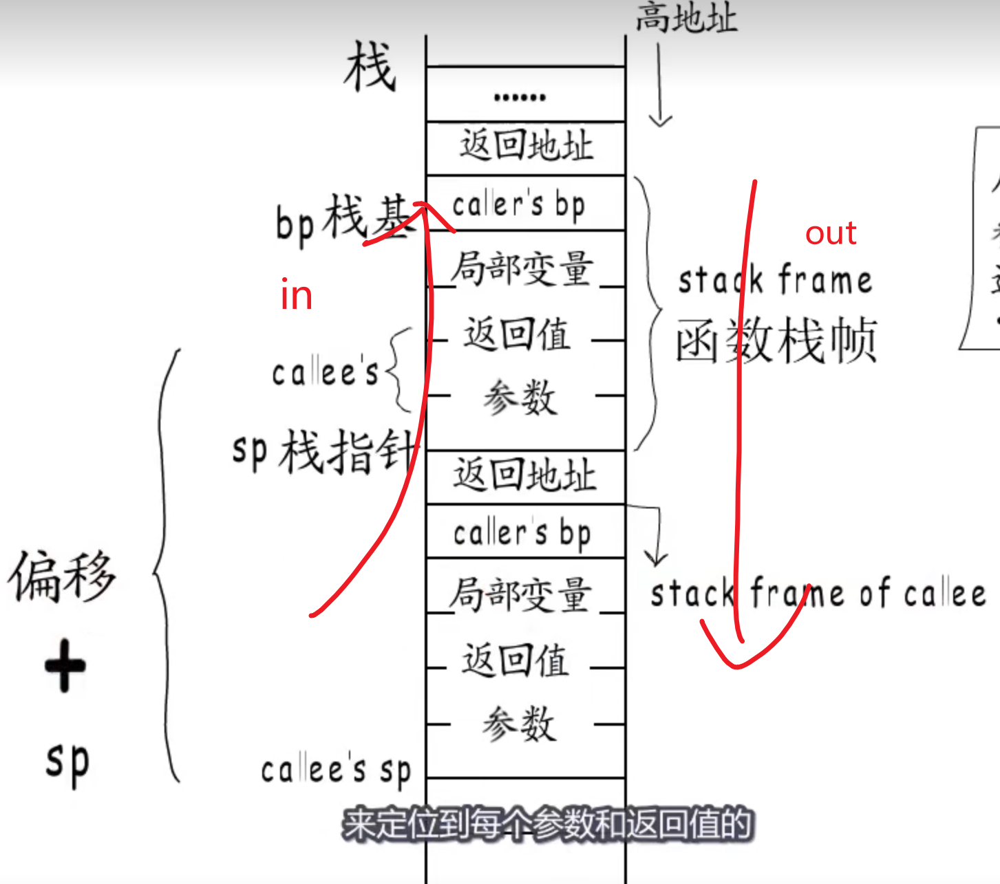
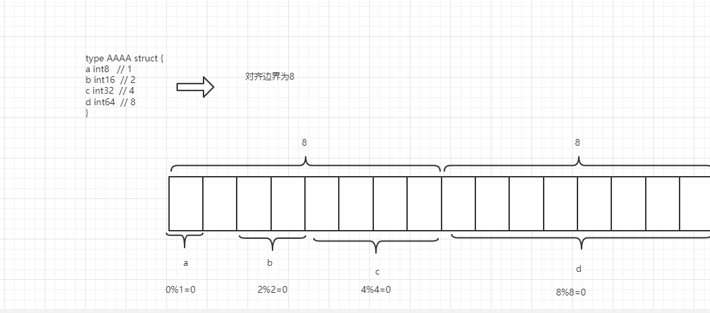
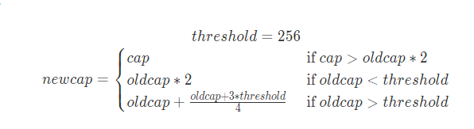
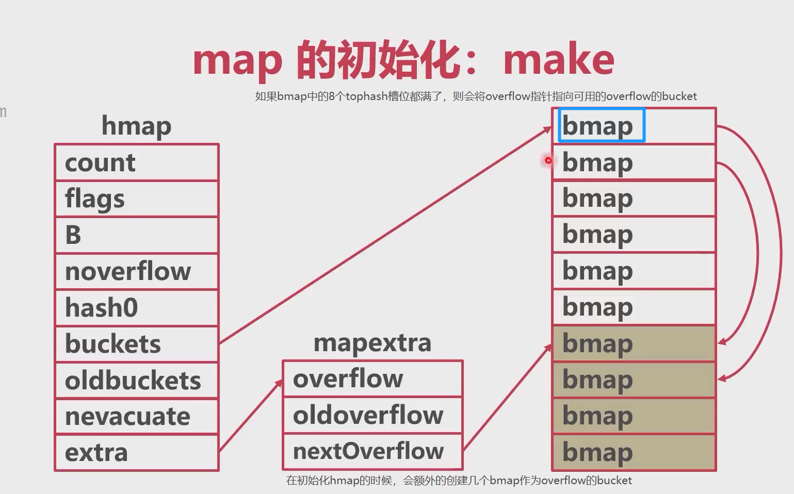
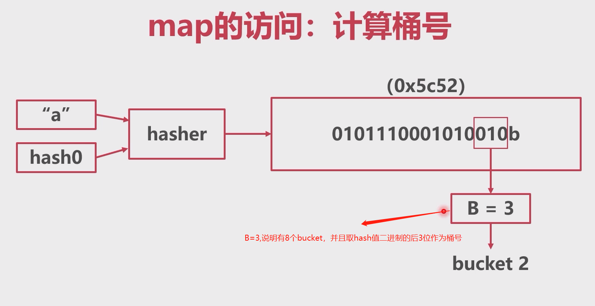

# 调用栈

栈的地址是由上到下从高地址到低地址的。

go语言的函数调用栈从栈基础地址开始，依次填入局部变量、调用的目标函数的返回值和参数。如果函数有多个参数和返回值是从代码顺序的右到左依次压入栈。

返回地址是下一条指令的地址，函数执行完之后会跳转到这里。

并且go语言分配栈空间是一次性分配最大的所需栈空间，因为栈空间在编译期间就可确定，所以可以通过后面要说的`morestack`进行检测，如果分配的不够则会进行栈增长，另外的开辟一块足够大的栈空间，把原来栈上的数据拷贝到新的空间。




举个例子

```go
func incrNumB(a int) int {
	var b int
	defer func() {
		a++
		b++
	}()

	a++
	b = a
	return b
}

func main() {
	var a = 0
	b := incrNumB(a)
	fmt.Println(a, b) // 输出 0 1
}
```

在defer函数执行之前，会先给返回值赋值，也就是先给栈上的返回值区域先赋值从0变为1，再执行defer函数。


```go
func incrNumB1(a int) (b int) {
	defer func() {
		a++
		b++
	}()

	a++
	b = a
	return b
}

func main() {
	var a = 0
	b := incrNumB1(a)
	fmt.Println(a, b) // 0 2
}
```

匿名函数返回值和上面的代码片段的情况不同在于，后者是直接在返回值的地址上做的修改，所以能够改变最后的b值。


# 数据结构

## 内存对齐

内存对齐：cpu从内存获取指令通常是一个字的取的，所以一个变量的内存地址跨越了两个字，存在了两个字之间，cpu想要得到这个变量就得读取两次内存，效率比较低，所以go语言会避免这种情况。


zerobase: 空结构体所指向的地址都是一样的，并且所占用的内存空间为0；这样设计是为了节约内存；使用场景：1.想使用`map`来做`set`时，可以将value都设置为空结构体，这样能够节约内存。2.如果使用channel，可以让channel为空结构体的channel，也能节约内存空间。

```go
	type K struct {
	}

	a := K{}
	b := 1
	c := K{}

	fmt.Printf("%p\n", &a)  
	fmt.Printf("%p\n", &b)
	fmt.Printf("%p\n", &c) // 与a变量的地址相同，但是每次编译的结果都不同。
	
	type F struct {
		n K
		a int32 // 如果这里没有一个int32的变量，则下面输出也是zerobase
	}

	d := F{}
	fmt.Printf("%p\n", &(d.n)) // 这里打印的不是zerobase，因为结构体的内存对齐是取成员的最大对齐地址
```


## 结构体内存对齐

```go
type AAAA struct {
		a int8
		b int16
		c int32
		d int64
}
```

在对齐时，选择类型占用和最大的字节数作为对齐边界，然后按照顺序摆放变量，对齐之后的结构体内存占用要是对齐边界的整数倍，如果不是就需要往上加一点。上面的结构体对齐参数已经是对齐边界 8 的倍数了，所以不需要更改。




## 关于sizeof的一些疑惑

https://blog.csdn.net/HaoDaWang/article/details/80005072


## 字符串

### 编码方式

字符转换成二进制编码，不同编码方式不能通用，所以有了unicode。

但是如果按照unicode来顺序存储字符的位置的话，可以出现多个不同的划分方式，如

`00000 00000 00001 00002 0002 0303`，可以划分成多个字符，并且划分方式有多种。

如果统一按照最长的字符来编码，每个字符占的位数太多，可能会导致浪费。

#### utf-8编码方式

| 编号         | 编码模板                   |
| ------------ | -------------------------- |
| 0 - 127      | 0???????                   |
| 128 - 2047   | 110????? 10??????          |
| 2048 - 65535 | 110????? 10?????? 10?????? |

如将字母`e`进行编码，e的二进制为101（1100101），在第一个编号范围内，可变成 `0 1100101

#### 数据结构

```go
type StringHeader struct {
    Data uintptr // 指针
    Len int		// 数组的大小
}
```

比如字符串`w爱n`，len长度为1+3+1=5，data指针指向了字符串开头。

## 切片

### 数据结构

```go
type SliceHeader struct {
    Data uintptr // 指针
    Cap int	 	// 容量
    Len int		// 当前的长度
}
```

### 初始化

不论是切片还是其他的，查看初始化的过程可以使用

```shell
go build -gcflags -S xxx.go
```

#### 字面量

字面量是指创建方式为： arr:=[]int{1, 2, 3}

这种方式在运行时创建了一个大小为3的数组，然后再创建一个slice对象，这个对象的len和cap都是3。伪代码如下

```go
tmp := [3]int{1, 2, 3}
arr := SliceHeader {
    tmp,
    len: 3,
    cap: 3
}
```


#### make

如果使用make(slice, len, cap)则会将上面的数据结构中的len和cap都置为make参数中的len和cap。

如

```go
var ints = make([]int, 2, 5)
ints = append(ints, 3)
```

此时ints[2] = 3，下标为0，1的值都为int类型的默认值0。

data指向数组的开头（只有这里会指向开头），len=2, cap=5

#### new

如果为new创建的slice，则data会为nil，len=0,cap=0.

#### 从数组中创建

```go
	var arr = []int{0, 1, 2, 3, 4, 5, 6, 7, 8, 9}
	var s1 = arr[1:4]
	var s2 = arr[5:]
	var s3 = arr[:]
	fmt.Printf("%d %d\n", len(s1), cap(s1))
	fmt.Printf("%d %d\n", len(s2), cap(s2))
	fmt.Printf("%d %d\n", len(s3), cap(s3))
```

输出的结果是

```txt
3 9  // data指向了1，len=3,cap=9
5 5  // data指向了5，len=3,cap=9
10 10 // data指向了0 len=10,cap=10
```

### 追加与扩容

#### 追加

如果不扩容，则调整长度len就行，如果需要扩容则需要创建新的数组，将数据挪过去。

#### 扩容

https://juejin.cn/post/7101928883280150558

1.18的扩容机制。

如果新的容量> 2* 老容量，则直接按照新容量进行扩容。否则，如果原来的容量小于256，则新容量为原来的2倍。如果原来容量大于256，则会进入循环，每次容量都增加 （旧容量 + 3*256）/4。



## map

### 数据结构

```go
type hmap struct {
	count     int // kv 的长度
	flags     uint8 // 状态，如正在扩容则会更改这个字段，用于标记是等量还是翻倍扩容
	B         uint8  // buckets长度的2的对数，因为bucket的长度为2的指数
	noverflow uint16 // 下一个溢出桶的编号
	hash0     uint32 // hash算法的种子

	buckets    unsafe.Pointer // bucket的指针，指向了一个bmap数组
	oldbuckets unsafe.Pointer // 扩容的时候会把这个oldbuckets指向原来的buckets
	nevacuate  uintptr        // 下一个执行驱逐的桶编号

	extra *mapextra // 溢出桶
}
```

buckets是指针，指向的数组中的元素的结构类型是

```go
// A bucket for a Go map.
type bmap struct {
    
    // bucketCnt 为 8
	tophash [bucketCnt]uint8
	// Followed by bucketCnt keys and then bucketCnt elems.
	// NOTE: packing all the keys together and then all the elems together makes the
	// code a bit more complicated than alternating key/elem/key/elem/... but it allows
	// us to eliminate padding which would be needed for, e.g., map[int64]int8.
	// Followed by an overflow pointer.
    // kv和overflow的指针会在编译时放入该对象。如果一个bucket要放多个，则overflow指针会指向新加的bmap
    // 如果bmap的tophash 8 个都放满了，则会把overflow指针指向新的bucket，指向的对象在下面初始化的时候会创建
}

```

### 初始化

#### make

1. 初始化map对象
2. 获取一个hash种子
3. 根据传入的 `hint` 计算出需要的最小需要的桶的数量
4. 如果需要创建bucket，则创建buckets数组和overflow数组，并且使用hmap对象中的指针指向他们。

```go
// makemap implements Go map creation for make(map[k]v, hint).
// If the compiler has determined that the map or the first bucket
// can be created on the stack, h and/or bucket may be non-nil.
// If h != nil, the map can be created directly in h.
// If h.buckets != nil, bucket pointed to can be used as the first bucket.
func makemap(t *maptype, hint int, h *hmap) *hmap {
	mem, overflow := math.MulUintptr(uintptr(hint), t.bucket.size)
	if overflow || mem > maxAlloc {
		hint = 0
	}

	// 初始化map对象
	if h == nil {
		h = new(hmap)
	}
    
    // 计算hash种子
	h.hash0 = fastrand()

    // make的时候传递的值，hint < bucketCnt(8)的时候会返回false
	B := uint8(0)
	for overLoadFactor(hint, B) {
		B++
	}
	h.B = B

	// 如果B 不为0，则进行初始化，分配内存空间，但是如果B==0则待会再进行分配
	if h.B != 0 {
		var nextOverflow *bmap
        
        // nextOverflow指针指向溢出桶，创建一个连续内存空间的buckets数组
		h.buckets, nextOverflow = makeBucketArray(t, h.B, nil)
		if nextOverflow != nil {
			h.extra = new(mapextra)
			h.extra.nextOverflow = nextOverflow
		}
	}

	return h
}
```

- 当桶的数量**小于 2^4**时，由于数据较少、使用溢出桶的可能性较低，会省略创建的过程以减少额外开销；
- 当桶的数量**多于 2^4** 时，会额外创建 **2^(B−4)** 个溢出桶；


初始化的图示。



#### 字面量


### 访问

总体来看，go中的map底层解决hash冲突是通过拉链法来解决的。

根据key和hash种子计算出hash值，并且取hash值的后B位，得到桶号。

计算桶号的图示过程。



得到桶号之后，访问桶，通过hash值的高8位在bmap中的tophash查询key，然后比对keys是否想要的key，如果key中没有，则去overflow中查询。

```go
	if h.flags&hashWriting != 0 {
		throw("concurrent map read and map write")
	}
	hash := t.hasher(key, uintptr(h.hash0))
	m := bucketMask(h.B)
	b := (*bmap)(add(h.buckets, (hash&m)*uintptr(t.bucketsize)))
	// 如果有oldBucktes，先去oldBuckets上查询
	if c := h.oldbuckets; c != nil {
		if !h.sameSizeGrow() {
			// There used to be half as many buckets; mask down one more power of two.
			m >>= 1
		}
		oldb := (*bmap)(add(c, (hash&m)*uintptr(t.bucketsize)))
		if !evacuated(oldb) {
			b = oldb
		}
	}
	top := tophash(hash)
```


如果在扩容的时候进行读取，当`oldbuckets`存在时，会先定位到旧桶并且在该桶没有被分流的时候获取kv，如果分流了就会去已经被分流的bucket去获取。


### 写入

和读取的流程一样，只不过

### 扩容

扩容的条件

```go
if !h.growing() && (overLoadFactor(h.count+1, h.B) || tooManyOverflowBuckets(h.noverflow, h.B)) {
		hashGrow(t, h)
		goto again // Growing the table invalidates everything, so try again
	}
```

负载因子（元素数量/桶数量）>6.5(loadFactorNum/loadFactorDen)或者溢出桶超过了普通桶的个数，则会进行扩容。

扩容的类型分为两种：翻倍扩容和等量扩容

等量扩容：溢出桶太多了。普通桶的数量不翻倍，去整理溢出桶。

翻倍扩容：新建普通桶。


等量扩容步骤：

和下面的步骤一样，只不过是不会创建新的

```go
func hashGrow(t *maptype, h *hmap) {
	// 默认翻倍扩容
	bigger := uint8(1)
    // 如果还没超过负载因子，那就不翻倍了
	if !overLoadFactor(h.count+1, h.B) {
		bigger = 0
		h.flags |= sameSizeGrow
	}
	oldbuckets := h.buckets
    // 创建新的bucket和溢出桶
	newbuckets, nextOverflow := makeBucketArray(t, h.B+bigger, nil)

	flags := h.flags &^ (iterator | oldIterator)
	if h.flags&iterator != 0 {
		flags |= oldIterator
	}
	// commit the grow (atomic wrt gc)
	h.B += bigger
	h.flags = flags
	h.oldbuckets = oldbuckets
	h.buckets = newbuckets
	h.nevacuate = 0
	h.noverflow = 0

	if h.extra != nil && h.extra.overflow != nil {
		// Promote current overflow buckets to the old generation.
		if h.extra.oldoverflow != nil {
			throw("oldoverflow is not nil")
		}
		h.extra.oldoverflow = h.extra.overflow
		h.extra.overflow = nil
	}
	if nextOverflow != nil {
		if h.extra == nil {
			h.extra = new(mapextra)
		}
		h.extra.nextOverflow = nextOverflow
	}

	// the actual copying of the hash table data is done incrementally
	// by growWork() and evacuate().
}
```


翻倍扩容步骤

1. 判断是否正在处于扩容阶段，避免二次扩容。

2. 新建buckets，并进行翻倍，将oldbuckets指针指向原来的bucket，buckets指针指向新建的bucket。并且原来的nextOverflow的指针也指向新的overflowbucket，而oldoverflow指向原来的overflowbucket。（runtime.hashgrow()）

3. 翻倍扩容迁移的过程是在进行数据操作（写操作）渐变式的迁移的，当要去操作一个kv的时候，不光需要操作一个kv，而是要迁移整个bucket。迁移会遇见一个问题，由于buckets数量变化，那么在迁移到目标bucket的时候，该怎么迁移。由于只翻了一倍，原来计算桶号的hash值和当前的hash值的最后几位只差了一位，所以当新桶号的高位为0则桶号不变，高位为1则会迁移到新桶号的桶中。(runtime.growWork())
4. 当迁移结束，则进行桶的释放。


# sync.Map


# 接口、指针、结构体

## 类型系统

每个类型，如int、int64、int32、string、slice、map都会有类型描述信息，这个就是类型元数据，并且每个类型的类型元数据都是全局唯一的。这些信息都被放到了`_type`结构体中。

```go
type _type struct {
	size       uintptr // 类型占用的空间
	ptrdata    uintptr // size of memory prefix holding all pointers
	hash       uint32  // 可以判断两个对象的类型是否相等
	tflag      tflag
	align      uint8
	fieldAlign uint8
	kind       uint8
	// function for comparing objects of this type
	// (ptr to object A, ptr to object B) -> ==?
	equal func(unsafe.Pointer, unsafe.Pointer) bool
	// gcdata stores the GC type data for the garbage collector.
	// If the KindGCProg bit is set in kind, gcdata is a GC program.
	// Otherwise it is a ptrmask bitmap. See mbitmap.go for details.
	gcdata    *byte
	str       nameOff
	ptrToThis typeOff
}
```


```go
type MyStruct int

func(o MyStruct) Len() string { return "" }
func(o MyStruct) Cap() string { return "" }
```

如果是自定义类型的话，如上所示，会在后面加上一个`uncommontype`结构体。

```go
type u struct {
	_type
	u uncommontype
}
```

```go
type uncommontype struct {
	pkgpath nameOff // 包路径
	mcount  uint16 // 方法的数量
	xcount  uint16 // 可导出的方法的数量
	moff    uint32 // offset from this uncommontype to [mcount]method
	_       uint32 // unused
}
```

`moff`表示，自定义的结构体中的方法相对于此`uncommontype`偏移了多少个字节。用最上面的自定义的结构体举个例子，通过这个变量就可以找到Len和Cap两个方法。


## 接口

### 数据结构

空接口有专门的数据结构

```go
type eface struct {
	_type *_type
	data  unsafe.Pointer
}
```

_type类型在上面已经给出。


有方法的接口

```go
type iface struct {
	tab  *itab
	data unsafe.Pointer
}
```

```go
itab
type itab struct {
	inter *interfacetype  //  接口类型元数据
	_type *_type // 实际类型元数据
	hash  uint32 // 这里的hash，当想把某个接口转换成具体类型的时候，可以用这个字段快速判断两个类型是否相等，这个在类型断言中会用到。
	_     [4]byte
	fun   [1]uintptr // 实现的方法地址
}

interfacetype
type interfacetype struct {
	typ     _type
	pkgpath name
	mhdr    []imethod
}
```

每一个 [`runtime.itab`](https://draveness.me/golang/tree/runtime.itab) 都占 **32** 字节，


**Go 语言的接口类型不是任意类型**，下面的例子说明在调用NilOrNot函数的时候发生了类型转换，这说明interface不是任意类型。

为什么传进该函数的不是nil？因为在转换的时候，空接口对象不仅包含转换前的变量（这个为nil），还包含转换前的类型。

也就是上面的eface中的`_type`不为nil，data指向的指针为空，所以转换之后的interface不为nil。

```go
type TestStruct struct{}

func NilOrNot(v interface{}) bool {
	return v == nil
}

func main() {
	var s *TestStruct
	var i interface{}
	fmt.Println(s == nil)    // #=> true
	fmt.Println(NilOrNot(s)) // #=> false
	fmt.Println(i == nil)    // #=> true
	fmt.Println(NilOrNot(i)) // #=> true
}
```


## 类型断言

空接口是判断`_type`是否为断言的类型元数据，因为类型元数据是全局唯一的。

非空接口比较`itab`中的hash值和断言类型元数据中的hash值是否相等


### 方法

```go
package main

import "fmt"

type InterA interface {
	Fu()
}

type InterB interface {
	Fu()
}

type StruA struct {
	Gu string
}

func (s StruA) Fu() {
	fmt.Println(s.Gu)
}

func main() {
	var c InterA = &StruA{}
	fmt.Println(c)
}
```

`InterA`可以使用`StruA`的指针来初始化，也可以使用`StruA`的值来初始化，但是`StruA`并没有手动实现`InterA`指针方法`Fu`，这个是因为编译器在编译的时候，会自动生成一个指针类型的`Fu`方法，所以变量`c`才能使用指针来进行初始化。但是如果使用指针实现的接口方法，编译器并不会自动生成一个值实现的方法。


# 并发编程

## 协程

### 本质

```go
type g struct {
	stack       stack   // offset known to runtime/cgo
	stackguard0 uintptr // offset known to liblink
	stackguard1 uintptr // offset known to liblink

	_panic    *_panic // innermost panic - offset known to liblink
	_defer    *_defer // innermost defer
	m         *m      // current m; offset known to arm liblink
	sched     gobuf // 协程运行的现场
	syscallsp uintptr // if status==Gsyscall, syscallsp = sched.sp to use during gc
	syscallpc uintptr // if status==Gsyscall, syscallpc = sched.pc to use during gc
	stktopsp  uintptr // expected sp at top of stack, to check in traceback
	param        unsafe.Pointer
	
    atomicstatus uint32
	
    stackLock    uint32 // sigprof/scang lock; TODO: fold in to atomicstatus
	
    goid         int64
	
    schedlink    guintptr
	waitsince    int64      // approx time when the g become blocked
	waitreason   waitReason // if status==Gwaiting

	preempt       bool // preemption signal, duplicates stackguard0 = stackpreempt
	preemptStop   bool // transition to _Gpreempted on preemption; otherwise, just deschedule
	preemptShrink bool // shrink stack at synchronous safe point

	asyncSafePoint bool

	paniconfault bool // panic (instead of crash) on unexpected fault address
	gcscandone   bool // g has scanned stack; protected by _Gscan bit in status
	throwsplit   bool // must not split stack
	
	activeStackChans bool
	parkingOnChan uint8
	raceignore     int8     // ignore race detection events
	sysblocktraced bool     // StartTrace has emitted EvGoInSyscall about this goroutine
	tracking       bool     // whether we're tracking this G for sched latency statistics
	trackingSeq    uint8    // used to decide whether to track this G
	runnableStamp  int64    // timestamp of when the G last became runnable, only used when tracking
	runnableTime   int64    // the amount of time spent runnable, cleared when running, only used when tracking
	sysexitticks   int64    // cputicks when syscall has returned (for tracing)
	traceseq       uint64   // trace event sequencer
	tracelastp     puintptr // last P emitted an event for this goroutine
	lockedm        muintptr
	sig            uint32
	writebuf       []byte
	sigcode0       uintptr
	sigcode1       uintptr
	sigpc          uintptr
	gopc           uintptr         // pc of go statement that created this goroutine
	ancestors      *[]ancestorInfo // ancestor information goroutine(s) that created this goroutine (only used if debug.tracebackancestors)
	startpc        uintptr         // pc of goroutine function
	racectx        uintptr
	waiting        *sudog         // sudog structures this g is waiting on (that have a valid elem ptr); in lock order
	cgoCtxt        []uintptr      // cgo traceback context
	labels         unsafe.Pointer // profiler labels
	timer          *timer         // cached timer for time.Sleep
	selectDone     uint32         // are we participating in a select and did someone win the race?

	
	gcAssistBytes int64
}
```

比较重要的几个属性：

```go
// 上面g中属性名称为stack的结构体的stack
type stack struct {
	lo uintptr // 低位指针
	hi uintptr // 高位指针
}


// 上面g中属性名称为sched的结构体
type gobuf struct {
	
	sp   uintptr // 栈指针
	pc   uintptr // 程序计数器
	g    guintptr
	ctxt unsafe.Pointer
	ret  uintptr
	lr   uintptr
	bp   uintptr // for framepointer-enabled architectures
}

atomicstatus uint32 // 协程的状态
goid         int64 // 协程的id
m         *m      // go语言中线程的描述

```

状态有下面几种：

```go
const (
	_Gidle = iota // 0
	_Grunnable // 1
	_Grunning // 2
	_Gsyscall // 3
	_Gwaiting // 4
	_Gmoribund_unused // 5
	_Gdead // 6
	_Genqueue_unused // 7
	_Gcopystack // 8
	_Gpreempted // 9
	_Gscan          = 0x1000
	_Gscanrunnable  = _Gscan + _Grunnable  // 0x1001
	_Gscanrunning   = _Gscan + _Grunning   // 0x1002
	_Gscansyscall   = _Gscan + _Gsyscall   // 0x1003
	_Gscanwaiting   = _Gscan + _Gwaiting   // 0x1004
	_Gscanpreempted = _Gscan + _Gpreempted // 0x1009
)
```

| 状态          | 描述                                                         |
| ------------- | ------------------------------------------------------------ |
| `_Gidle`      | 刚刚被分配并且还没有被初始化                                 |
| `_Grunnable`  | 没有执行代码，没有栈的所有权，存储在运行队列中               |
| `_Grunning`   | 可以执行代码，拥有栈的所有权，被赋予了内核线程 M 和处理器 P  |
| `_Gsyscall`   | 正在执行系统调用，拥有栈的所有权，没有执行用户代码，被赋予了内核线程 M 但是不在运行队列上 |
| `_Gwaiting`   | 由于运行时而被阻塞，没有执行用户代码并且不在运行队列上，但是可能存在于 Channel 的等待队列上 |
| `_Gdead`      | 没有被使用，没有执行代码，可能有分配的栈                     |
| `_Gcopystack` | 栈正在被拷贝，没有执行代码，不在运行队列上                   |
| `_Gpreempted` | 由于抢占而被阻塞，没有执行用户代码并且不在运行队列上，等待唤醒 |
| `_Gscan`      | GC 正在扫描栈空间，没有执行代码，可以与其他状态同时存在      |


线程在go中的体现

```go
type m struct {
	g0      *g     // g0 是持有调度栈的 Goroutine，主协程对应的g
	morebuf gobuf  // gobuf arg to morestack
	divmod  uint32 // div/mod denominator for arm - known to liblink
	_       uint32 // align next field to 8 bytes

	// Fields not known to debuggers.
	procid        uint64            // for debuggers, but offset not hard-coded
	gsignal       *g                // signal-handling g
	goSigStack    gsignalStack      // Go-allocated signal handling stack
	sigmask       sigset            // storage for saved signal mask
	tls           [tlsSlots]uintptr // thread-local storage (for x86 extern register)
	mstartfn      func()
	curg          *g       // curg 是在当前线程上运行的用户 Goroutine
	caughtsig     guintptr // goroutine running during fatal signal
	p             puintptr // gmp模型中的p
	nextp         puintptr
	oldp          puintptr // the p that was attached before executing a syscall
	id            int64
	mallocing     int32
	throwing      int32
	preemptoff    string // if != "", keep curg running on this m
	locks         int32
	dying         int32
	profilehz     int32
	spinning      bool // m is out of work and is actively looking for work
	blocked       bool // m is blocked on a note
	newSigstack   bool // minit on C thread called sigaltstack
	printlock     int8
	incgo         bool   // m is executing a cgo call
	freeWait      uint32 // if == 0, safe to free g0 and delete m (atomic)
	fastrand      uint64
	needextram    bool
	traceback     uint8
	ncgocall      uint64      // number of cgo calls in total
	ncgo          int32       // number of cgo calls currently in progress
	cgoCallersUse uint32      // if non-zero, cgoCallers in use temporarily
	cgoCallers    *cgoCallers // cgo traceback if crashing in cgo call
	park          note
	alllink       *m // on allm
	schedlink     muintptr
	lockedg       guintptr
	createstack   [32]uintptr // stack that created this thread.
	lockedExt     uint32      // tracking for external LockOSThread
	lockedInt     uint32      // tracking for internal lockOSThread
	nextwaitm     muintptr    // next m waiting for lock
	waitunlockf   func(*g, unsafe.Pointer) bool
	waitlock      unsafe.Pointer
	waittraceev   byte
	waittraceskip int
	startingtrace bool
	syscalltick   uint32
	freelink      *m // on sched.freem

	// these are here because they are too large to be on the stack
	// of low-level NOSPLIT functions.
	libcall   libcall
	libcallpc uintptr // for cpu profiler
	libcallsp uintptr
	libcallg  guintptr
	syscall   libcall // stores syscall parameters on windows

	vdsoSP uintptr // SP for traceback while in VDSO call (0 if not in call)
	vdsoPC uintptr // PC for traceback while in VDSO call

	// preemptGen counts the number of completed preemption
	// signals. This is used to detect when a preemption is
	// requested, but fails. Accessed atomically.
	preemptGen uint32

	// Whether this is a pending preemption signal on this M.
	// Accessed atomically.
	signalPending uint32

	dlogPerM

	mOS // 操作系统线程信息

	// Up to 10 locks held by this m, maintained by the lock ranking code.
	locksHeldLen int
	locksHeld    [10]heldLockInfo
}
```

调度器（**部分属性**）：

调度器中存放了全局的goroutine队列，

```go
type schedt struct {
	// accessed atomically. keep at top to ensure alignment on 32-bit systems.
	goidgen   uint64
	lastpoll  uint64 // time of last network poll, 0 if currently polling
	pollUntil uint64 // time to which current poll is sleeping

	lock mutex
	midle        muintptr // 空闲的m

	pidle      puintptr // 空闲的p
	npidle     uint32
	nmspinning uint32 // See "Worker thread parking/unparking" comment in proc.go.

	// Global runnable queue.
	runq     gQueue // 全局的协程队列
	runqsize int32

	// Central cache of sudog structs.
	sudoglock  mutex
	sudogcache *sudog

	// Central pool of available defer structs.
	deferlock mutex
	deferpool *_defer
    
	freem *m

	gcwaiting  uint32 // gc is waiting to run
	stopwait   int32
	stopnote   note
	sysmonwait uint32
	sysmonnote note

	safePointFn   func(*p)
	safePointWait int32
	safePointNote note

	profilehz int32 // cpu profiling rate

	procresizetime int64 // nanotime() of last change to gomaxprocs
	totaltime      int64 // ∫gomaxprocs dt up to procresizetime
}
```

### 程序引导启动做了什么

https://juejin.cn/post/6942509882281033764

```asm
TEXT runtime·rt0_go(SB),NOSPLIT|TOPFRAME,$0
	// copy arguments forward on an even stack

	// create istack out of the given (operating system) stack.
	// _cgo_init may update stackguard.
	// 初始化g0的执行栈
	MOVQ	$runtime·g0(SB), DI
	// ...
	
	// find out information about the processor we're on
	
	// set the per-goroutine and per-mach "registers"
	get_tls(BX)
	LEAQ	runtime·g0(SB), CX
	MOVQ	CX, g(BX)
	LEAQ	runtime·m0(SB), AX

	// 设置引用关系
	// save m->g0 = g0
	MOVQ	CX, m_g0(AX)
	// save m0 to g0->m
	MOVQ	AX, g_m(CX)

	CLD				// convention is D is always left cleared

	
	CALL	runtime·check(SB)

	// ...
	
	CALL	runtime·args(SB)
	CALL	runtime·osinit(SB)
	// 初始化调度
	CALL	runtime·schedinit(SB)

	// create a new goroutine to start program
	MOVQ	$runtime·mainPC(SB), AX		// entry
	PUSHQ	AX
	// 创建一个goroutine启动程序，不是g0,是main-goroutine，启动runtime.main
	CALL	runtime·newproc(SB)
	POPQ	AX

	// 启动线程
	CALL	runtime·mstart(SB)

	CALL	runtime·abort(SB)	// mstart should never return
	RET
```

两个主要的全局变量：

`m0`：主线程对应的m，m0和其他的m的数据结构没有任何区别，在上面的汇编代码中可以看见m0是在go程序启动时，用汇编赋值的，而后续的其他m都是通过`mstart`创建的。

`g0`：负责在每个正在运行的线程上调度和管理 goroutine的特殊的协程，与`m0`一样，其赋值是在进程启动时进行赋值的，在`g0`上分配的栈是系统栈，调度函数是在`g0`上运行的， **每一个 m 都只有一个 `g0`**（仅此只有一个 `g0`），全局变量的`g0` 是 `m0` 的 `g0`。`main goroutine`是运行runtime.main的协程，是在汇编代码创建并且启动的协程，在runtim.main中的`getg()`获取的就是该协程。

[G0的作用](https://medium.com/a-journey-with-go/go-g0-special-goroutine-8c778c6704d8)：其实就是运行schedule()，m上的g变为_GWaiting了之后，会切换到g0执行调度寻找g。

### 创建新协程经历了什么

前置知识：[调用栈](#调用栈)

几个全局变量

`g0`：负责在每个正在运行的线程上调度和管理 goroutine的特殊的协程，每一个 m 都只有一个 g0（仅此只有一个 g0），全局变量的g0 是 m0的g0。

`m0`: 主线程对应的m，一个进程只会有一个m0，m0负责执行初始化操作和启动第一个 g (g0).

`allgs`：所有的协程，包括状态为`_Gdead`，所以不会减小。

`sched`：记录了所有状态为`_Grunnable`的协程的`runq`，并且记录了空闲的p和空闲的m。

在1.18下调用newproc函数需要传递一个参数，那就是函数的指针。所以在函数调用栈中会传递函数的指针。


而调用Foo函数

```go
func main() {
    go Foo("Bar")
}


func newproc(fn *funcval) {
	gp := getg()
	pc := getcallerpc()
	systemstack(func() {
		newg := newproc1(fn, gp, pc)

		_p_ := getg().m.p.ptr()
		runqput(_p_, newg, true)
 
		if mainStarted {
			wakep()
		}
	})
}
```

newproc的步骤：

1. 获取当前的g。
2. 获取调用结束后的pc，就是调用newproc函数结束后，在栈中的返回地址。
3. 切换成g0栈调用newproc1函数。切换成g0栈的目的是g0栈使用的是主线程的栈，足够大不会有栈溢出的风险。

4. 将新建的g放入分配的p的本地runq中。

newproc1函数太长了，只放部分关键步骤：

```go

// 
func newproc1(fn *funcval, callergp *g, callerpc uintptr) *g {
    // 获取当前g，这里的g就是g0,newproc是切换到g0栈上运行的本函数
    _g_ := getg()
	acquirem() // 抢占m，并且不让m被抢占，因为局部变量会保存当前_p_，如果别的m把当前的p抢走了会有问题。
    
    _p_ := _g_.m.p.ptr()
    
    // 获取g，如果没获取到就新建一个并且把状态改成_Gdead，添加到allgs中
    // 此时newg有自己的协程栈
    newg := gfget(_p_)
   if newg == nil {
		newg = malg(_StackMin)
		casgstatus(newg, _Gidle, _Gdead)
		allgadd(newg)
	}

	if readgstatus(newg) != _Gdead {
		throw("newproc1: new g is not Gdead")
	}
    
    // ... 
    
    newg.sched.sp = sp
	newg.stktopsp = sp
    
    // 将调度器的pc指向goexit函数
	newg.sched.pc = abi.FuncPCABI0(goexit) + sys.PCQuantum 
	newg.sched.g = guintptr(unsafe.Pointer(newg))
    // 把pc指向了目标协程函数的地址，就是指令跳转到目标函数栈帧
    // 等调度开始了就开始执行目标函数，执行完了就会调用上面压入栈的goexit函数
	gostartcallfn(&newg.sched, fn)
    
    // ...
    // 更改状态
    casgstatus(newg, _Gdead, _Grunnable)
	gcController.addScannableStack(_p_, int64(newg.stack.hi-newg.stack.lo))
    
    // 释放抢占的m
    releasem(_g_.m) 
}


func gostartcall(buf *gobuf, fn, ctxt unsafe.Pointer) {
     sp := buf.sp
     ...
     sp -= sys.PtrSize
    // 把sp指针指向了goexit函数地址
     *(*uintptr)(unsafe.Pointer(sp)) = buf.pc
     buf.sp = sp
    // 把pc指向了函数的地址
     buf.pc = uintptr(fn)
     buf.ctxt = ctxt
}
```

总结上面的步骤：

1. 抢占m，获取当前的g（g0，因为切换到了g0栈上），禁止m被抢占。
1. 获取g，如果没获取到就新建一个并且把状态改成_Gdead，并且如果newg没有栈，就新建一个2k的栈，把g添加到allgs中
1. 将调度器的sp指针指向goexit函数，这样在协程调度回来运行完成之后才会自动调用goexit()函数（因为这里存放的相当于是return addr,是下一条指令的地址），具体可以看https://cloud.tencent.com/developer/article/1836273
1. 把g的状态从_GDead改成 _GRunnable，从而能放到当前p的本地队列。
1. 释放m。


## 调度

### 0.x的调度器

1. 获取调度的全局锁。
2. 从**全局队列（此时就只有一个全局队列）**中获取可执行的go协程。
3. 修改线程`m`中执行的协程。
4. 运行协程。

这种方式是单线程取执行的，效率比较低。

### 1.0的调度器

这个时候调度器已经发展成多线程调度器，多线程就是多个线程共享一个协程队列，获取协程运行，但是多线程调度器有许多问题：

1. 协程队列会有并发问题，多个线程争抢锁消耗严重。
2. 每个线程都需要处理内存缓存，导致大量的内存占用并影响数据局部性；

### 任务窃取调度器

在上面的多线程的调度器基础上引入了：

1. 在当前的 G-M 模型中引入了处理器 P，增加中间层；
2. 在处理器 P 的基础上实现基于工作窃取的调度器；

p的结构体(**只保留了部分重要的属性**)

```go
type p struct {
	id          int32
	status      uint32
	m           muintptr  // 线程
	runqhead uint32		// 指向协程队列的队首指针
	runqtail uint32		// 指向协程队列的队尾指针
	runq     [256]guintptr	// 当前线程的协程队列，最大256个协程
	runnext guintptr	// 下一个可以执行的协程指针
}
```

p也有几种状态：

| 状态        | 描述                                                         |
| ----------- | ------------------------------------------------------------ |
| `_Pidle`    | 处理器没有运行用户代码或者调度器，被空闲队列或者改变其状态的结构持有，运行队列为空 |
| `_Prunning` | 被线程 M 持有，并且正在执行用户代码或者调度器                |
| `_Psyscall` | 没有执行用户代码，当前线程陷入系统调用                       |
| `_Pgcstop`  | 被线程 M 持有，当前处理器由于垃圾回收被停止                  |
| `_Pdead`    | 当前处理器已经不被使用                                       |


G-M-P模型的思想就是在每个线程中都保存一个协程队列，线程不直接和协程打交道，而是从p中取协程执行，如果p中的协程都被消费完了，p再从全局协程队列获取锁拿取一批协程放入本地队列，如果本地或者全局都没有协程了，则会去看其他线程有没有没执行完的协程，偷几个过来。


任务窃取调度器的缺点：

* 在某些情况下协程不会让出，导致线程饥饿。
* 在gc时的stw时间太长，会导致程序无法工作。

### 抢占式调度器

#### 基于协作的抢占式调度器

编译器编译的时，在调用函数前，插入`morestack()`函数，在发生函数调用时，可能会执行编译器前插的`morestack()`函数，这个函数调用的`newStack()`会检查协程的`stackguard0`是否为`StackPreemt`这个数是一个很大的数，所以可以用作判断。如果`stackguard0`为`stackpreemt`则会触发抢占，让出当前协程。

这种方式有个缺点，那就是这个是主动行为，如果没发生函数调用的时候，这种检测方式将不适用。


#### 基于信号的抢占式调度

1. 在触发gc的栈扫描的时候（下面有gc算法，需要从栈开始扫描），gc线程

### 调度时机


1. 主动调用`gopark()`，如time.Sleep()底层调用了`gopark`。
2. 系统调用完成`exitsyscall`。
3. 协作式调度（编译器在函数调用前插入`morestack()`）。
4. 系统监控`sysmon`。监控线程由`main goroutine` (`runtime.main`)创建的，确保`timers`执行，该m不需要依赖p。

### 栈增长

在前面[调用栈](#调用栈)中说过，go语言的栈帧大小是一次性确定的，就是通过插入栈增长检测代码确定是否需要栈增长。

`stackguard0`：栈的下界

framesize <= _StackSmall时，如果sp指针 > `stackguard0`，就要进行栈增长。

_StackSmall < framesize <= _StackBig, 超出 `stackguard0`的部分 > _stacksmall就会进行栈增长。

_StackBig < framesize，也会执行栈增长，此时会将`stackguard0`设置为`stackpreemt`。这样执行`morestack`函数的时候，会根据这个值来判断当前协程是否需要被抢占。

### 调度过程

```go

```


## channel


## select

* select能够在channel上进行非阻塞的收发操作。
* select在遇到多个channel的时候，会随机选择一个channel执行。

实现原理：


## 锁


# GC

## 内存分布


指令存在代码段，静态区域和全局变量存在数据段，函数的局部变量、返回值、参数放在栈上，如果不能在编译阶段确定数据对象的大小或者变量的生命周期超出当前所在函数，则会分配在堆上。

栈上的空间不用gc，当函数调用结束就会自动释放，而堆上的空间，如果不能及时释放就会导致内存泄漏。

## 几种垃圾回收算法

### 标记清除算法

程序用的到的数据，一定是由栈和数据段作为根节点追踪得到的数据，如果从根节点不能追踪到的数据，一定是垃圾数据，就要被回收了，所以把能够追踪到的数据都进行标记，把那些没有标记的数据给清除了，这就是标记清除算法的思想。

#### 三色标记

白色对象：目标的垃圾，需要回收。

灰色对象：活跃的对象，可能指向白色的对象，需要进一步扫描这些对象的子对象。

黑色对象：活跃的对象，这个对象和他直接引用的对象都被访问过。黑色所指向的对象都是灰色的，gc线程不会再访问这个对象。

最开始的时候，所有的数据都是白色。


把root节点都标记成灰色，灰色表示基于当前节点的追踪还没有完成。


如果基于某个节点的追踪完成之后，会把该节点标记为黑色，表示数据存活并且不需要再基于这个节点进行跟踪了。

简单概括一下步骤：

1. 在最开始的时候，所有对象都是白色的，把根节点（栈、数据段）都标记为灰色的。
2. 从灰色对象的集合中选择一个对象标记成黑色的。
3. 把黑色对象指向的对象标记成灰色的。
4. 重复上面的步骤，直到没有灰色的对象。此刻堆中的对象只会剩下白色的，就是目标垃圾回收对象。


### 复制压缩算法

把内存中造成的碎片向一边移动，这样就会腾出一块连续的空间。


### 分代回收算法(JVM Serial收集器用的算法)

把内存分为几个区域，保存不同年龄的对象，分为新生代、老年代、永久代。

新生代分为eden区，survivor区。在gc的时候，扫描eden space和survior（s0或者s1)，将gc后的对象移动到survivor中空闲的区域（s0或者s1)，如果有一个s区满了或者一些对象达到了年龄的阈值，就将这一部分的对象移动到老年代。而如果老年代的内存满了也会采用复制压缩算法去gc。

下面的永久代，已经在jdk8中移除，在早期版本中是存放在方法区中。


### 引用计数法

在程序运行时，gc线程会给每个对象维护一个引用计数器，如果引用到0了，就说明可以进行回收。但是会有一个问题，如果两个对象互相引用，则引用计数器不可能会达到0.


上面说的都是在stop the world 的情况下的gc算法，实际上用户线程不能忍受长时间的stw。

## 垃圾回收的stw优化

### 增量stw

避免一次stw给用户线程给停了，那就分多次，每次只暂停一小段时间。


但是这样会有一个问题，如果采用的是标记清除算法，可能前脚gc线程判定的一个对象是黑色的，后脚用户线程就更改了该对象和原本待清除的对象（此时不该清除）的关联关系，而黑色对象不会再被访问，所以不能改变白色对象的颜色，造成错误的清理。即指针没有指向特定类型的对象，会造成悬挂指针问题，如下图


所以会引入屏障技术。

#### 两个不变式

强三色不变式：黑色对象不会指向白色对象，只会指向黑色或者灰色对象。

弱三色不变式：黑色所指向的白色对象，必须包含一个灰色对象指向该白色对象。

写屏障：在屏障之前，对共享变量的改动都会同步到主存中。

读屏障：在屏障之后，从内存中读取的共享变量都是最新的数据。

