# 基础算法

## 快速排序

背模板，避免边界问题出现。

快速排序的算法思想是（从小到大排序）：

1. 选定一个哨兵元素，从左往右扫描，直到找到第一个比这个数大的数之后，从右往左扫描，直到找到第一个比这个数要小的数。
2. 如果左边的指针小于右边的指针，交换两个指针指向的数。 
3. 重复上面的步骤，直到左边的指针大于右边的指针。

```java
    public static void quickSort(int[] nums) {
        quickSort(nums, 0, nums.length - 1);
    }

    private static void quickSort(int[] nums, int l, int r) {
        if (l >= r) {
            return;
        }

        // 由于选取的第一个数为哨兵节点，所以i = l - 1，为了统一，j也写成r + 1
        int x = nums[l], i = l - 1, j = r + 1;
        while (i < j) {
            while (nums[++i] < x) ;
            while (nums[--j] > x) ;
            // 从i出发找到比x大的数，从j出发找到比x小的数，交换
            if (i < j) {
                swap(nums, i, j);
            }
        }

        // 注意边界
        quickSort(nums, l, j);
        quickSort(nums, j + 1, r);
    }

    private static void swap(int[] nums, int i, int j) {
        int tmp = nums[i];
        nums[i] = nums[j];
        nums[j] = tmp;
    }
```

### 快速选择

```java
    public static int quickSelect(int[] nums, int k, int l, int r) {
        if (l >= r) {
            return nums[l];
        }
        int x = nums[l], i = l - 1, j = r + 1;
        while (i < j) {
            while (nums[++i] < x) ;
            while (nums[--j] > x) ;
            if (i < j) {
                swap(nums, i, j);
            }
        }
        // 如果k落在分区的左边，则就是找左边分区第k小的数字
        if (j - l + 1 >= k) {
            return quickSelect(nums, k, l, j);
        }
        // 如果落在了右边的分区，则找右边分区第 k - (j - l + 1) 小的数字
        return quickSelect(nums, k - (j - l + 1), j + 1, r);
    }
```

## 归并排序

和快速排序一样，背模板，避免造成边界问题。
算法思想是：
1. 把一个大数组不断分成小数组。
2. 从小数组开始，选取两个小数组，合并数组。
3. 重复上述步骤，直到只有一个数组。

```java
    public static void mergeSort(int[] nums) {
        mergeSort(nums, 0, nums.length - 1);
    }

    public static void mergeSort(int[] nums, int l, int r) {
        if (l >= r) {
            return;
        }
        int mid = l + r >> 1;
        mergeSort(nums, l, mid);
        mergeSort(nums, mid + 1, r);
        merge(nums, l, r);
    }

    private static void merge(int[] nums, int l, int r) {
        int[] tmp = new int[r - l + 1];
        int mid = l + r >> 1;
        int i = l, j = mid + 1, idx = 0;

        while (i <= mid && j <= r) {
            tmp[idx++] = nums[i] < nums[j] ? nums[i++] : nums[j++];
        }
        while (i <= mid) {
            tmp[idx++] = nums[i++];
        }
        while (j <= r) {
            tmp[idx++] = nums[j++];
        }
        for (int k = 0; k < tmp.length; k++) {
            nums[l + k] = tmp[k];
        }
    }
```

### [剑指 Offer 51. 数组中的逆序对](https://leetcode.cn/problems/shu-zu-zhong-de-ni-xu-dui-lcof/)

在归并排序中，分成了两个数组，其中会产生三种情况：

1. 所有的逆序对都在同一边（左边和右边）。
2. 逆序对分别在两个部分，

其中第一个问题，可以递归的转换成第二个问题，所以只需要关心第二个问题。

在归并的时候，两边的数组都是有序的，所以对于前面部分的 `i`和后面部分的`j`来说，如果`nums[i] > nums[j]`，即前面的部分>后面的部分时，`nums[i]`和`nums[j]`都组成了一对逆序对。并且，由于两边的部分都是有序的，所以对于下标`j`来说，左边部分的下标大于`i`的元素都能与下标为`j`的元素组成逆序对。

总结一下来说，对于j来说，逆序对数为`mid - i + 1`，而对于右边部分的所有元素来说都可能会出现这种情况。所以求和就行。

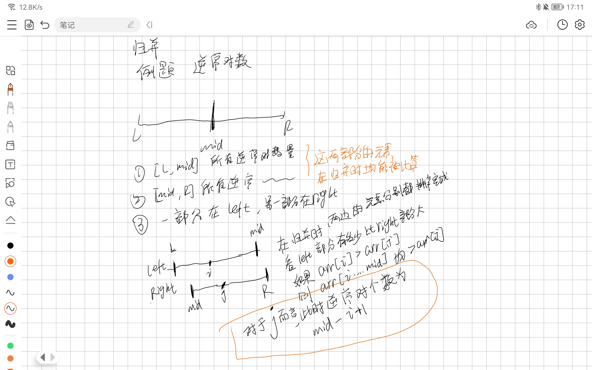

```java
class Solution {
    public int reversePairs(int[] nums) {
        return mergeSort(nums, 0, nums.length - 1);
    }

    public int mergeSort(int[] nums, int l, int r) {
        if (l >= r) {
            return 0;
        }
        int mid = l + r >> 1;
        
        int res = mergeSort(nums, l, mid) + mergeSort(nums, mid + 1, r);

        int[] tmp = new int[r - l + 1];
        // 归并
        int i = l , j = mid + 1, idx = 0;
        while(i <= mid && j <= r) {
            // 前面的小于后面的，则正常归并，否则计算逆序对数
            if (nums[i] <= nums[j]) {
                tmp[idx++] = nums[i++];
            } else {
                tmp[idx++] = nums[j++];
                res += mid - i + 1;
            }
        }
        while(i <= mid) {
            tmp[idx++] = nums[i++];
        }
        while(j <= r) {
            tmp[idx++] = nums[j++];
        }

        for(int k = 0; k < tmp.length; k++) {
            nums[l + k] = tmp[k];
        }
        return res;
    }
}
```

## 二分查找

```java

```


# KMP算法

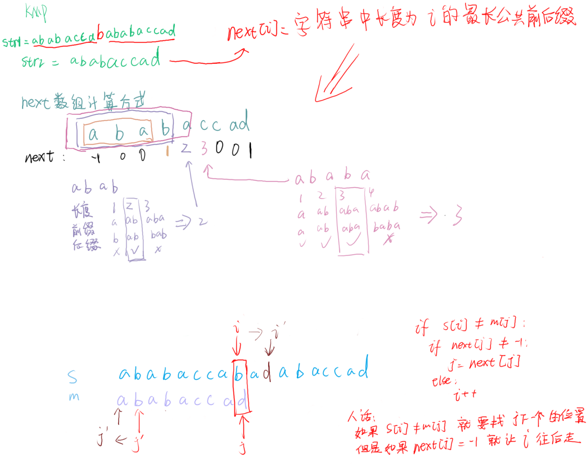

# 并查集

两个集合找祖宗节点，看祖宗是否相等，如果祖宗相同，则认为这两个集合相同。

```c++
#include <iostream>
using namespace std;

const int N = 10010;

int fa[N];

int find(int i) {
    if (fa[i] != i) {
        // 路径压缩
        fa[i] = find(fa[i]);
    }
    return fa[i];
}

void merge(int a, int b) {
    fa[find(a)] = find(b);
}

int main() {
    int n;
    scanf("%d", &n);
    for(int i = 1; i <= n; i++) {
        fa[i] = i;
    }
    while (n--) {
        char c[2];
        int a, b;
        scanf("%s%d%d", &c, &a, &b);
        if (c[0] == 'M') {
            merge(a, b);
        } else {
            if (find(a) == find(b)) {
                printf("%s\n", "yeah!");
            } else {
                printf("%s\n", "oops :(");
            }
        }
    }
    return 0;
}
```

# 链表

用数组模拟链表。

```c++
#include <algorithm>
#include <iostream>
#include <vector>
using namespace std;

const int N = 100010;

// head 表示头节点，存放是的节点下标
// e[i] 表示第i个节点
// ne[i] 表示第i个节点的下一个节点的下标
// idx 节点编号
int head, e[N], ne[N], idx = 0;

void insert(int x) {
    // 创建新节点
    e[idx] = x;
    // 指向头节点的下一个节点的下标
    ne[idx] = head;
    // 存储当前的节点下标
    head = idx++;
}

void init() {
    head = -1;
}

void print() {
    for (int i = head; i != -1; i = ne[i]) {
        cout << e[i] << endl;
    }
}

int main() {
    init();
    for (int i = 0; i < 10; i++) {
        insert(i);
    }
    print();
    return 0;
}
```


# 图

### 邻接表

```cpp
#include <bits/stdc++.h>
#include <algorithm>
#include <iostream>
using namespace std;

const int N = 100010, M = 2 * N;

// h[i] 表示第i个链表的头节点，有多少个节点就会有多少个头节点
// e[i] 表示下标为i的端点
// ne[i] 表示下标为i的端点指向了目标点
// idx 表示图的节点个数（编号）
int h[N], e[M], ne[M], idx = 0;
bool visited[N];

void add(int a, int b) {
    e[idx] = b;
    // 指向a为头节点的下一个节点的下标
    ne[idx] = h[a];
    // 把a节点的头节点指向b的下标，然后个数++
    h[a] = idx++;
}

void dfs(int u) {
    visited[u] = true;
    for (int i = h[u]; i != -1; i = ne[i]) {
        int j = e[i];
        cout << j << endl;
        if (!visited[j]) {
            dfs(j);
        }
    }
}

void init() {
    memset(h, -1, sizeof(h));
}

int main() {
    init();
    for (int i = 0; i < 100; i++) {
        add(i, 100 - i);        
    }
    dfs(0);

    return 0;
}
```


# 前缀树

# 堆

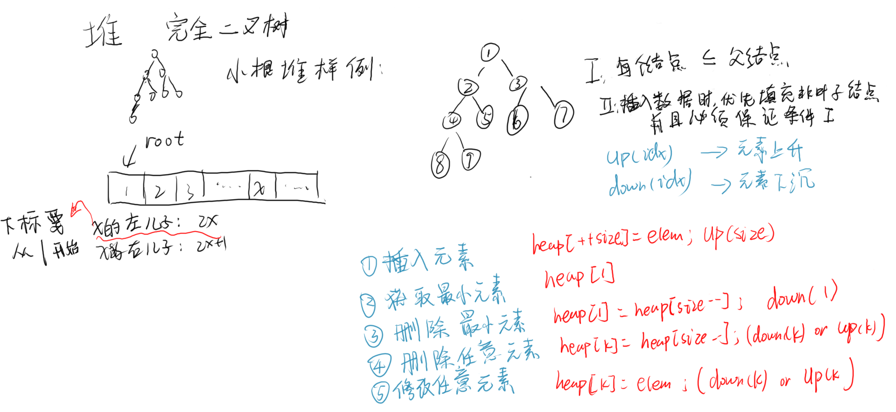

使用数组来表示堆，有下面的几个要点：

1. 堆实际的逻辑结构为完全二叉树，即除了叶子节点之外，每个节点要么满要么空。
2. 如果是小顶堆，则每个子树父节点的值必须大于所有子节点的值。
3. 底层存储结构为数组时，假设父节点的下标为`x`（必须从1开始算），则左子树的位置为`2x`，右子树的位置为`2x+1`。
4. 上图的down和up操作分别是，让节点往下沉和往上挪的操作。在插入或者删除节点的时候，可能会导致堆的平衡性被破坏，所以需要有平衡的过程。

```java
    public static class Heap {
        private final static int N = 10;
        private int[] h;
        // 指向了堆的最后一个元素
        private int size;

        public Heap(int[] h) {
            int n = h.length;
            this.h = new int[N];
            System.arraycopy(h, 0, this.h, 1, n);
            this.size = n - 1;
            for (int i = size / 2; i > 0; i--) {
                down(i);
            }
        }

        public Heap(int n) {
            // 下标从1开始，所以为 n + 1
            this.h = new int[n + 1];
            this.size = 0;
        }

        public void initFromArr(int[] h) {
            int n = h.length;
            this.size = n;
            for (int i = size / 2; i > 0; i--) {
                down(i);
            }
        }

        public void insert(int val) {
            if (size >= h.length) {
                return;
            }
            // 要先执行size=size+1，不然会覆盖有用的元素
            h[++size] = val;
            up(size);
        }

        private void down(int i) {
            // min是最小的节点的下标
            int min = i;
            // 如果左儿子比i小，则取左儿子
            if (i * 2 <= size && h[i * 2] < h[min]) {
                min = 2 * i;
            }
            // 如果右儿子比左儿子和i都要小，则取右儿子
            // min的含义就是取 左右儿子和当前节点 三个节点中的最小值
            if (i * 2 + 1 <= size && h[i * 2 + 1] < h[min]) {
                min = i * 2 + 1;
            }
            // 如果不是当前节点，说明左右儿子中必有一个比当前节点小
            if (min != i) {
                // 让小的元素往上走
                swap(h, min, i);
                // 大的元素继续往下沉
                down(min);
            }
        }

        private void up(int i) {
            // 父节点的下标都是 i/2
            // 如果 i 为左儿子节点，x = i/2
            // 如果 i 为右儿子节点，x = (i - 1)/2
            while (i / 2 > 0 && h[i / 2] > h[i]) {
                swap(h, i / 2, i);
                i /= 2;
            }
        }

        public int getSize() {
            return size;
        }

        public int getMin() {
            return h[1];
        }

        public void removeMin() {
            // 这里没有把size位置上的元素干掉
            // size指针已经不指向了原来的那个元素了，在插入的时候会直接覆盖原来的元素
            h[1] = h[size--];
            down(1);
        }

        public int popMin() {
            int res = getMin();
            removeMin();
            return res;
        }

        private static void swap(int[] nums, int i, int j) {
            int tmp = nums[i];
            nums[i] = nums[j];
            nums[j] = tmp;
        }
    }
```

# 滑动窗口

例题：给定一个数组arr和一个窗口，这个窗口在运动，求在这个窗口每次运动时，这个窗口的最大值。

解题思路：

维护一个双端队列，保持单调性，从大到小。

每次窗口移动时，如果是right指针移动，则把arr[right]给放入队列中，如果队列中有比arr[right]小的就pop。

如果left指针移动，看队首是否存放的left所在的下标。

```java
	public static int[] getMaxValInWindow(int[] arr, int w) {
        if (arr == null || arr.length < w) {
            return null;
        }
        // 从小->大
        Deque<Integer> deque = new ArrayDeque<>();
        int[] res = new int[arr.length - w + 1];
        int idx = 0;

        // right = i
        for (int i = 0; i < arr.length; i++) {

            while (!deque.isEmpty() && arr[deque.peekLast()] <= arr[i]) {
                deque.pollLast();
            }
            deque.addLast(i);
            if (deque.peekFirst() == i - w) {
                deque.pollFirst();
            }
            // 如果right >= 窗口长度了，就要统计最大值了
            if (i >= w - 1) {
                res[idx++] = arr[deque.peekFirst()];
            }
        }
        return res;
    }
```

# 动态规划

优化过程：

递归 -> 记忆化搜索 -> 画图 -> 自底向上的dp。

## 线性动态规划

### 背包问题

#### 01背包问题

对于有每个v都有选和不选两种选择，所以可以使用dfs来写。

但是**注意**！01背包问题，可能会出现**包未装满**的情况，所以需要看当前的下标是否超过了数组的长度，此时来判断包是否装满

<font color="red">**错误示例**</font>：

```java
	public static int dfs(int[] v, int[] w, int capacity, int cur, int curV) {
        // 在这里，没有考虑到，包未装满的情况
        if (curV > capacity || cur >= v.length) {
            return -1;
        }
        
        if (dp[cur][curV] != -2) {
            return dp[cur][curV];
        }
        
        if (curV == capacity) {
            dp[cur][curV] = 0;
        } else {
            int p1 = dfs(v, w, capacity, cur + 1, curV + v[cur]);
            int p2 = dfs(v, w, capacity, cur + 1, curV);
            if (p1 == -1){
                dp[cur][curV] = p2;
            } else if(p2 == -1) {
                dp[cur][curV] = p1 + w[cur];
            } else {
                dp[cur][curV] = Math.max(p1 + w[cur], p2);
            }
        }
        
        return dp[cur][curV];
    }
```

下面的才是<font color='green'>**正确示例**</font>：

```java
import java.util.*;

class Main{
    private static int[][] dp;
    public static void main(String[] args){
        Scanner sc = new Scanner(System.in);
        int n = sc.nextInt();
        int k = sc.nextInt();
        int[] v = new int[n];
        int[] w = new int[n];
        
        dp = new int[n + 1][k + 1];
        
        for(int[] d : dp) {
            Arrays.fill(d, -2);
        }
        
        for(int i = 0; i < n; i++){
            v[i] = sc.nextInt();
            w[i] = sc.nextInt();
        }
        System.out.println(dfs(v, w, k, 0, 0));
    }
    
    public static int dfs(int[] v, int[] w, int capacity, int cur, int curV) {
        // v: 6 5 5 2
        // w: 7 3 6 9
        // capacity: 10
        // 可能会出现包未装满的情况，但是此时的价值是最大的。
        if (cur >= v.length) {
            if (curV <= capacity) {
                dp[cur][curV] = 0;
                return 0;
            } else {
                return -1;
            }
        }
        if (curV > capacity) {
            return -1;
        }

        if (dp[cur][curV] != -2) {
            return dp[cur][curV];
        }

        if (curV == capacity) {
            dp[cur][curV] = 0;
        } else {
            int p1 = dfs(v, w, capacity, cur + 1, curV + v[cur]);
            int p2 = dfs(v, w, capacity, cur + 1, curV);
            if (p1 == -1 && p2 == -1) {
                dp[cur][curV] = -1;
            } else if (p1 == -1) {
                dp[cur][curV] = p2;
            } else if (p2 == -1) {
                dp[cur][curV] = p1 + w[cur];
            } else {
                dp[cur][curV] = Math.max(p1 + w[cur], p2);
            }
        }

        return dp[cur][curV];
    }
}
```

优化成dp表后的代码：

优化的步骤：先把base case位置上的数据填入表格，然后看递归函数的依赖关系。如上面的` p1`依赖于`dfs(cur+1, curV+v[cur])`的位置，所以优化成dp表的版本就是`dp[i][j] = max(dp[i + 1][j + v[i]] + w[i], ...)`，但是在优化时，需要注意边界问题。

```java
	public static void main(String[] args) throws IOException {
        BufferedReader br = new BufferedReader(new InputStreamReader(System.in));

        String[] ns = br.readLine().split(" ");
        int n = Integer.parseInt(ns[0]);
        int V = Integer.parseInt(ns[1]);

        int[] v = new int[n];
        int[] w = new int[n];

        dp = new int[n + 1][V + 1];

        for (int i = 0; i < n; i++) {
            String[] tmp = br.readLine().split(" ");
            v[i] = Integer.parseInt(tmp[0]);
            w[i] = Integer.parseInt(tmp[1]);
        }
		
        // 在递归的base case中，n - 1 和 V 的位置都填0，所以可以忽略初始化的步骤。
        // 自顶向下的循环遍历，要求的就是dp[0][0]（在递归函数参数为0和0）
        for (int i = n - 1; i >= 0; i--) {
            for (int j = V; j >= 0; j--) {
                if (j + v[i] > V) {
                    dp[i][j] = dp[i + 1][j];
                } else {
                    dp[i][j] = Math.max(dp[i + 1][j + v[i]] + w[i], dp[i + 1][j]);
                }
            }
        }
        System.out.println(dp[0][0]);
    }
```

#### 01完全背包问题

与01背包问题不同的是，每件物品都是无限的。和下面的[322. 零钱兑换](#322-零钱兑换)是一个类型的。

```java
import java.util.*;

class Main{
    private static int[][] dp;
    public static void main(String[] args){
        // 省略输入过程
        
        dp = new int[n + 1][V + 1];
        
        for(int[] d : dp) {
            Arrays.fill(d, -2);
        }
        
        System.out.println(dfs(v, w, V, 0, 0));
    }
    
    public static int dfs(int[] v, int[] w, int capacity, int cur, int curV) {
        // v: 6 5 5 2
        // w: 7 3 6 9
        // capacity: 10
        // 可能会出现包未装满的情况，但是此时的价值是最大的。
        if (cur >= v.length) {
            if (curV <= capacity) {
                dp[cur][curV] = 0;
                return 0;
            } else {
                return -1;
            }
        }
        if (curV > capacity) {
            return -1;
        }

        if (dp[cur][curV] != -2) {
            return dp[cur][curV];
        }

        if (curV == capacity) {
            dp[cur][curV] = 0;
        } else {
            // 这个地方不能+1，要首先尝试一直拿一个物品。
            int p1 = dfs(v, w, capacity, cur, curV + v[cur]);
            int p2 = dfs(v, w, capacity, cur + 1, curV);
            if (p1 == -1 && p2 == -1) {
                dp[cur][curV] = -1;
            } else if (p1 == -1) {
                dp[cur][curV] = p2;
            } else if (p2 == -1) {
                dp[cur][curV] = p1 + w[cur];
            } else {
                dp[cur][curV] = Math.max(p1 + w[cur], p2);
            }
        }

        return dp[cur][curV];
    }
}
```

严格表结构优化的代码：

```java

```

#### 多重背包问题

<font size="50">这题切记！！</font>因为我太菜了，一开始做本题的时候，没有意识到是三维dp，如果使用<font color='red'>递归非循环</font>要使用<font color='red'>三维</font>dp表，如果使用<font color='blue'>递归循环</font>则二维就够了。这个是因为如果使用二维的状态表的话，会导致缓存错误命中。

举个例子：

下面的数据：

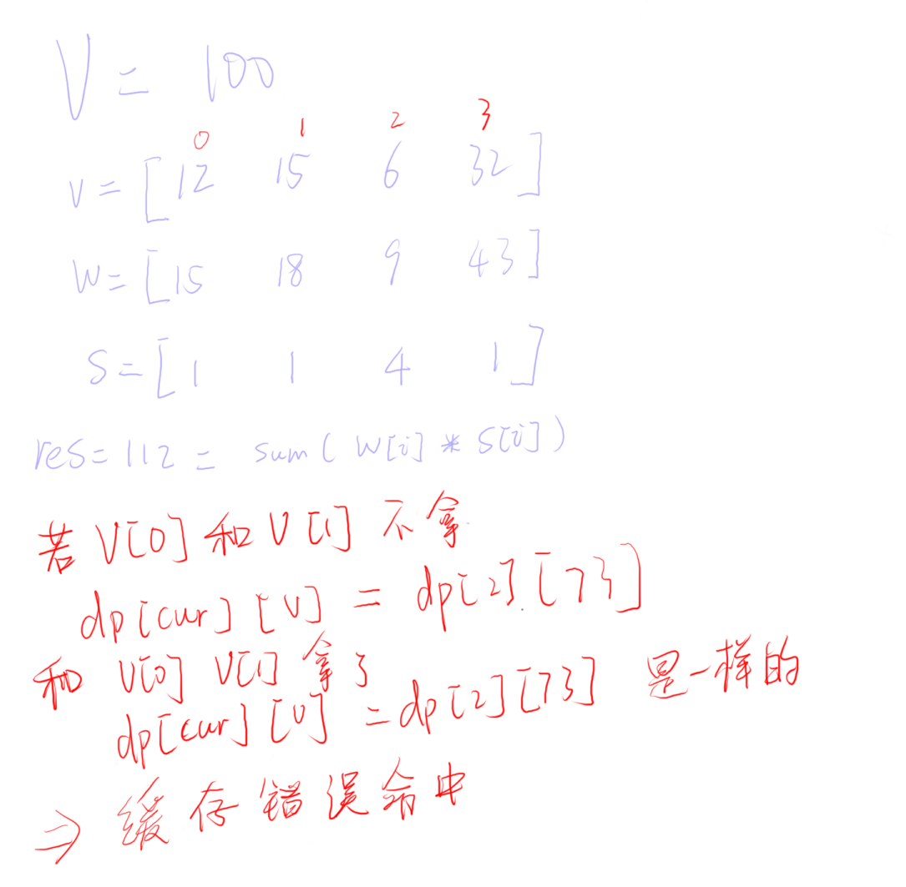

综上所述：

**需要添加一个额外的状态**，来表示当前的物品剩多少个。

<font color='red'>**错误**</font>答案 (截选核心代码片段):

```java
 	if (curV == V) {
            dp[cur][curV] = 0;
            return 0;
        }
        int res = 0;
        if (s[cur] > 0) {
            s[cur]--;
            int p1 = dfs(v, w, s, V, cur, curV + v[cur]);
            int p2 = dfs(v, w, s, V, cur + 1, curV);
            if (p1 == -1 && p2 == -1) {
                res = -1;
            } else if (p1 == -1) {
                res = p2;
            } else if (p2 == -1) {
                res = p1 + w[cur];
            } else {
                res = Math.max(p1 + w[cur], p2);
            }
            s[cur]++;
        } else {
            res = dfs(v, w, s, V, cur + 1, curV);
        }
        System.out.println(res);
        dp[cur][curV] = Math.max(res, dp[cur][curV]);
        return dp[cur][curV];
```

下面的才是<font color='green'>**正确**</font>的答案

```java
import java.util.*;

public class Main {
    private static int[][][] dp;

    public static void main(String[] args) {
        // 省略输入过程
        dp = new int[n + 1][V + 1][maxS + 1];
        for (int[][] d : dp) {
            for (int[] dd : d) {
                Arrays.fill(dd, -2);
            }
        }
        System.out.println(dfs(v, w, s, V, 0, 0));
    }


    public static int dfs(int[] v, int[] w, int[] s, int V, int cur, int curV) {
        if (cur >= v.length) {
            if (curV <= V) {
                return 0;
            } else {
                return -1;
            }
        }
        if (curV > V) {
            return -1;
        }

        if (dp[cur][curV][s[cur]] != -2) {
            return dp[cur][curV][s[cur]];
        }

        if (curV == V) {
            dp[cur][curV][s[cur]] = 0;
            return 0;
        }
        int res = 0;
        if (s[cur] > 0) {
            s[cur]--;
            int p1 = dfs(v, w, s, V, cur, curV + v[cur]);
            int p2 = dfs(v, w, s, V, cur + 1, curV);
            if (p1 == -1 && p2 == -1) {
                res = -1;
            } else if (p1 == -1) {
                res = p2;
            } else if (p2 == -1) {
                res = p1 + w[cur];
            } else {
                res = Math.max(p1 + w[cur], p2);
            }
            s[cur]++;
        } else {
            res = dfs(v, w, s, V, cur + 1, curV);
        }
        dp[cur][curV][s[cur]] = Math.max(res, dp[cur][curV][s[cur]]);
        return dp[cur][curV][s[cur]];
    }
}
```

也可以换成递归循环的方式：

```java
	public static int dfs(int[] v, int[] w, int[] s, int cur, int V) {
        if (cur >= v.length) {
            if (V >= 0) {
                dp[cur][V] = 0;
                return dp[cur][V];
            } else {
                return -1;
            }
        }

        if (V < 0) {
            return -1;
        }

        if (dp[cur][V] != -2) {
            return dp[cur][V];
        }

        if (V == 0) {
            dp[cur][V] = 0;
            return dp[cur][V];
        }

        int res = 0;
        for (int i = 0; i * v[cur] <= V && i <= s[cur]; i++) {
            int tmp = Math.max(dfs(v, w, s, cur + 1, V - i * v[cur]) + i * w[cur],
                    dfs(v, w, s, cur + 1, V));
            if (res < tmp) {
                res = tmp;
            }
        }
        dp[cur][V] = res;
        return dp[cur][V];
    }
```

## 动态规划压缩

# 单调队列

例题：给定一个滑动窗口和一个数组，每次滑动窗口都往右边移动1格，求每个滑动窗口中的最大值。leetcode：[239. 滑动窗口最大值](https://leetcode.cn/problems/sliding-window-maximum/)

解法：

维护一个单调队列，右指针在移动的时候，把元素的下标从后面入队，此时要维护单调性，如果当前元素下标入队会破坏单调性，则一直pop数据，直到单调性正确为止。

每次左边指针移动时，如果左边指针的下标是队首中的元素，则将队首的元素过期（pop()）掉，每次窗口移动时，都取队首元素作为当前窗口的最大值。

```java
class Solution {
    public int[] maxSlidingWindow(int[] nums, int w) {
        int n = nums.length;
        int idx = 0;
        // 比nums的长度少w-1个
        int[] res = new int[n - w + 1];
        Deque<Integer> queue = new ArrayDeque<>();
        for(int r = 0; r < n; r++) {
            // r在移动时，维持单调队列的单调性
            while(!queue.isEmpty() && nums[queue.peekLast()] <= nums[r]) {
                queue.pollLast();
            }

            queue.addLast(r);
            // 滑动窗口的左边界
            int l = r - w + 1;
            // 如果滑动窗口把队列的最大值给划过去了，就需要把队首元素给删除
            if (queue.peekFirst() == l - 1) {
                queue.pollFirst();
            }

            // 如果有滑动窗口了，就要取最大值了
            if (l >= 0) {
                res[idx++] = nums[queue.peekFirst()];
            }
        }

        return res;
    }
}
```

# 单调栈

例题：给定一个数组arr，求数组中每个元素的左边和右边的离该数字最近的最大的数。

解法：

维护一个栈，在遍历数组的时候，把数放进栈里面，不过要保证单调性。

```java
	public static int[][] getNearBiggerNoRepeat(int[] arr) {
        int[][] res = new int[arr.length][2];
        Stack<Integer> stack = new Stack<>();
        for (int i = 0; i < arr.length; i++) {
            // 如果栈里面的数比当前数要大，则需要pop栈中数据，把当前数据放入stack。
            while (!stack.isEmpty() && arr[stack.peek()] < arr[i]) {
                int popIndex = stack.pop();
                int leftLessIndex = stack.isEmpty() ? -1 : stack.peek();
                if (leftLessIndex != -1) {
                    res[popIndex][0] = arr[leftLessIndex];
                } else {
                    res[popIndex][0] = leftLessIndex;
                }
                res[popIndex][1] = arr[i];
            }
            stack.push(i);
        }
        while (!stack.isEmpty()) {
            int popIndex = stack.pop();
            int leftLessIndex = stack.isEmpty() ? -1 : stack.peek();
            if (leftLessIndex != -1) {
                res[popIndex][0] = arr[leftLessIndex];
            } else {
                res[popIndex][0] = leftLessIndex;
            }
            res[popIndex][1] = -1;
        }
        return res;
    }
```

# 差分数组

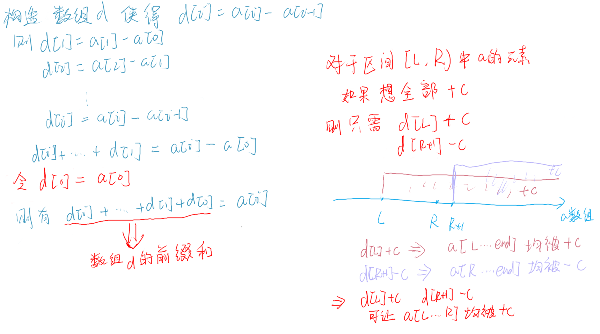

要修改在区间`[L...R]`内的数组中的所有的数，只需要让差分数组`d[L] + c` 以及 `d[R + 1] - c`即可。

## 例题

### [6158. 字母移位 II](https://leetcode.cn/problems/shifting-letters-ii/)

```java
class Solution {
    public String shiftingLetters(String s, int[][] shifts) {
        int n = s.length();
        // 差分的变化数组，并不直接求和得到原数组
        int[] d = new int[n + 1];

        for(int[] shift: shifts) {
            int start = shift[0], end = shift[1], dir = shift[2];
            if (dir == 0) {
                dir = -1;
            }
            d[start] += dir;
            d[end + 1] -= dir;
        }

        // 前缀和
        for(int i = 1; i < n; i++) {
            d[i] += d[i - 1];
        }

        StringBuilder sb = new StringBuilder();
        for(int i = 0; i < n; i++) {
            int c = s.charAt(i) - 'a';
            c = (c + d[i] % 26 + 26) % 26;
            sb.append((char) (c + 'a'));
        }
        return sb.toString();
    }
}
```

下面是传统的差分数组的写法，需要定义`d[0]`才能使用前缀和计算原数组。

```java
class Solution {
    public String shiftingLetters(String s, int[][] shifts) {
        int n = s.length();
        int[] d = new int[n + 1];

        // 传统的差分数组，第一项d[0] = s[0]
        d[0] = s.charAt(0) - 'a';
        for (int i = 1; i < n; i++) {
            d[i] = s.charAt(i) - s.charAt(i - 1);
        }

        for (int[] shift : shifts) {
            int start = shift[0], end = shift[1], dir = shift[2];
            if (dir == 0) {
                dir = -1;
            }
            d[start] += dir;
            d[end + 1] -= dir;
        }

        // 前缀和
        for (int i = 1; i < n; i++) {
            d[i] += d[i - 1];
        }

        StringBuilder sb = new StringBuilder();
        for (int i = 0; i < n; i++) {
            int x = ((d[i] % 26) + 26) % 26 + 'a';
            sb.append((char) x);
        }
        return sb.toString();
    }
}
```

### [1109. 航班预订统计](https://leetcode.cn/problems/corporate-flight-bookings/)

这题比较坑的是下标的问题。

```java
class Solution {
    public int[] corpFlightBookings(int[][] bookings, int n) {
        int[] res = new int[n];
        int[] d = new int[n + 2];
        for(int[] booking: bookings) {
            int s = booking[0], e = booking[1], se = booking[2];
            d[s] += se;
            d[e + 1] -= se;
        }

        // 这里要取到n
        for(int i = 1; i <= n; i++) {
            d[i] += d[i - 1];
        }

        for(int i = 0; i < n; i++) {
            res[i] = d[i + 1];
        }

        return res;
    }
}
```

# 双指针算法

## 例题：

### [6156. 得到 K 个黑块的最少涂色次数](https://leetcode.cn/problems/minimum-recolors-to-get-k-consecutive-black-blocks/)

```java
class Solution {
    public int minimumRecolors(String s, int k) {
        int n = s.length();
        int res = k;
        for(int i = 0, j = 0, cnt = 0; j < n; j++) {
            if (s.charAt(j) == 'W') {
                cnt++;
            }

            // 如果i滑出了滑动窗口，要维护cnt的大小
            if (i <= j - k) {
                if (s.charAt(i) == 'W') {
                    cnt--;
                }
                i++;
            }
            
            // 有窗口了，要开始维护res了
            if (j >= k - 1) {
                res = Math.min(res, cnt);
            }
        }
        return res;
    }
}
```

# 题目

## [221. 最大正方形](https://leetcode.cn/problems/maximal-square/)

dfs，正方形的长度取决于其上左斜上的最小的正方形的长度（木桶原理），答案就是所有的正方形的长度取最大值。

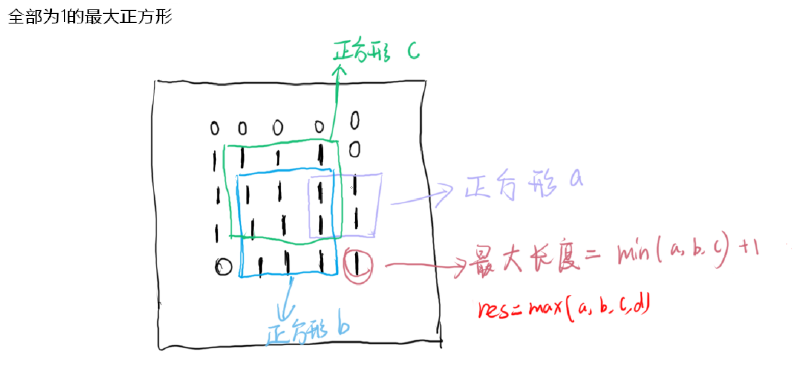


```java
class Solution {
    private int m;
    private int n;
    private int[][] dp;
    public int maximalSquare(char[][] matrix) {
        m = matrix.length;
        n = matrix[0].length;
        dp = new int[m + 1][n + 1];
        for(int[] d : dp) {
            Arrays.fill(d, -1);
        }
        int res = 0;
        for(int i = 0; i < m; i++) {
            for(int j = 0; j < n; j++) {
                if(matrix[i][j] == '1') {
                    int tmp = dfs(matrix, i, j);
                    res = Math.max(res, tmp);
                }
            }
        }
        return res * res;
    }

    public int dfs(char[][] matrix, int row, int col) {
        if(dp[row][col] != -1) {
            return dp[row][col];
        }
        
        if(row >= m || col >= n || matrix[row][col] != '1') {
            dp[row][col] = 0;
            return dp[row][col];
        }

        int a = dfs(matrix, row + 1, col);
        int b = dfs(matrix, row, col + 1);
        int c = dfs(matrix, row + 1, col + 1);
        if (matrix[row][col] == '1') {
            dp[row][col] = Math.min(a, Math.min(b, c)) + 1;
        }
        return dp[row][col];
    }
}
```


## [53. 最大子数组和](https://leetcode.cn/problems/maximum-subarray/)

dp问题：

子问题：找以下标为i结束的前面的最大子数组和

未优化的版本：

```java
class Solution {
    public int maxSubArray(int[] nums) {
        int res = Integer.MIN_VALUE;
        int n = nums.length;
        for(int i = 0; i < n; i++) {
            res = Math.max(res, getMax(nums, i));
        }
        
        return res;
    }


    public int getMax(int[] nums, int cur) {
        if (cur == nums.length) {
            return 0;
        }
        int nextMax = getMax(nums, cur + 1);
        // 如果后面的答案对当前的答案有增益，则加，否则不处理
        return nums[cur] + (nextMax > 0 ? nextMax: 0);
    }
}
```

严格表结构：

```java
class Solution {
    public int maxSubArray(int[] nums) {
        int res = Integer.MIN_VALUE;
        int n = nums.length;
        int[] dp = new int[n + 1];
        // base case为0，所以不用手动填写
        for(int i = n - 1; i >= 0; i--) {
            dp[i] = nums[i] + ( dp[i + 1] > 0 ? dp[i + 1] : 0);
            res = Math.max(res, dp[i]); 
        }
        
        return res;
    }
}
```

## [152. 乘积最大子数组](https://leetcode.cn/problems/maximum-product-subarray/)

dp问题：

递归解法：返回值维护一个最大值和最小值。每次都只有3种可能性，

1. `nums[cur]`最大 or 最小。
2. `nums[cur] * max`最大 or 最小
3. `nums[cur] * min` 最大 or 最小。

这样可以忽略正负号的影响，因为在计算最大值 or 最小值的时候，把三者都计算进去了。

```java
class Solution {
    public static class ReturnInfo {
        public int max;
        public int min;

        public ReturnInfo(int x, int i) {
            this.max = x;
            this.min = i;
        }
    }

    private ReturnInfo[] dp;

    public int maxProduct(int[] nums) {
        int res = Integer.MIN_VALUE;
        int n = nums.length;
        dp = new ReturnInfo[n + 1];
        for(int i = 0; i < n; i++) {
            int x = getMax(nums, i).max;
            res = Math.max(res, x);
        }
        
        return res;
    }

    public ReturnInfo getMax(int[] nums, int cur) {
        if (dp[cur] != null ) {
            return dp[cur];
        }

        // 返回1,1不影响结果
        if ( cur == nums.length) {
            dp[cur] = new ReturnInfo(1, 1);
            return dp[cur];
        }
        ReturnInfo nextReturn = getMax(nums, cur + 1);
        // 不用管正负，因为如果min为负数或者max为负数，在执行Math.min()和Math.max()都把这种可能性算进去了
        int max = Math.max(nums[cur], Math.max(nextReturn.max * nums[cur], nextReturn.min * nums[cur]));
        int min = Math.min(nums[cur], Math.min(nextReturn.max * nums[cur], nextReturn.min * nums[cur]));
        dp[cur] = new ReturnInfo(max, min);
        return dp[cur];
    }
}
```

严格表结构，效率和记忆化搜索差不多。

```java
class Solution {
    public static class ReturnInfo {
        public int max;
        public int min;

        public ReturnInfo(int x, int i) {
            this.max = x;
            this.min = i;
        }
    }

    private ReturnInfo[] dp;

    public int maxProduct(int[] nums) {
        int res = Integer.MIN_VALUE;
        int n = nums.length;
        dp = new ReturnInfo[n + 1];
        // base case
        dp[n] = new ReturnInfo(1, 1);
        for(int i = n - 1; i >= 0; i--) {
            ReturnInfo nextReturn = dp[i + 1];
            int max = Math.max(nums[i], Math.max(nextReturn.max * nums[i], nextReturn.min * nums[i]));
            int min = Math.min(nums[i], Math.min(nextReturn.max * nums[i], nextReturn.min * nums[i]));
            dp[i] = new ReturnInfo(max, min);
            res = Math.max(res, max);
        }
        
        return res;
    }
}
```

## [72. 编辑距离](https://leetcode.cn/problems/edit-distance/)

dp问题：

用两个指针指向字符串，那么就会有3种情况

1. 其中一个字符串结束了，那么编辑距离就是剩下的字符串的长度。
2. 两个字符串的指针指向的字符相同，那么编辑距离=dfs(i+1, j+1)
3. 如果不相同，则会出现编辑：插入、替换、删除。

插入可以理解成长的字符串删除了一个字符，所以和删除是一样的。

```java
class Solution {
    public int minDistance(String word1, String word2) {
        return dfs(word1, word2, 0, 0);
    }

    public int dfs(String word1, String word2, int i, int j) {
        
        // i的指针指向了word1的结尾，此时的编辑距离为word2剩下的长度
        if (i == word1.length()) {
            return word2.length() - j;
        }

        // 和上面的分支同理
        if(j == word2.length()) {
            return word1.length() - i;
        }

        // 如果两个字符串此时的字符相等，则往前推进
        if (word1.charAt(i) == word2.charAt(j)) {
            return dfs(word1, word2, i + 1, j + 1);
        }

        // 如果此时的两个字符不相等，则会发生编辑，编辑距离+1。有三种情况。
        return Math.min(
            // 替换
            dfs(word1, word2, i + 1, j + 1),
            Math.min(
                // 插入
                dfs(word1, word2, i + 1, j),
                // 删除
                dfs(word1, word2, i, j + 1)
            )
        ) + 1;
    }
}
```

记忆化搜索：

```java
class Solution {
    public int minDistance(String word1, String word2) {
        int[][] dp = new int[word1.length() + 1][word2.length() + 1];
        for(int[] d : dp) {
            Arrays.fill(d, -1);
        }

        return dfs(dp, word1, word2, 0, 0);
    }


    public int dfs(int[][] dp, String word1, String word2, int i, int j) {
        if(dp[i][j] != -1) {
            return dp[i][j];
        }
        
        // i的指针指向了word1的结尾，此时的编辑距离为word2剩下的长度
        if (i == word1.length()) {
            dp[i][j] = word2.length() - j;
            return dp[i][j];
        }

        // 和上面的分支同理
        if(j == word2.length()) {
            dp[i][j] =  word1.length() - i;
            return dp[i][j];
        }

        // 如果两个字符串此时的字符相等，则往前推进
        if (word1.charAt(i) == word2.charAt(j)) {
            dp[i][j] = dfs(dp, word1, word2, i + 1, j + 1);
            return dp[i][j];
        }

        // 如果此时的两个字符不相等，则会发生编辑，编辑距离+1。有三种情况。
        dp[i][j] = Math.min(
            // 替换
            dfs(dp, word1, word2, i + 1, j + 1),
            Math.min(
                // 插入
                dfs(dp, word1, word2, i + 1, j),
                // 删除
                dfs(dp, word1, word2, i, j + 1)
            )
        ) + 1;
        return dp[i][j];
    }
}
```

## [5. 最长回文子串](https://leetcode.cn/problems/longest-palindromic-substring/)

解法：

枚举每一个字字符串，看是否为回文串，如果为回文串，并且长度更长，则更新结果。

判断是否为回文串，用dp记录一下[i....j]是否已经计算过，如果计算过则返回，否则`f(i, j) = s[i] == s[j] && f(i + 1, j -1);`

```java
	public String longestPalindrome(String s) {
        int n = s.length();
        String res = "";
        Boolean[][] dp = new Boolean[n + 1][n + 1];

        for(int i = 0; i < n; i++) {
            for (int j = i; j < n; j++) {
                if (isPalindrome(dp, s, i, j) && j - i + 1 > res.length()) {
                    res = s.substring(i, j + 1);
                }
            }
        }
        return res;
    }

    public boolean isPalindrome(Boolean[][] dp, String s, int i, int j) {

        if (dp[i][j] != null) {
            return dp[i][j];
        }

        if (i == j) {
            dp[i][j] = true;
        } else if (i + 1 == j) {
            dp[i][j] = s.charAt(i) == s.charAt(j);
        } else {
            dp[i][j] = (s.charAt(i) == s.charAt(j) && isPalindrome(dp, s, i + 1, j - 1));
        }

        return dp[i][j];
    }
```

## [1143. 最长公共子序列](https://leetcode.cn/problems/longest-common-subsequence/)

dp问题，子问题就是 如果两个字符串s1 s2，s1[0] == s2[0]，可转换成s1[1:] 和 s2[1:]的最长公共子序列。

递归解法（未ac，超时）

```java
class Solution {
    public int longestCommonSubsequence(String text1, String text2) {
        return longestCommonSubsequence(text1, text2, 0, 0);
    }

    public int longestCommonSubsequence(String text1, String text2, int i, int j) {
        // base case
        if (i == text1.length() || j == text2.length()) {
            return 0;
        }
        if (text1.charAt(i) == text2.charAt(j)) {
            return longestCommonSubsequence(text1, text2, i + 1, j + 1) + 1;
        }
        return Math.max(longestCommonSubsequence(text1, text2, i + 1, j), longestCommonSubsequence(text1, text2, i, j + 1));
    }
}
```

记忆化搜索，（ac）

```java
class Solution {
    private int[][] dp;
    public int longestCommonSubsequence(String text1, String text2) {
        dp = new int[text1.length() + 1][text2.length() + 1];
        for(int[] d: dp) {
            Arrays.fill(d, -1);
        }
        return longestCommonSubsequence(text1, text2, 0, 0);
    }

    public int longestCommonSubsequence(String text1, String text2, int i, int j) {
        if(dp[i][j] != -1) {
            return dp[i][j];
        }
        if (i == text1.length() || j == text2.length()) {
            dp[i][j] = 0;
        } else if (text1.charAt(i) == text2.charAt(j)) {
            dp[i][j] = longestCommonSubsequence(text1, text2, i + 1, j + 1) + 1;
        } else {
            dp[i][j] = Math.max(longestCommonSubsequence(text1, text2, i + 1, j), longestCommonSubsequence(text1, text2, i, j + 1));
        }
        return dp[i][j];    
    }
}
```

严格表结构：

```java
class Solution {
    public int longestCommonSubsequence(String text1, String text2) {
        int n = text1.length();
        int m = text2.length();
        int[][] dp = new int[n+ 1][m + 1];
        for(int i = n - 1; i >= 0; i--) {
            for(int j = m - 1; j >= 0; j--) {
                if (text1.charAt(i) == text2.charAt(j)) {
                    dp[i][j] = dp[i + 1][j + 1] + 1;
                } else {
                    dp[i][j] = Math.max(dp[i + 1][j], dp[i][j + 1]);
                }
            }
        }

        return dp[0][0];
    }
}
```


## [45. 跳跃游戏 II](https://leetcode.cn/problems/jump-game-ii/)

dp问题：

先用dfs模拟跳跃。
```java
class Solution {
    public int jump(int[] nums) {
        int res = dfs(nums, 0);
        return res;
    }

    public int dfs(int[] nums, int curIdx) {

        if (curIdx >= nums.length - 1) {
            return 0;
        }

        int tmp = nums[curIdx];
        int res = Integer.MAX_VALUE;
        while (tmp > 0) {
            // 开始跳
            int r = dfs(nums, curIdx + (tmp--));
            if (r != -1) {
                res = Math.min(res, r + 1);
            }
        }
        // -1表示跳不到，在nums[curIdx] = 0时，是不可达的
        res = res == Integer.MAX_VALUE ? -1 : res;
        return res;
    }
}
```

记忆化搜索：

```java
class Solution {
    private int[] dp;
    public int jump(int[] nums) {
        dp = new int[nums.length + 1];
        Arrays.fill(dp, -2);
        int res = dfs(nums, 0);
        return res;
    }

    public int dfs(int[] nums, int curIdx) {
        if (curIdx >= nums.length) {
            return 0;
        }
        if (dp[curIdx] != -2) {
            return dp[curIdx];
        }

        if (curIdx == nums.length - 1) {
            dp[curIdx] = 0;
            return dp[curIdx];
        }

        int tmp = nums[curIdx];
        int res = Integer.MAX_VALUE;
        while (tmp > 0) {
            int r = dfs(nums, curIdx + (tmp--));
            if (r != -1) {
                res = Math.min(res, r + 1);
            }
        }
        dp[curIdx] = res == Integer.MAX_VALUE ? -1 : res;
        return dp[curIdx]; 
    }
}
```

优化成dp表的代码：

```java
class Solution {
    private int[] dp;
    public int jump(int[] nums) {
        int n = nums.length;
        // 是否为n+1影响不大
        dp = new int[n];
        
        // basecase 为 dp[n - 1] = 0
        // 所以下面的从n-2开始往下循环
        for(int i = n - 2; i >= 0; i--) {
            int tmp = nums[i];
            // 这里比较坑，不能使用Integer.MAX_VALUE，不然会溢出.....
            dp[i] = 1 << 31 -1;
            for(int j = 1; j <= tmp; j++ ) {
                if (i + j < n) {
                    dp[i] = Math.min(dp[i], dp[i + j] + 1);
                }
            }
        }
        return dp[0];
    }
}
```

## [3. 无重复字符的最长子串](https://leetcode.cn/problems/longest-substring-without-repeating-characters/)

解法：

使用滑动窗口，用哈希表来存放不同元素的最大的下标。

```java
class Solution {
    public int lengthOfLongestSubstring(String s) {
        // 左边界
        int l = 0;
        int n = s.length();
        int res = 0;
        Map<Character, Integer> window = new HashMap<>();
        for(int r = 0; r < n; r++) {
            // 如果包含了当前字符，说明有重复字符，需要移动左边界。
            if (window.containsKey(s.charAt(r))) {
                // 这里使用max的原因是：如果不使用，则在abba 的这种情况下，在r指针指向最后一个a的时候，l会往回挪。
                l = Math.max(l, window.get(s.charAt(r)) + 1);
            }
            window.put(s.charAt(r), r);
            res = Math.max(res, r - l + 1);
        }
        return res;
    }
}
```


## [11. 盛最多水的容器](https://leetcode.cn/problems/container-with-most-water/)

解法：

求i-j的的面积，有三种情况

1. i-j就是最大的
2. i+1,j中会有最大的
3. i,j - 1中会有最大的

优化前的：

```java
class Solution {
    public int maxArea(int[] height) {
        int n = height.length;
        int[][] dp = new int[n][n];
        for(int[] d: dp) {
            Arrays.fill(d, -1);
        }
        return f(dp, height, 0, n - 1);
    }

    // i 和 j之间的最大面积
    public int f(int[][] dp, int[] height, int i, int j) {
        if(dp[i][j] != -1) {
            return  dp[i][j];
        }

        // base case: j - i == 1 return min(height[i], height[j])
        if (j - i == 1) {
            dp[i][j] = Math.min(height[i], height[j]);
            return dp[i][j];
        }
        int s = (j - i) * Math.min(height[i], height[j]);
        dp[i][j] = Math.max(s, Math.max( f(dp, height, i + 1, j), f(dp, height, i, j - 1)));
        return dp[i][j];
    }
}
```

优化后的

```java
class Solution {
    public int maxArea(int[] height) {
        return f(height, 0, height.length - 1);
    }

    // i 和 j之间的最大面积
    public int f(int[] height, int i, int j) {
        // base case: j - i == 1 return min(height[i], height[j])
        if (j - i == 1) {
            return Math.min(height[i], height[j]);
        }
        int tmp;
        // 因为面积是按照最矮的一条边来算的，s=x*h. 面积是无论如何都不会超过h*x的，x为最短边，但是如果移动高的则可能会变得更小。
        if (height[i] < height[j]) {
            tmp = f(height, i + 1, j);
        } else {
            tmp = f(height, i, j - 1);
        }

        int s = (j - i) * Math.min(height[i], height[j]);
        return Math.max(s, tmp);
    }
}
```

## [42. 接雨水](https://leetcode.cn/problems/trapping-rain-water/)

解法：

维护一个单调栈，每次要破坏单调性的时候，计算接到的雨水。

在栈中，栈底的元素总是比栈顶要大（或者等于）的，所以当要破坏单调性的时候，就说明出现了凹槽。

在重新维护单调栈的时候，先把栈顶元素出栈，原来栈顶下面的元素为left，此时待入栈的元素height[i]。

计算雨水的时候，计算的方式是计算每一层的接到的雨水（每次pop元素的时候，都是计算该元素被两边夹住的高度差），高即为left和height[i]的最小值-刚出栈的元素的高度，宽度是pop的元素的两侧元素的下标差，并且需要减去待入栈的元素本身的宽度。

```java
class Solution {
    public int trap(int[] height) {
        int res = 0;
        Deque<Integer> stack = new ArrayDeque<>();
        for(int i = 0; i < height.length; i++) {
            // 遇到破坏单调性的元素，重新入栈了，此时应该计算能接到的水的数量
            while(!stack.isEmpty() && height[stack.peek()] < height[i]) {
                int top = stack.pop();
                // 栈中至少要有两个元素
                if(stack.isEmpty()) {
                    break;
                }
                int left = stack.peek();
                int curLen = i - left - 1;
                // 每次都是计算top被夹住的情况
                int curHeight = Math.min(height[i], height[left]) - height[top];

                res += curHeight * curLen;

            }
            stack.push(i);
        }

        return res;
    }
}
```

## [62. 不同路径](https://leetcode.cn/problems/unique-paths/)

同[11. 盛最多水的容器](#11-盛最多水的容器)，使用记忆化搜索。

可以一步一步的优化成自底向上的dp。

```java
class Solution {
    // 版本3
    public int uniquePaths(int m, int n) {
        int[][] dp = new int[n][m];
        for(int i = 0; i < m; i++ ) {
            dp[0][i] = 1;
        }

        for(int i = 0; i < n; i++) {
            dp[i][0] = 1;
        }

        for(int i = 1; i < n; i++) {
            for(int j = 1; j < m; j++) {
                dp[i][j] = dp[i - 1][j] + dp[i][j - 1];
            }
        }

        return dp[n - 1][m - 1];
    }
    
	// 版本2
    // public int uniquePaths(int m, int n) {
    //     int[][] dp = new int[n + 2][m + 2];
    //     for(int[] d: dp) {
    //         Arrays.fill(d, -1);
    //     }

    //     return dfs(dp, m, n, 1, 1);
    // }

    // public int dfs(int[][] dp,int m, int n, int x, int y) {
    //     if(dp[x][y] != -1) {
    //         return dp[x][y];
    //     }

    //     if (x > n || y > m) {
    //         dp[x][y] = 0;
    //     } else if (x == n && y == m) {
    //         dp[x][y] = 1;
    //     } else {
    //         dp[x][y] = dfs(dp, m, n, x + 1, y) + dfs(dp, m, n, x, y + 1);
    //     }

    //     return dp[x][y]; 
    // }
    
    // 版本1
	// public int uniquePaths(int m, int n) {
    //     return dfs(m, n, 1, 1);
    // }
    //
    // public int dfs(int m, int n, int x, int y) {
    //     if (x > n || y > m) {
    //         return 0;
    //     } else if (x == n && y == m) {
    //         return 1;
    //     }
    //
    //     return dfs(m, n, x + 1, y) + dfs(m, n, x, y + 1);
    // }
}
```

## [63. 不同路径 II](https://leetcode.cn/problems/unique-paths-ii/)

和[62. 不同路径](#62. 不同路径)一样，只不过加上了障碍物

```java
class Solution {
    public int uniquePathsWithObstacles(int[][] obstacleGrid) {
        int n = obstacleGrid[0].length;
        int m = obstacleGrid.length;
        int[][] dp = new int[n + 2][m + 2];

        for(int[] d: dp) {
            Arrays.fill(d, -1);
        }

        return dfs(dp, obstacleGrid, 1, 1);
    }


    public int dfs(int[][] dp, int[][] obstacleGrid,int x, int y) {
        if(dp[x][y] != -1) {
            return dp[x][y];
        }
        
        int n = obstacleGrid[0].length;
        int m = obstacleGrid.length;
        
        // 走不通，或者走过了
        if (x > n || y > m || obstacleGrid[y - 1][x - 1] == 1) {
            dp[x][y] = 0;
        } else if (x == n && y == m) {
			// 正好走到
            dp[x][y] = 1;
        } else {
            dp[x][y] = dfs(dp, obstacleGrid,x + 1, y) + dfs(dp, obstacleGrid, x, y + 1);
        }

        return dp[x][y];
    }
}
```


## [198. 打家劫舍](https://leetcode.cn/problems/house-robber/)

经典的dp问题：

子问题：选与不选当前的最大值。

优化前的递归：

```java
class Solution {
    public int rob(int[] nums) {
        return rob(nums, 0);
    }

    public int rob(int[] nums, int cur) {
        if (cur >= nums.length) {
            return 0;
        }

        // 选了当前的就不能选之后第2个的。
        // 在选不选当前的决策上，取最大的。
        return Math.max(rob(nums, cur + 2) + nums[cur], rob(nums, cur + 1));
    }
}
```

记忆化搜索：

```java
class Solution {
    public int rob(int[] nums) {
        int[] dp = new int[nums.length + 2];
        Arrays.fill(dp, -1);
        return rob(dp, nums, 0);
    }
    
    public int rob(int[] dp, int[] nums, int index) {
        if (dp[index] != -1) {
            return dp[index];
        }

        if (index >= nums.length) {
            dp[index] = 0;
        } else {
            dp[index] = Math.max(
                rob(dp, nums, index + 2) + nums[index],
                rob(dp, nums, index + 1));
        }
        return dp[index];
    }
}
```

严格表结构：

由上面的记忆化搜索改成严格表结构的时候，需要初始化

```java
class Solution {
    public int rob(int[] nums) {
        int n = nums.length;
        int[] dp = new int[n + 1];
        // 这里需要注意的是，下面的方程需要访问dp[i + 1]，但是在递归函数并不需要手动初始化，改成严格表结构需要初始化
        dp[n - 1] = nums[n - 1];
        for (int i = n - 2; i >= 0; i--) {
            dp[i] = Math.max(dp[i + 2] + nums[i], dp[i + 1]);
        }
        return dp[0];
    }
}
```

## [322. 零钱兑换](https://leetcode.cn/problems/coin-change/)

经典的dp问题，用二维的dp数组存放。

子问题：

min(选择当前钱币；不选择当前的钱币，选择下一个钱币)

如果选择了当前的钱币，则答案需要+1，表示选择了钱币。

```java
class Solution {
    private int[][] dp;
    public int coinChange(int[] coins, int amount) {
        dp = new int[amount + 1][coins.length + 1];
        for(int[] d: dp) {
            Arrays.fill(d, -2);
        }
        return coinChange(coins, amount, 0, 0);
    }

    public int coinChange(int[] coins, int amount, int sum, int index) {
        if (sum > amount || index >= coins.length || sum < 0) {
            return -1;
        }

        if(dp[sum][index] != -2) {
            return dp[sum][index];
        }
		
        // 这里返回0是表示basecase，需要退出了，如果是在求零钱兑换的方式，这里返回1表示一种兑换方式，但是在这里是求硬币个数
        // 所以不能在这里返回1，需要在调用递归函数的时候计算。
        if (sum == amount) {
            dp[sum][index] = 0;
        } else {
            // 选择当前的硬币，并且可以再次选择相同的硬币，所以p1需要+1
            int p1 = coinChange(coins, amount, sum + coins[index], index);
            // 不选当前硬币，选择新的硬币
            int p2 = coinChange(coins, amount, sum, index + 1);
            if (p1 == -1 && p2 == -1) {
                dp[sum][index] = -1;
            } else if (p1 == -1) {
                dp[sum][index] = p2;
            }else if(p2 == -1) {
                dp[sum][index] = p1 + 1;
            }else {
                dp[sum][index] = Math.min(p1 + 1, p2);
            }
        }
        return dp[sum][index];
    } 
}
```

## [32. 最长有效括号](https://leetcode.cn/problems/longest-valid-parentheses/)

解法：

暴力循环，判断每个字串是否有效括号，并且记录下最长的长度。（未ac，超时）

```java
class Solution {
    public int longestValidParentheses(String s) {
        int n = s.length();
        int res = 0;
        for(int i = 0; i < n; i++) {
            for(int j = i + 1; j < n; j++) {
                if(isValid(s, i, j)) {
                    res = Math.max(res, j - i + 1);
                }
            }
        }

        return res;
    }

    public boolean isValid(String s, int start, int end) {
        int balance = 0;
        for(int i = start; i <= end; i++) {
            if (s.charAt(i) == '(') {
                balance++;
            } else {
                balance--;
            }
            if (balance < 0) {
                return false;
            }
        }
        return balance == 0;
    }
}
```

暴力循环优化版：增加缓存（未ac，内存超了）

```java
class Solution {
    public int longestValidParentheses(String s) {
        int n = s.length();
        int res = 0;
        Boolean[][] dp = new Boolean[n + 1][n + 1];
        for(int i = 0; i < n; i++) {
            for(int j = i + 1; j < n; j++) {
                if(isValid(dp, s, i, j)) {
                    res = Math.max(res, j - i + 1);
                }
            }
        }

        return res;
    }

    public boolean isValid(Boolean[][] dp, String s, int start, int end) {
        if (dp[start][end] != null) {
            return dp[start][end];
        }
        int balance = 0;
        for(int i = start; i <= end; i++) {
            if (s.charAt(i) == '(') {
                balance++;
            } else {
                balance--;
            }
            if (balance < 0) {
                dp[start][end] = false;
                return dp[start][end];
            }
        }
        dp[start][end] = balance == 0;
        return dp[start][end];
    }
}
```

自底向上动态规划

放几个截图来说明这个问题：

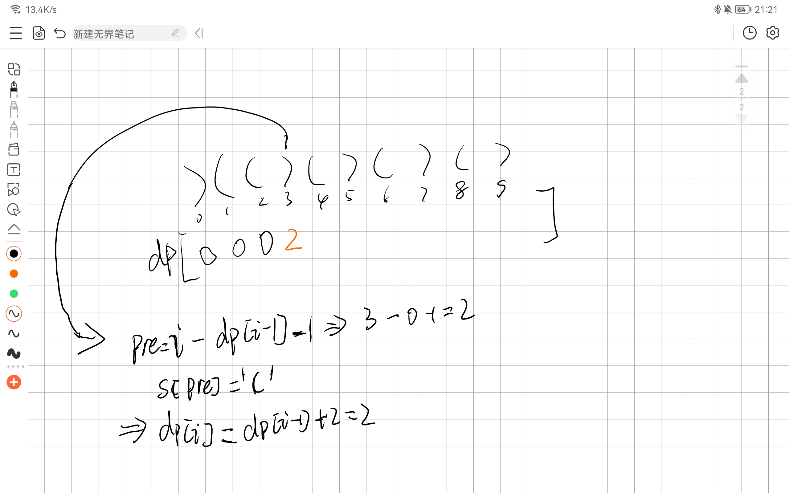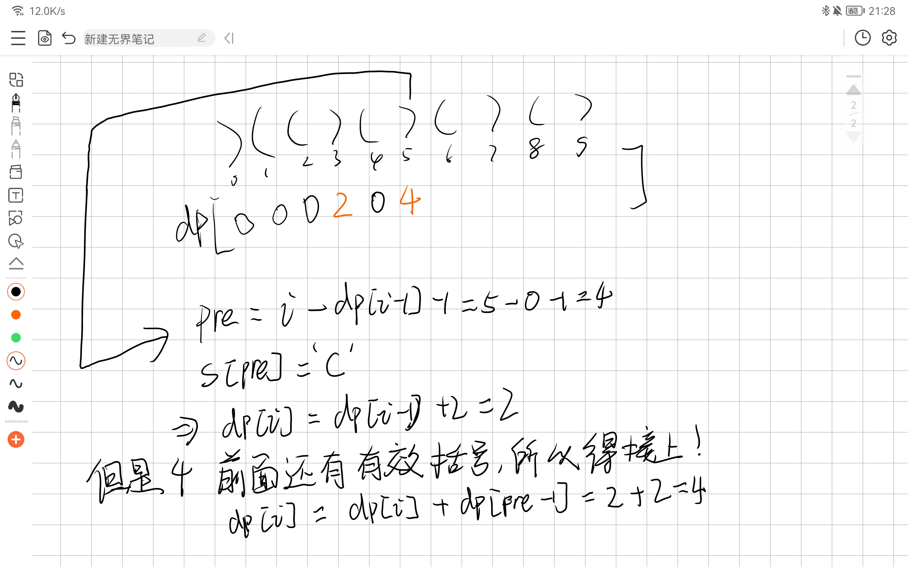

```java
class Solution {
    public int longestValidParentheses(String s) {
        int n = s.length();
        // dp[i]表示以`)`结尾的，前i个字符的最长有效括号的长度。
        // 如果在当前字符前 dp[i - 1] (前面一个以`)`结尾的最长有效括号长度)的字符前面一个字符为`(`，则dp[i] = dp[i - 1] + 2;
        // 如果跳到了前一个为`(`的字符串，前面的还有有效括号则需要接上一段
        int[] dp = new int[n + 1];
        int res = 0;
        for(int i = 1; i < n; i++) {
            if (s.charAt(i) == ')') {
                int pre = i - dp[i - 1] - 1;
                if( pre >= 0 && s.charAt(pre) == '(') {
                    dp[i] = dp[i - 1] + 2;
                    if (pre > 0) {
                        dp[i] += dp[pre - 1];
                    }
                }
                // 这里使用max是因为，最后一个字符可能是`(`，这样dp[i]为0，所以需要一个最大值存放答案
                res = Math.max(res, dp[i]);
            }
        }
        return res;
    }
}
```

## [剑指 Offer 46. 把数字翻译成字符串](https://leetcode.cn/problems/ba-shu-zi-fan-yi-cheng-zi-fu-chuan-lcof/)

两种解法：

子问题：max(开始选择一个字符翻译的结果数；开始选择2个字符的翻译结果数)。

但是在写代码的时候，需要注意的几个特例：

* 递归到了最后1个字符，则只能选择单字符翻译。
* 如果当前字符串为0，则必须单字符翻译，因为字符串如01，02，03等，是不能双字符翻译
* 如果当前字符和后面的字符合起来，在有效字符范围之外，如26、27等，只能选择单字符翻译。

一种解法是转换成字符串，递归。

```java
class Solution {
    public int translateNum(int num) {
        return translateNum(String.valueOf(num), 0);
    }

    public int translateNum(String s, int index) {
        int n = s.length();
        // base case 到头了，说明这种方式能行，返回1
        if (index == n) {
            return 1;
        }
        // 只剩最后一个字符，或者当前的字符为0，或者>=26 区间外边，后边的字符都是取一个
        if (index == n - 1 || s.charAt(index) == '0' || s.substring(index, index + 2).compareTo("26") >= 0) {
            return translateNum(s, index + 1);
        } else {
            return translateNum(s, index + 1) + translateNum(s, index + 2);
        }
    }
}
```

另一种比较高效，使用取模和除法巧妙递归。

```java
class Solution {
    public int translateNum(int num) {
        if (num == 0) {
            return 1;
        }
        // 最后两位是10- 26之间的，就可以用两种方法翻译。
        // 除法是为了取前1位（/100）或者前两位(/100)
        if (num%100 >= 10 && num%100 < 26) {
            return translateNum(num/10) + translateNum(num/100);
        // 否则就是一种翻译方式，并且取前1位
        } else {
            return translateNum(num/10);
        }
    }
}
```

## [91. 解码方法](https://leetcode.cn/problems/decode-ways/)

本题与上面一题的区别在于，本题的前导0不能和后面的数字一起计算。

dfs:

```java
class Solution {
    public int numDecodings(String s) {
        return dfs(s, 0);
    }

    public int dfs(String s, int curIdx) {
        int n = s.length();

        if (curIdx == n) {
            return 1;
        }
        
        // 与上面的一题区别在这里
        if (s.charAt(curIdx) == '0') {
            return 0;
        }

        if (curIdx == n - 1 || s.substring(curIdx, curIdx + 2).compareTo("27") >= 0) {
            return dfs(s, curIdx + 1);
        } else {
            return dfs(s, curIdx + 1) + dfs(s, curIdx + 2);
        }
    }
}
```

记忆化搜索：

```java
class Solution {
    int[] dp;
    public int numDecodings(String s) {
        dp = new int[s.length() + 1];
        Arrays.fill(dp, -1);
        return dfs(s, 0);
    }

    public int dfs(String s, int curIdx) {
        int n = s.length();
        if (dp[curIdx] != -1){
            return dp[curIdx];
        }

        if (curIdx == n) {
            dp[curIdx] = 1;
            return 1;
        }
		
        if (s.charAt(curIdx) == '0') {
            dp[curIdx] = 0;
            return 0;
        }

        if (curIdx == n - 1 || s.substring(curIdx, curIdx + 2).compareTo("27") >= 0) {
            dp[curIdx] = dfs(s, curIdx + 1);
        } else {
            dp[curIdx] = dfs(s, curIdx + 1) + dfs(s, curIdx + 2);
        }
        return dp[curIdx];
    }
}
```

## [300. 最长递增子序列(最长上升子序列)](https://leetcode.cn/problems/longest-increasing-subsequence/)

dp问题。

暴力递归：

把所有的最长上升子序列的长度都找出来，选择最大的那个。

本题需要注意的是，以`i`结尾的字符串的最长的上升子序列，不一定是答案，下面的例子说明了，答案是3（1, 9, 10 或者 1, 200, 300）但是以`2`结尾的上升子序列长度为2，显然不是答案。

```
1, 200, 300, 9, 10, 2
```

题目要求的潜在的意思是以**任意字符结尾**的最大长度，所以，需要把以数组中所有元素结尾的最长上升子序列的长度都求出来取最大值。

所以dp的子问题就是：

**找到前 `i`个字符中，以任意字符结尾的最大上升子序列**

所以才需要，遍历前`i`个字符，如果当前的`nums[i] > nums[j in {0, 1, ..., i - 1}]中任意一个`，都能从对应的 以`j`结尾的最大长度转移过来，长度加1。

`f[i] = max(f[i], f[j] + 1)`。

```java
class Solution {
    public int lengthOfLIS(int[] nums) {
        int max = 0;

       	// dfs 是找以 i 开始的最长上升子序列，注意，以i开始，并不一定就是最长的，所以需要再对所有的dfs结果取最大值
        for(int i = 0; i < nums.length; i++) {
            max = Math.max(max, lengthOfLIS(nums, i));
        }
        
        return max;
    }

    public int lengthOfLIS(int[] nums, int index) {
        int n = nums.length;
        // 遍历到了nums数组的结尾，退出函数
        if (index == n) {
            return 0;
        }

        // 上升子序列中已经有了nums[index]，所以长度为1
        int res = 1;
        // 从index+1开始算，可以少算一个
        for(int i = index + 1; i < n; i++) {
            if (nums[i] > nums[index]) {
                res = Math.max(res, lengthOfLIS(nums, i) + 1);
            }
        }
        return res;
    }
}
```

记忆化搜索：

```java
class Solution {
    public int lengthOfLIS(int[] nums) {
        int max = 0;
        int[] dp = new int[nums.length + 1];
        Arrays.fill(dp, -1);

        // dfs 是找以 i 开始的最长上升子序列，注意，以i开始，并不一定就是最长的，所以需要再对所有的dfs结果取最大值
        for(int i = 0; i < nums.length; i++) {
            max = Math.max(max, lengthOfLIS(dp, nums, i));
        }
        
        return max;
    }

    public int lengthOfLIS(int[] dp, int[] nums, int index) {
        int n = nums.length;
        if (dp[index] != -1) {
            return dp[index];
        }

        // 遍历到了nums数组的结尾，退出函数
        if (index == n) {
            dp[index] = 0;
            return dp[index];
        }

        // 上升子序列中已经有了nums[index]，所以长度为1
        int res = 1;
        // 从index+1开始算，可以少算一个
        for(int i = index + 1; i < n; i++) {
            if (nums[i] > nums[index]) {
                res = Math.max(res, lengthOfLIS(dp, nums, i) + 1);
            }
        }
        dp[index] = res;
        return dp[index];
    }
}
```

严格表结构

```java
class Solution {
    public int lengthOfLIS(int[] nums) {
        int n = nums.length;
        int[] f = new int[n];
        int res = 0;
        for(int i = 0; i < n; i++) {
            f[i] = 1;
            for(int j = 0; j < i; j++) {
                // 如果能加1，就加1，否则不变
                if (nums[i] > nums[j]) {
                    // 取前i个的最大值。
                    f[i] = Math.max(f[i], f[j] + 1);
                }
            }
            res = Math.max(res, f[i]);
        }
        return res;
    }
}
```

## [674. 最长连续递增序列](https://leetcode.cn/problems/longest-continuous-increasing-subsequence/)

滑动窗口和dp问题：

滑动窗口：

因为题目要求了连续，所以可以使用滑动窗口来进行解题：

```java
class Solution {
    public int findLengthOfLCIS(int[] nums) {
        int l = 0, r = 1;
        int res = 0;
        while(r <= nums.length) {
            
            while(r < nums.length && nums[r] > nums[r - 1]) {
                r++;
            }

            // 如果是遇到遍历数组结束了，就可以返回答案了
            if (r == nums.length) {
                res = Math.max(res, r - l);
                break;
            }
    
            // 是遇到了 nums[r] < nums[r - 1] 而结束的，窗口左边界应该收缩了
            if (nums[r] <= nums[r - 1]) {
                res = Math.max(res, r - l);
                l = r;
            }

            // 移动右边界
            r++;
        }

        return res;
    }
}
```

动态规划：

```java
class Solution {
    public int findLengthOfLCIS(int[] nums) {
        int n = nums.length;
        int[] dp = new int[n + 1];
        Arrays.fill(dp, 1);
        int res = dp[0];
        for(int i = 1; i < n; i++) {
            dp[i] = nums[i] > nums[i - 1] ? dp[i - 1] + 1 : dp[i];
            res = Math.max(dp[i], res);
        }
        return res;
    }
}
```

和最长上升子序列问题的不同之处在于，本问题只需要和上一个元素比对，而最长上升子序列，是要比对前面所有的比当前字符小的。

下面是以集合的角度来思考这两个问题的差异性。

最长上升子序列被划分成了多个集合，最长以i结尾的最长上升子序列可能包含`a[0]...a[i]` 

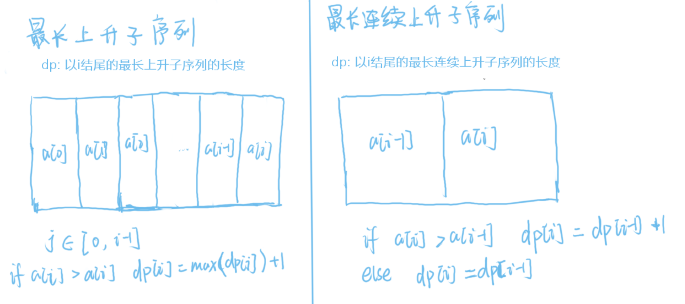


## 之字形打印矩阵

解法：固定两个点，一个点负责向下，一个点负责向右，每次都只打印两个点连起来的线。

```java
	public static void zigzagPrintMatrix(int[][] matrix) {
        // 点A往右边走
        int aRow = 0;
        int aCol = 0;
        // 点B往下边走
        int bRow = 0;
        int bCol = 0;
        int endRow = matrix.length;
        int endCol = matrix[0].length;
        boolean toDown = false;
        while (aRow != endRow) {
            printLevel(matrix, aRow, aCol, bRow, bCol, toDown);
            // 当a往右走，走到最后一列的时候，需要往下走
            aRow = aCol == endCol - 1 ? aRow + 1 : aRow;
            aCol = aCol == endCol - 1 ? aCol : aCol + 1;
            // 当b往下走，走到最后一行的时候，需要往右边走
            bCol = bRow == endRow - 1 ? bCol + 1 : bCol;
            bRow = bRow == endRow - 1 ? bRow : bRow + 1;
            toDown = !toDown;
        }
    }

    public static void printLevel(int[][] matrix, int aRow, int aCol, int bRow, int bCol, Boolean toDown) {
        if (toDown) {
            // 从上往下打印
            while (aRow <= bRow) {
                System.out.println(matrix[aRow++][aCol--]);
            }
        } else {
            // 从下网往打印
            while (bCol <= aCol) {
                System.out.println(matrix[bRow--][bCol++]);
            }
        }
    }
```

## 螺旋打印矩阵

与之字形打印矩阵一样，控制两个点从外往内移动，打印这两个点之间的轨迹就行。

```java
public static void spiralPrint(int[][] matrix) {
        int aRow = 0, aCol = 0;
        int bRow = matrix.length - 1, bCol = matrix[0].length - 1;

        while (aRow <= bRow && aCol <= bCol) {
            printCircle(matrix, aRow++, aCol++, bRow--, bCol--);
        }
    }

    public static void printCircle(int[][] matrix, int aRow, int aCol, int bRow, int bCol) {
        if (aRow == bRow) {
            for (int i = aCol; i <= bCol; i++) {
                System.out.printf("%d\t", matrix[aRow][i]);
            }
        } else if (aCol == bCol) {
            for (int i = aRow; i <= bRow; i++) {
                System.out.printf("%d\t", matrix[i][aCol]);
            }
        } else {
            int curRow = aRow, curCol = aCol;
            while (curCol < bCol) {
                System.out.printf("%d\t", matrix[curRow][curCol++]);
            }
            while (curRow < bRow) {
                System.out.printf("%d\t", matrix[curRow++][curCol]);
            }
            while (curCol > aCol) {
                System.out.printf("%d\t", matrix[curRow][curCol--]);
            }
            while (curRow > aRow) {
                System.out.printf("%d\t", matrix[curRow--][curCol]);
            }
        }
    }
```

## [155. 最小栈](https://leetcode.cn/problems/min-stack/)

解法：

维护两个栈，一个普通的栈，一个栈顶为最小值的栈，两个栈同进同出，在push值的时候，最小栈检查栈顶的值与push进来的值哪个最小，把最小值入栈（如果原来的元素就在栈内，也必须入栈，因为要保证和另一个栈同进同出）

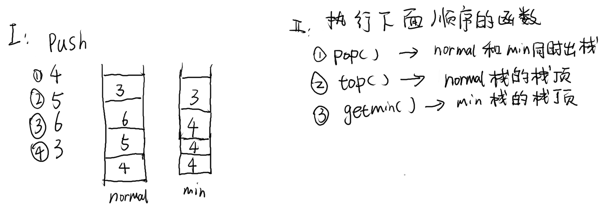

## [判断两个字符串是否互为旋转词](https://www.nowcoder.com/questionTerminal/687deda2cc57473499e058207f6258cf)

解法：

把母串复制一遍，拼在母串后面，看字串是否为拼接后的字符串的子串。

## 达标字符串

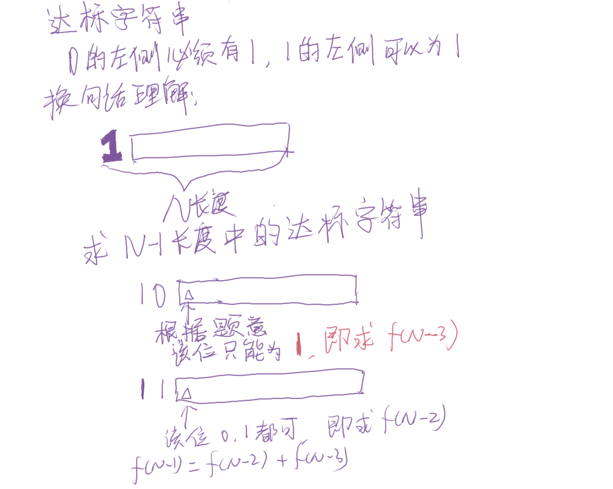

## [46. 全排列](https://leetcode.cn/problems/permutations/)

解法：

使用回溯。每次都交换两个数

```java
class Solution {
    private List<List<Integer>> res;
    private List<Integer> nums;
    private int n;
    
    public List<List<Integer>> permute(int[] nums) {
        this.n = nums.length;
        this.res = new ArrayList<>();
        List<Integer> clone = new ArrayList<>();

        for (int n : nums) {
            clone.add(n);
        }
        this.nums = clone;
        dfs(0);
        return res;
    }

    public void dfs(int cur) {
        if (cur >= n) {
            res.add(new ArrayList<>(nums));
            return;
        }

        for(int i = cur; i < n; i++) {
            Collections.swap(nums, cur, i);
            // cur + 1 不是 i + 1，因为cur表示当前搜索到了第几个数字
            // 如果使用i+1，中间必定会跳数字
            dfs(cur + 1);
            Collections.swap(nums, cur, i);
        }
    }
}
```

## [240. 搜索二维矩阵 II](https://leetcode.cn/problems/search-a-2d-matrix-ii/)

解法：

最开始在矩阵右上角，如果比目标数大，就往下搜，如果比目标数小，往左边搜，直到成功搜索到，否则说明矩阵中没有此元素。和[螺旋打印矩阵](#螺旋打印矩阵)类似，都是用有限几个点控制，而非关注细节。

```java
class Solution {
    public boolean searchMatrix(int[][] matrix, int target) {
        if (matrix == null || matrix.length == 0) {
            return false;
        }
        int r = 0, c = matrix[0].length - 1;
        int m = matrix.length;
        while(r < matrix.length && c >=0 ) {
            if (matrix[r][c] == target) {
                return true;
            } else if (r < m && matrix[r][c] < target) {
                r++;
            } else if (c >=0 && matrix[r][c] > target) {
                c--;
            }
        }
        return false;
    }
}
```

## [236. 二叉树的最近公共祖先](https://leetcode.cn/problems/lowest-common-ancestor-of-a-binary-tree/)

解法：

看左右子树是否包含给定的节点，如果左右子树都包含则说明root为给定节点的最近公共祖先，如果只有左子树或者右子树一边包含，则需要在右子树/左子树中重复上述步骤递归搜索。

```java
class Solution {
    public TreeNode lowestCommonAncestor(TreeNode root, TreeNode p, TreeNode q) {
        // 如果搜索到了就返回
        if (root == null || root.val == p.val || root.val == q.val) {
            return root;
        }
        TreeNode left = lowestCommonAncestor(root.left, p, q);
        TreeNode right = lowestCommonAncestor(root.right, p, q);
        if (left != null && right != null) {
            return root;
        }
        if (left != null ) {
            return left;
        }
        if (right != null) {
            return right;
        }
        // 没有公共节点
        return null;
    }
}
```

## [84. 柱状图中最大的矩形](https://leetcode.cn/problems/largest-rectangle-in-histogram/)

解法：

暴力（超时，未ac）：枚举每个矩形，计算最小值。

```java
class Solution {
    public int largestRectangleArea(int[] heights) {
        // brute force：遍历所有的，然后依次选择1个，2个....选出最大值
        int res = heights[0];
        for(int i = 0; i < heights.length; i++) {
            int min = heights[i];
            for(int j = i; j < heights.length; j++) {
                min = min > heights[j] ? heights[j] : min;
                res = Math.max(res, min * (j - i + 1));
            }
        }
        return res;
    }
}
```

双指针递归（和暴力一样，未ac）与[盛最多水的容器](#11. 盛最多水的容器)类似，但是不同的是，后者需要两根柱子才能形成一个矩形，但是本题单个柱子就能形成一个矩形。

子问题：如何找到一个最小的矩形。

1. 找到最小的柱子。
2. 以该柱子为中心，向两边扩展，计算最大值。
3. 拓展时递归的调用上面的步骤。

虽然没有ac，但是思想可以学习一下。

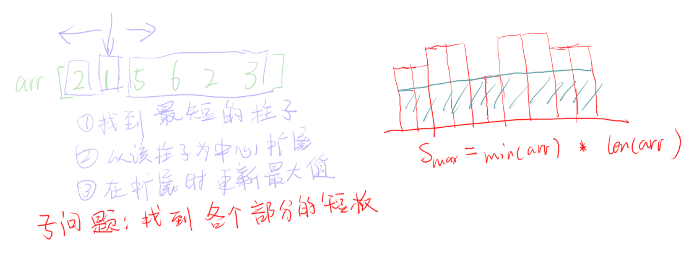

```java
class Solution {
    public int largestRectangleArea(int[] heights) {
        int n = heights.length;
        return rec(heights, 0, n - 1);
    }

    public int rec(int[] heights, int i, int j) {
        // base case：如果 i > j 说明需要退出了
        if (i > j ) {
            return 0;
        }
        int min = getMin(heights, i, j);
        int s = heights[min] * (j - i + 1);

        int left = rec(heights, i, min - 1);
        int right = rec(heights, min + 1, j);

        return Math.max(s, Math.max(left, right));
    }

    public int getMin(int[] heights, int s, int e) {
        int min = s;
        for(int i = s; i <= e; i++) {
            min = heights[i] < heights[min] ? i : min;
        }
        return min;
    }
}
```

## [1423. 可获得的最大点数](https://leetcode.cn/problems/maximum-points-you-can-obtain-from-cards/)

dp问题：

超时未ac。本题的数组长度量级在 `10^5` 级别，如果使用常规dfs或者常规dp(这里要用三维数组了)，会超时或者超内存。

```java
class Solution {
    public int maxScore(int[] cardPoints, int k) {
        return dfs(cardPoints, k, 0, cardPoints.length - 1);
    }

    public int dfs(int[] cardPoints, int k, int l, int r) {
        if (k <= 0) {
            return 0;
        }

        int p1 = dfs(cardPoints, k - 1, l + 1, r) + cardPoints[l];
        int p2 = dfs(cardPoints, k - 1, l, r - 1) + cardPoints[r];
        return Math.max(p1, p2);
    }
}
```

## [347. 前 K 个高频元素](https://leetcode.cn/problems/top-k-frequent-elements/)

时间复杂度要求`O(nlogn)`，所以考虑堆。

```java
class Solution {
    /**
    * 定义一个键值对 元素 和 频次；
    * 并且定义按照频次的大小排序的方法。
    */
    private static class Pair {
        public int ele;
        public int cnt;

        public Pair(int ele, int cnt) {
            this.ele = ele;
            this.cnt = cnt;
        }

        public boolean cmp(Pair other) {
            return this.cnt > other.cnt;
        }
    }

    /**
    * 大根堆
    */
    public static class Heap {
        private Pair[] h;
        private int tail;

        public Heap(int n) {
            // 下标从1开始，所以为n + 1;
            this.h = new Pair[n + 1];
            this.tail = 0;
        }

        public Pair popMax() {
            Pair res = h[1];
            h[1] = h[tail--];
            down(1);
            return res;
        }

        public void insert(Pair p) {
            if (tail >= h.length) {
                return;
            }
            // 先++是因为：
            // 1. tail初始指向了0位置
            // 2. 在pop的时候，有些数据不会删除，而是在insert的时候覆盖
            h[++tail] = p;
            up(tail);
        }

        public void down(int i) {
            int max = i;
            int leftIdx = getLeftIdx(i);
            int rightIdx = getRightIdx(i);
            if (leftIdx <= tail && h[leftIdx].cmp(h[max])) {
                max = leftIdx;
            }
            if (rightIdx <= tail && h[rightIdx].cmp(h[max])) {
                max = rightIdx;
            }

            if (max != i) {
                swap(h, max, i);
                down(max);
            }
        }

        public void up(int i) {
            int fa = i / 2;
            while (fa >= 1 && h[i].cmp(h[fa])) {
                swap(h, fa, i);
                i /= 2;
                fa = i / 2;
            }
        }

        private void swap(Pair[] nums, int i, int j) {
            Pair tmp = nums[i];
            nums[i] = nums[j];
            nums[j] = tmp;
        }

        private int getLeftIdx(int i) {
            return i * 2;
        }

        private int getRightIdx(int i) {
            return i * 2 + 1;
        }

        public int getSize() {
            return tail;
        }
    }

    public int[] topKFrequent(int[] nums, int k) {
        Heap heap = new Heap(nums.length);
        Map<Integer, Pair> map = new HashMap<>();
        for (int n : nums) {
            map.compute(n, (key, v) -> {
                if (v == null) {
                    v = new Pair(key, 1);
                } else {
                    v.cnt++;
                }
                return v;
            });
        }

        map.forEach((key, v) -> {
            heap.insert(v);
        });

        int[] res = new int[k];
        for (int i = 0; i < k; i++) {
            res[i] = heap.popMax().ele;
        }

        return res;
    }
}
```

## [105. 从前序与中序遍历序列构造二叉树](https://leetcode.cn/problems/construct-binary-tree-from-preorder-and-inorder-traversal/)

注意边界就行。

前序遍历 左子树的右端点为：前序start + 中序遍历头节点所在下标(i) - 中序start。
前序遍历 右子树的左端点为：上面求的+1。

```java
/**
 * Definition for a binary tree node.
 * public class TreeNode {
 *     int val;
 *     TreeNode left;
 *     TreeNode right;
 *     TreeNode() {}
 *     TreeNode(int val) { this.val = val; }
 *     TreeNode(int val, TreeNode left, TreeNode right) {
 *         this.val = val;
 *         this.left = left;
 *         this.right = right;
 *     }
 * }
 */
class Solution {
    public TreeNode buildTree(int[] preorder, int[] inorder) {
        return buildTree(preorder, 0, preorder.length - 1, inorder, 0, inorder.length - 1);
    }

    public TreeNode buildTree(int[] preorder, int ps, int pe, int[] inorder, int is, int ie) {
        if (is > ie || ps > pe) {
            return null;
        }

        TreeNode root = new TreeNode(preorder[ps]);
        for(int i = is; i <= ie; i++) {
            if (inorder[i] == preorder[ps] ) {
                root.left = buildTree(preorder, ps + 1, ps + i - is, inorder, is, i - 1);
                root.right = buildTree(preorder, ps + i - is + 1, pe, inorder, i + 1, ie);
            }
        }
        return root;
    }
}
```


## [128. 最长连续序列](https://leetcode.cn/problems/longest-consecutive-sequence/)

动态规划和并查集：

动态规划：

`dfs`表示暴力的搜索以`n`结尾的连续序列的最大长度。

取数组中每个元素的最大值就是答案。

```java
class Solution {
    private Set<Integer> set = new HashSet<>();
    private Map<Integer, Integer> dp;

    public int longestConsecutive(int[] nums) {
        if (nums == null || nums.length == 0) {
            return 0;
        }
        int n = nums.length;
        dp = new HashMap<>(n + 1);
        int res = 0;
        for(int i: nums) {
            set.add(i);
        }
        for(int i: nums) {
            res = Math.max(res, dfs(i));
        }
        
        return res;
    }

    private int dfs(int n) {
        if (dp.containsKey(n)) {
            return dp.get(n);
        }
        int len = 1;
        if (set.contains(n - 1)) {
            len += dfs(n - 1);
        }
        dp.put(n, len);
        return len;
    }
}
```

并查集：


## [435. 无重叠区间](https://leetcode.cn/problems/non-overlapping-intervals/)

本质还是[最长上升子序列问题](#300. 最长递增子序列(最长上升子序列))

本题可以看成从 给出的区间集合中，选出一个最大长度的区间集合。所以，`f[i]`表示以`i`结尾的最长区间集合长度。

那么就可以看成是最长上升子序列问题。

先按照左端点或者右端点排序，然后用最长上升子序列问题的方式，查看是否能选当前的区间

超时了

```java
class Solution {
    public int eraseOverlapIntervals(int[][] intervals) {
        Arrays.sort(intervals, Comparator.comparingInt((int[] a) -> a[0]));
        int n = intervals.length;
        int[] f = new int[n];
        int res = 0;
        for (int i = 0; i < n; i++) {
            f[i] = 1;
            for (int j = 0; j < i ; j++) {
                // 如果能选，就加一
                if (intervals[j][1] <= intervals[i][0]) {
                    f[i] = Math.max(f[i], f[j] + 1);
                }
            }
            res = Math.max(res, f[i]);
        }
        return n - res;
    }
}
```

## [662. 二叉树最大宽度](https://leetcode.cn/problems/maximum-width-of-binary-tree/)

bfs模板，由于null节点也需要算，所以可以看成一颗二叉完全树，`leftIndex = 2 * x`，`rigthIndex = 2 * x + 1`  `x`为父节点的下标，从1开始计算。

```java
class Solution {

    static class TreeNodeIndex {
        public int index;
        public TreeNode node;

        public TreeNodeIndex(int index, TreeNode node) {
            this.index = index;
            this.node = node;
        }
    }

    public int widthOfBinaryTree(TreeNode root) {
        return bfs(root);
    }

    public int bfs(TreeNode root) {
        if (root == null) {
            return 0;
        }

        int res = 0;
        Deque<TreeNodeIndex> queue = new ArrayDeque<>();
        queue.addFirst(new TreeNodeIndex(1, root));
        while (!queue.isEmpty()) {
            int size = queue.size();
            // 队列中存放的是一层，最后添加进来的节点就是一层中最大的节点，最先放进去的就是一层中最小的节点
            // 大节点的下标减去小的节点的下标，就是当前层的宽度。
            res = Math.max(res, queue.peekFirst().index - queue.peekLast().index + 1);
            while (size-- > 0) {
                TreeNodeIndex p = queue.pollLast();
                if (p.node.left != null) {
                    queue.addFirst(new TreeNodeIndex(p.index * 2, p.node.left));
                }
                if (p.node.right != null) {
                    queue.addFirst(new TreeNodeIndex(p.index * 2 + 1, p.node.right));
                }
            }
        }
        return res;
    }
}
```

## [51. N 皇后](https://leetcode.cn/problems/n-queens/)

回溯。

使用dfs搜索每行能放的位置。

dfs使用一个变量（row或者col）来搜索，然后在dfs函数中，循环判断另一个维度（如果dfs使用行来搜索，则需要循环判断这一行有没有列可以放）。

```java
class Solution {
    private List<List<String>> res = new ArrayList<>();

    public List<List<String>> solveNQueens(int n) {
        char[][] board = new char[n][n];
        for (int i= 0; i< board.length; i++ ) {
            Arrays.fill(board[i], '.');
        }
        dfs(board, 0);
        return res;
    }
    
    public void dfs(char[][] board, int row) {
        int n = board.length;

        // 搜索到了结尾，说明当前的方案可行
        if (row == n) {
            res.add(board2String(board));
            return;
        }

        for(int c = 0; c < n; c++) {
            if (check(board, row, c)) {
                board[row][c] = 'Q';
                dfs(board, row + 1);
                board[row][c] = '.';
            }
        }
    }

    public List<String> board2String(char[][] board) {
        List<String> t = new ArrayList<>();
        for (char[] chars : board) {
            StringBuilder str = new StringBuilder();
            for (int j = 0; j < board[0].length; j++) {
                str.append(chars[j]);
            }
             t.add(str.toString());
        }
        return t;
    }

    public boolean check(char[][] board, int row, int col){
        int n = board.length;
        
        //检查此列是否放置
        for(int i = 0; i < n; i++){
            if(board[i][col] == 'Q'){
                return false;
            }
        }

        //检查左上角
        for(int i = row, j = col; i >=0 && j >= 0; i--, j--){
            if (board[i][j] == 'Q'){
                return false;
            }
        }

        //检查右上角
        for(int i = row, j = col; i >=0 && j < n; i--, j++ ){
            if (board[i][j] == 'Q'){
                return false;
            }
        }

        return true;
    }
}
```

## [1035. 不相交的线](https://leetcode.cn/problems/uncrossed-lines/)

最长公共子序列问题。

只要子序列在两个数组中的相对顺序不变，那么形成的线就不会相交。

```java
class Solution {
    // 只要子序列相对两个源数组的相对顺序是一样的就能构成不相交的线
    public int maxUncrossedLines(int[] nums1, int[] nums2) {
        int n = nums1.length;
        int m = nums2.length;
        int[][] dp = new int[n+ 1][m + 1];
        for(int i = n - 1; i >= 0; i--) {
            for(int j = m - 1; j >= 0; j--) {
                if (nums1[i] == nums2[j]) {
                    dp[i][j] = dp[i + 1][j + 1] + 1;
                } else {
                    dp[i][j] = Math.max(dp[i + 1][j], dp[i][j + 1]);
                }
            }
        }

        return dp[0][0];
    }
	
    // lcs 的dfs写法，本写法超时了
    public int lcs(int[] nums1, int[] nums2, int i, int j) {
        if (i == nums1.length || j == nums2.length) {
            return 0;
        } 
        if (nums1[i] == nums2[j]) {
            return lcs(nums1, nums2, i + 1, j + 1) + 1;
        }
        return Math.max(lcs(nums1, nums2, i + 1, j), lcs(nums1, nums2, i, j + 1));
    }
}
```

## [6160. 和有限的最长子序列](https://leetcode.cn/problems/longest-subsequence-with-limited-sum/)

两种解法，但是这两种解法都建立在一个基础之上。答案与原数组的元素顺序没有关系。

要求 子序列的和小于等于某个数 的子序列最大长度，就是不断的取原数组的最小值，这样就能得到最大的子序列长度。因为，相同大小的目标数，子序列中的元素越小，所需要的子序列的长度就越大。所以才能不断的取最小值。

第一种解法：贪心+模拟

```java
class Solution {
    public int[] answerQueries(int[] nums, int[] queries) {
        int m = queries.length;
        int n = nums.length;
        int[] ans = new int[m];
        Arrays.sort(nums);
        for(int i = 0; i < m; i++) {
            int sum = 0, count = 0;
            for(int j = 0; j < n; j++) {
                sum += nums[j];
                if (sum > queries[i]) {
                    ans[i] = count;
                    break;
                } else {
                    count++;
                }
            }
            if (sum <= queries[i]) {
                ans[i] = count;
            }
        }
        return ans;
    }
}
```

第二种解法，前缀和+二分

```java
class Solution {
    public int[] answerQueries(int[] nums, int[] queries) {
        int m = queries.length;
        int n = nums.length;
        int[] ans = new int[m];
        Arrays.sort(nums);
        int[] sum = new int[n + 1];
        for(int i = 1; i <= n; i++) {
            sum[i] = nums[i - 1] + sum[i - 1];
        }

        for (int i = 0; i < m; i++) {
            ans[i] = midSearch(sum, 0, sum.length - 1, queries[i]);
        }

        return ans;
    }
	
    // 找到一个最大的小于 等于 x的数
    public int midSearch(int[] nums, int l, int r, int x) {
        while (l < r) {
            // r = mid - 1 所以 mid 这边的r要+1
            int mid = l + (r + 1) >> 1;
            if (nums[mid] <= x) {
                l = mid;
            } else {
                r = mid - 1;
            }
        }
        return l;
    }
}
```


## [735. 行星碰撞](https://leetcode.cn/problems/asteroid-collision/)

解法：

栈模拟。使用一个是否存活的标记来判断**当前行星**是否能入栈，如果当前行星 < 0 说明可能产生碰撞，看栈顶元素与当前行星的绝对值大小，如果当前行星比较大，则栈顶元素爆炸，如果栈顶元素较大或者与当前行星相等，则栈顶元素爆炸，从栈中移除该元素。

```java
class Solution {
    public int[] asteroidCollision(int[] asteroids) {
        Deque<Integer> stack = new ArrayDeque<>();
        int n = asteroids.length;
        for(int i = 0; i < n; i++) {
            // 当前行星是否存活
            boolean alive = true;
            // 如果小于0，就判断
            if (asteroids[i] < 0) {
                while (alive && !stack.isEmpty() && stack.peekLast() > 0) {
                    // 如果当前的行星小于栈顶元素，说明当前行星应该要爆炸 alive = false
                    alive = stack.peekLast() < -asteroids[i];
                    // 栈顶行星爆炸，当前的行星应该被添加到栈中 alive = true
                    if (stack.peekLast() <= -asteroids[i]) {
                        stack.pollLast();
                    }
                }
            }
            if (alive) {
                stack.addLast(asteroids[i]);
            }
        }

        int[] res = new int[stack.size()];
        int i = 0;
        while(!stack.isEmpty()) {
            res[i++] = stack.pollFirst();
        }
        return res;
    }
}
```

## [226. 翻转二叉树](https://leetcode.cn/problems/invert-binary-tree/)

```java
class Solution {
    public TreeNode invertTree(TreeNode root) {
        if (root == null) {
            return null;
        }
        TreeNode tmp = root.left;
        root.left = root.right;
        root.right = tmp;
        root.left = invertTree(root.left);
        root.right = invertTree(root.right);
        return root;
    }
}
```

## [1223. 掷骰子模拟](https://leetcode.cn/problems/dice-roll-simulation/)

在进行搜索的时候，需要：

* 当前是第几个骰子:  `curIdx`。
* 前一次摇出来的数是多少: `preNum`。
* 前一次摇出来的数到目前位置摇了多少次: `t`。

并且对于每个骰子，都有机会摇出 6 个面的数，退出的base case为把所有的骰子都摇了一遍：`curIdx == n`。

感觉和多重背包问题还是比较相似的。

```java
class Solution {
    private int[] rollMax;
    private int n;

    public int dieSimulator(int n, int[] rollMax) {
        this.rollMax = rollMax;
        this.n = n;
        return dfs(0, 0, 0);
    }

    public int dfs(int preNum, int curIdx, int t) {
        if (curIdx == n) {
            return 1;
        }
        
        int res = 0;
        for(int i = 0; i < 6; i++) {
            // 如果和之前摇的数一样，看看最大能摇多少个
            // 如果还能摇之前的数，就摇之前的数
            // 摇不了的话就只能摇下一个数了
            if (i == preNum) {
                if (t < rollMax[i]) {
                    res += dfs(preNum, curIdx + 1, t + 1);
                }
            } else {
                // 如果和之前的数不一样，就摇当前的数
                // 因为连续摇出相同的数字才要算roll的次数，所以要重置次数为1
                res += dfs(i, curIdx + 1, 1);
            }
        }
        return res;
    }
}
```

记忆化搜索：

```java
class Solution {
    private int[] rollMax;
    private int n;
    private final static int MOD = (int) 1e9 + 7;
    private int[][][] dp;

    public int dieSimulator(int n, int[] rollMax) {
        this.rollMax = rollMax;
        this.n = n;
        int maxRoll = 15;
        int maxNum = 6;

        dp = new int[maxNum + 1][n + 1][maxRoll + 1];
        for(int[][] dd: dp) {
            for(int[] d: dd) {
                Arrays.fill(d, -1);
            }
        }

        return dfs(0, 0, 0);
    }

    public int dfs(int preNum, int curIdx, int t) {
        if (dp[preNum][curIdx][t] != -1) {
            return dp[preNum][curIdx][t];
        }

        if (curIdx == n) {
            dp[preNum][curIdx][t] = 1;
            return 1;
        }
        
        int res = 0;
        for(int i = 0; i < 6; i++) {
            // 如果和之前摇的数一样，看看最大能摇多少个
            // 如果还能摇之前的数，就摇之前的数
            // 摇不了的话就只能摇下一个数了
            if (i == preNum) {
                if (t < rollMax[i]) {
                    res += dfs(preNum, curIdx + 1, t + 1);
                }
            } else {
                // 如果和之前的数不一样，就摇当前的数
                // 因为连续摇出相同的数字才要算roll的次数，所以要重置次数为1
                res += dfs(i, curIdx + 1, 1);
            }
            res %= MOD;
        }
        dp[preNum][curIdx][t] = res;
        return res;
    }
}
```

## [946. 验证栈序列](https://leetcode.cn/problems/validate-stack-sequences/)

将`pushed`中的元素入栈，并且维护一个指针指向`poped`，遍历`pushed`数组，每次把`pushed`数组中的元素入栈之后，都取当前的栈顶和当前的`poped`数组中的元素比对，如果相同，就`pop`，如果不同就不管，最后看栈是否为空。

```java
class Solution {
    public boolean validateStackSequences(int[] pushed, int[] popped) {
        Deque<Integer> stack = new ArrayDeque<>();
        int idx = 0;
        for(int p: pushed) {
            stack.push(p);
            while(!stack.isEmpty() && stack.peek() == popped[idx]) {
                stack.pop();
                idx++;
            }
        }
        return stack.isEmpty();
    }
}
```

## [122. 买卖股票的最佳时机 II](https://leetcode.cn/problems/best-time-to-buy-and-sell-stock-ii/)

每天有三种选择：

1. 买入。买入的前提是手头没股票，`isHold` 为 false.
2. 卖出。卖出的前提是手头有股票，`isHold`为tue.
3. 什么都不做。什么都不做就把当前手里的状态往下传递。

dfs：（暴力未ac）

```java
class Solution {
    private int[] prices;
    public int maxProfit(int[] prices) {
        this.prices = prices;
        return dfs(0, false);
    }

    public int dfs(int cur, boolean isHold) {
        if (cur == prices.length) {
            return 0;
        }
        int res = 0;
        if (isHold) {
            res = Math.max(res, dfs(cur + 1, !isHold) + prices[cur]);
        } else {
            res = Math.max(res, dfs(cur + 1, !isHold) - prices[cur]);
        }
        res = Math.max(res, dfs(cur + 1, isHold));
        return res;
    }
}
```

## [329. 矩阵中的最长递增路径](https://leetcode.cn/problems/longest-increasing-path-in-a-matrix/)

dfs，上下左右取最大值+本身的1。

```java
class Solution {
    private int[][] matrix;
    private int[][] dp;
    private int n;
    private int m;
    
    public int longestIncreasingPath(int[][] matrix) {
        this.matrix = matrix;
        this.n = matrix[0].length;
        this.m = matrix.length;
        dp = new int[m + 1][n + 1];
        int res = 0;
        for(int i = 0; i < m; i++) {
            for(int j = 0; j < n; j++) {
                res = max(res, dfs(i, j, -1));
            }
        }
        return res;
    }

    public int dfs(int row, int col, int preValue) {
        if (col >= n || row >= m || row < 0 || col < 0 || matrix[row][col] <= preValue) {
            return 0;
        }
        if (dp[row][col] != 0) {
            return dp[row][col];
        }

        int cur = matrix[row][col];
        int up = dfs(row - 1, col, cur);
        int down = dfs(row + 1, col, cur);
        int left = dfs(row, col - 1, cur);
        int right = dfs(row, col + 1, cur);

        dp[row][col] = max(up, down, left, right) + 1;
        return dp[row][col];
    }

    private int max(Integer... nums) {
        int max = nums[0];
        for(int i: nums) {
            max = Math.max(max, i);
        }
        return max;
    }
}
```

## [673. 最长递增子序列的个数](https://leetcode.cn/problems/number-of-longest-increasing-subsequence/)

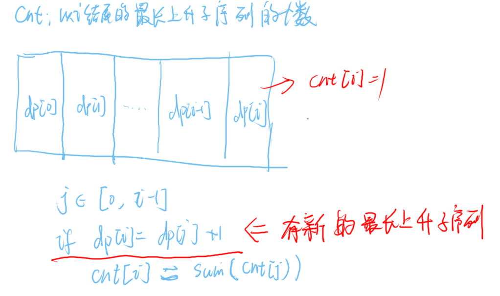

```java
class Solution {
    public int findNumberOfLIS(int[] nums) {
        int n = nums.length;
        int[] dp = new int[n + 1];
        int[] cnt = new int[n + 1];

        int ans = 0;
        for(int i = 0; i < n; i++ ) {
            dp[i] = 1;
            cnt[i] = 1;
            for(int j = 0; j < i; j++ ) {
                if (nums[i] > nums[j]) {
                    if (dp[i] < dp[j] + 1) {
                        dp[i] = dp[j] + 1;
                        cnt[i] = cnt[j];
                    } else if (dp[i] == dp[j] + 1) {
                        // 如果 dp[i] = dp[j] + 1 表示，有新的长度(cnt)了
                        cnt[i] += cnt[j];
                    }
                }
            }
            ans = Math.max(ans, dp[i]);
        }

        int res = 0;
        for(int i = 0; i < n; i++) {
            if (dp[i] == ans) {
                res += cnt[i];
            }
        }
        return res;
    }
}
```

## [6173. 被列覆盖的最多行数](https://leetcode.cn/problems/maximum-rows-covered-by-columns/)

把不同的col组合选出来，枚举每个组合，计算当前覆盖的行数，取最大行。

选不同col组合的过程与 [46. 全排列](#46. 全排列)类似。

```java
class Solution {
    private List<List<Integer>> paths;
    private int m;
    private int n;
    private int res = Integer.MIN_VALUE;
    
    public int maximumRows(int[][] mat, int cols) {
        this.m = mat.length;
        this.n = mat[0].length;
        this.paths = new ArrayList<>();
        dfs(0, cols, new ArrayList<>());

        int ans = 0;
        // 从 已有的col组合中选择覆盖的行数最大的。
        for (List<Integer> path : paths){
            int row = 0;
            for (int i = 0; i < m; ++i){
                boolean flag = true;
                for (int j = 0; j < n; ++j){
                    if (mat[i][j] == 1 && !path.contains(j)){
                        flag = false;
                        break;
                    }
                } 
                if (flag) ++row;
            }
            ans = Math.max(ans, row);
        }
        return ans;
    }
	
    
    // 把所有的col选择出来
    public void dfs(int curCol, int cols, List<Integer> path) {
        if (path.size() == cols) {
            paths.add(new ArrayList<>(path));
            return;
        }
		
        // 从当前的col下一个开始选
        for(int i = curCol; i < n; i++) {
            path.add(i);
            dfs(i + 1, cols, path);
            path.remove(path.size() - 1);
        }
    }
}
```

## [297. 二叉树的序列化与反序列化](https://leetcode.cn/problems/serialize-and-deserialize-binary-tree/)

### 层序遍历解法

层序遍历的序列化没什么要说的，使用普通的层序遍历就能构造出

>  [1,2,null,null,4,5]

这种形式。

反序列化最重要的一个点是，构造出了一个节点依然需要将这个节点放入队列中，和层序遍历一样取出迭代。

```java
public class Codec {
    public String serialize(TreeNode root) {
        Deque<TreeNode> q = new LinkedList<>();
        q.addFirst(root);
        List<Object> l = new ArrayList<>();
        while(!q.isEmpty()) {
            int size = q.size();
            while(size > 0) {
                TreeNode r = q.pollLast();
                if (r == null) {
                    l.add("null");
                } else {
                    l.add(r.val);
                    q.addFirst(r.left);
                    q.addFirst(r.right);
                }
                size--;
            }
        }
        StringBuilder sb = new StringBuilder();
        for(int i = 0; i < l.size(); i++) {
            sb.append(l.get(i));
            if (i < l.size() - 1) {
                sb.append(',');
            }
        }
        return sb.toString();
    }

    public TreeNode deserialize(String data) {
        String[] elems = data.split(",");
        Deque<TreeNode> q = new ArrayDeque<>();
        int idx = 0;
        if ("null".equals(elems[idx])){
            return null;
        }
        TreeNode root = new TreeNode(parse(elems[idx++]));
        q.addFirst(root);
        while (!q.isEmpty()) {
            int size = q.size();
            while (size > 0) {
                TreeNode r = q.pollLast();
                if (!("null".equals(elems[idx]))) {
                    r.left = new TreeNode(parse(elems[idx]));
                    q.addFirst(r.left);
                }
                // null节点跳过，left 和 right 默认值为null
                idx++;
                if (!("null".equals(elems[idx]))) {
                    r.right = new TreeNode(parse(elems[idx]));
                    q.addFirst(r.right);
                }
                idx++;
                size--;
            }
        }
        return root;
    }

    private int parse(String s) {
        return Integer.parseInt(s);
    }
}
```

### 前序遍历解法

前序遍历解法需要注意的是：

1. 在反序列化的时候，需要使用一个全局的idx指针指向elems数组。
2. 序列化的时候，使用前序遍历的递归方式，拼接结果就行。

```java
public class Codec {
    private int dCur = 0;

    // Encodes a tree to a single string.
    public String serialize(TreeNode root) {
        if (root == null) {
            return "null";
        }
        return root.val + "," + serialize(root.left) + "," + serialize(root.right);
    }

    // Decodes your encoded data to tree.
    public TreeNode deserialize(String data) {
        TreeNode root = deserialize(data.split(","));
        dCur = 0;
        return root;
    }

    public TreeNode deserialize(String[] elems) {
        if (dCur >= elems.length ) {
            return null;
        }
        if ("null".equals(elems[dCur])) {
            dCur++;
            return null;
        }
        TreeNode root = new TreeNode(Integer.parseInt(elems[dCur++]));
        root.left = deserialize(elems);
        root.right = deserialize(elems);
        return root;
    }
}
```

## [652. 寻找重复的子树](https://leetcode.cn/problems/find-duplicate-subtrees/)

前序遍历序列化二叉树，在序列化的过程中，将同一样的子树添加进结果中。

由于规定了序列化的模式，所以不会出现，左右子树的顺序反着的问题。

```java
class Solution {
    private Map<String, Integer> m = new HashMap<>();
    private List<TreeNode> res = new ArrayList<>();

    public List<TreeNode> findDuplicateSubtrees(TreeNode root) {
        serialize(root);
        return res;
    }

    public String serialize(TreeNode root) {
        if (root == null) {
            return "null";
        }
        String s = root.val + "," + serialize(root.left) + "," + serialize(root.right);
        int cnt = m.getOrDefault(s, 0);
        m.put(s, cnt + 1);
        if (m.get(s) == 2) {
            res.add(root);
        }
        return s;
    }
}
```

## [77. 组合](https://leetcode.cn/problems/combinations/)

解法：回溯，与排列类似，但是排列的`curIdx`为`curIdx + 1`，这个需要具体问题具体分析。

```java
class Solution {
    private List<List<Integer>> res = new ArrayList<>();
    public List<List<Integer>> combine(int n, int k) {
        int[] nums = new int[n];
        for(int i = 0; i < n; i++) {
            nums[i] = i + 1;
        }
        combine(nums, k, 0, new ArrayList<>());
        return res;
    }

    public void combine(int[] nums, int k, int curIdx, List<Integer> path) {
        if (k == 0) {
            res.add(new ArrayList<>(path));
            return;
        }
        for(int i = curIdx; i < nums.length; i++) {
            path.add(nums[i]);
            combine(nums, k - 1, i + 1, path);
            path.remove(path.size() - 1);
        }
    }
}
```

## [78. 子集](https://leetcode.cn/problems/subsets/)

与[77. 组合](#77. 组合)的区别在于，`res`在递归函数开始时就需要添加，因为所有的可能性都需要添加进结果集

例如：`[1,2,3]` 在进行dfs的时候，会产生`[],[1],[1,2],[1,2,3],[1,3],[2],[2,3],[3]`

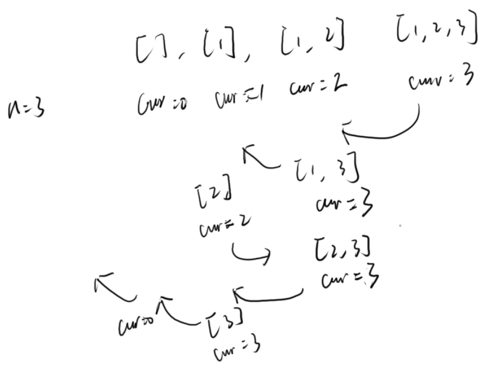

```java
class Solution {
    private List<List<Integer>> res = new ArrayList<>();

    public List<List<Integer>> subsets(int[] nums) {
        dfs(nums, 0, new ArrayList<>());
        return res;
    }

    public void dfs(int[] nums, int curIdx, List<Integer> path) {
        res.add(new ArrayList<>(path));
        if (curIdx >= nums.length) {
            return;
        }
        for(int i = curIdx; i < nums.length; i++) {
            path.add(nums[i]);
            dfs(nums, i + 1, path);
            path.remove(path.size() - 1);
        }
    }
}
```

## [90. 子集 II](https://leetcode.cn/problems/subsets-ii/)

两种解法：

第一种解法：

使用一个used数组，表示当前的节点被使用过。

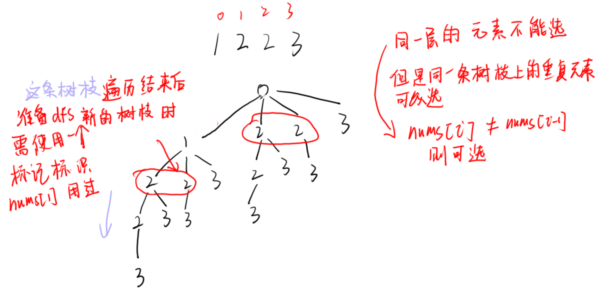

```java
class Solution {
    /**
    * [2,3,2] 如果不去重会出现 [], [2], [2,3], [2,3,2], [2,2], [3], [3,2], [2]
    * 此时 重复的元素有 [2] [2,3], [2,3] 和 [3,2] 算同一种，所以应该去重
    * 去重之后的结果是 [], [2], [2,3], [2,3,2], [2,2], [3]
    */
    private List<List<Integer>> res = new ArrayList<>();
    private boolean[] used;
    public List<List<Integer>> subsetsWithDup(int[] nums) {
        Arrays.sort(nums);
        used = new boolean[nums.length];
        dfs(nums, 0, new ArrayList<>());
        return res;
    }

    public void dfs(int[] nums, int curIdx, List<Integer> path) {
        res.add(new ArrayList<>(path));
        for(int i = curIdx; i < nums.length; i++) {
            if (i > curIdx && nums[i] == nums[i - 1]) {
                continue;
            }
            path.add(nums[i]);
            used[i] = true;
            dfs(nums, i + 1, path);
            used[i] = false;
            path.remove(path.size() - 1);
        }
    }
}
```

第二种解法：

正常的剪枝，如果当前元素和前面的元素相同的话，就肯定会产生重复的子数组。

想想一下 如果 i > 0, 对于[1,2,2]，必然会产生两个[1,2]和两个[2]，这个重复就是因为如果之前选过了一个2，后面就不应该再选了。

这样的保证的做法就是当前的做法和上面使用标记的做法。

```
if (i > curIdx && nums[i] == nums[i - 1]) {
	continue;
}
```

上面的剪枝条件，最关键的是`i > curIdx`，为什么不是`i > 0`？

还是上面的数组，如果是 nums[curIdx] = 2，并且另一个条件`nums[i] == nums[i - 1]`也满足了，就不会出现`[2,2]`这个子集了。

~~如果是`i>0`则表示是枝叶的剪枝，而这里子集中的元素可以无限重复，所以应该进行 **枝层的剪枝**。~~

```java
class Solution {
    /**
    * [2,3,2] 如果不去重会出现 [], [2], [2,3], [2,3,2], [2,2], [3], [3,2], [2]
    * 此时 重复的元素有 [2] [2,3], [2,3] 和 [3,2] 算同一种，所以应该去重
    * 去重之后的结果是 [], [2], [2,3], [2,3,2], [2,2], [3]
    */
    private List<List<Integer>> res = new ArrayList<>();

    public List<List<Integer>> subsetsWithDup(int[] nums) {
        Arrays.sort(nums);
        dfs(nums, 0, new ArrayList<>());
        return res;
    }

    public void dfs(int[] nums, int curIdx, List<Integer> path) {
        res.add(new ArrayList<>(path));
        for(int i = curIdx; i < nums.length; i++) {
            // 剪枝条件，当前元素不能等于之前的重复元素，因为排过序，所以使用i和i-1就可以判断，当前元素是否和前面所有的元素中的元素是否重合
            if (i > curIdx && nums[i] == nums[i - 1]) {
                continue;
            }
            path.add(nums[i]);
            dfs(nums, i + 1, path);
            path.remove(path.size() - 1);
        }
    }
}
```

## [98. 验证二叉搜索树](https://leetcode.cn/problems/validate-binary-search-tree/)

中序遍历是升序的就是二叉搜索树。

```java
class Solution {
    // 恶心的case: [ Intger.MIN_VALUE ], 所以这里使用Long.MIN_VALUE;
    long pre = Long.MIN_VALUE;

    // 中序遍历是升序的就是二叉搜索树
    public boolean isValidBST(TreeNode root) {
        if (root == null) {
            return true;
        }
        
        if (!isValidBST(root.left)) {
            return false;
        }

        if (root.val <= pre) {
            return false;
        }

        pre = root.val;

        return isValidBST(root.right);
    }
}
```

## [99. 恢复二叉搜索树](https://leetcode.cn/problems/recover-binary-search-tree/)

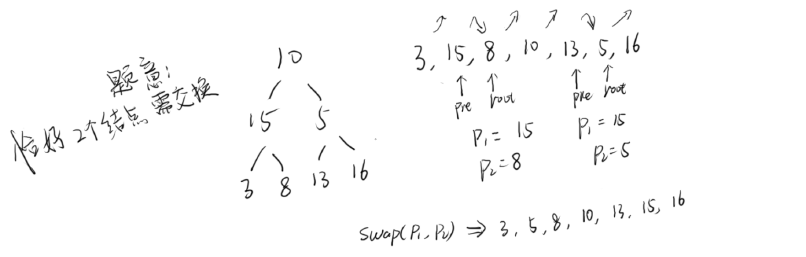

根据本题的题意可知，最多只能有两个节点进行交换。

思考一个正序序列 `1,2,3,4,5,6,7`，如果交换2和6，就会出现两对逆序对，如果交换2和3就会出现一对逆序对。

1. 如果出现了两队逆序对`i`和`i+1`与`j`和`j+1`，交换a[i]和a[j + 1]
2. 如果出现了一对逆序对`i`和`i+1`，交换a[i]和a[i + 1]

```java
class Solution {
    TreeNode pre = new TreeNode(Integer.MIN_VALUE);
    TreeNode p1, p2;

    public void recoverTree(TreeNode root) {
        dfs(root);
        if (p1 != null && p2 != null) {
            int v = p1.val;
            p1.val = p2.val;
            p2.val = v;
        }
    }

    public void dfs(TreeNode root) {
        if (root == null) {
            return;
        }
        dfs(root.left);
        if (root.val < pre.val) {
            p1 = root;
            // 这里要加上这个条件
            if (p2 == null) {
                p2 = pre;
            }
        }
        pre = root;

        dfs(root.right);
    }
}
```

## [113. 路径总和 II](https://leetcode.cn/problems/path-sum-ii/)

注意题目说的是 **恰好到叶子节点** 的路径。

```java
class Solution {
    private List<List<Integer>> res = new ArrayList<>();
    
    public List<List<Integer>> pathSum(TreeNode root, int targetSum) {
        dfs(root, targetSum, new ArrayList<>());
        return res;
    }

    private void dfs(TreeNode root, int targetSum, List<Integer> path) {
        if (root == null) {
            return;
        }

        path.add(root.val);
        // 恰好是叶子节点，并且剩下的就是当前的value，就说明这条路径是可选的
        // 把路径添加进结果集中
        if (root.left == null && root.right == null && targetSum == root.val) {
            res.add(new ArrayList<>(path));
        }
        dfs(root.left, targetSum - root.val, path);
        dfs(root.right, targetSum - root.val, path);
        // 回溯，不然会影响上层函数path集合
        path.remove(path.size() - 1);
    }
}
```

## [114. 二叉树展开为链表](https://leetcode.cn/problems/flatten-binary-tree-to-linked-list/)

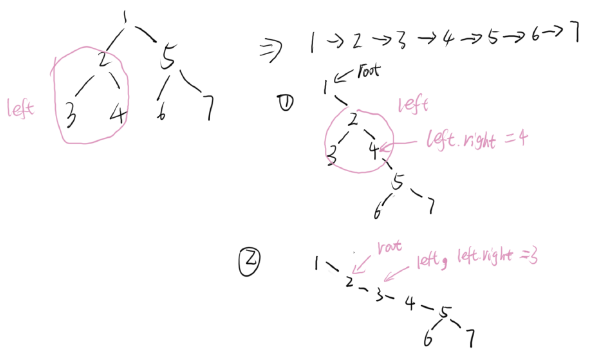

过程与上图类似。

1. 把左子树依次插入右子树，每次root指针都往右子树挪。
2. 在左子树上找最右边的节点left，把当前的右子树加到left节点后面。
3. 把root的右子树置换为原来root的左子树的根节点，把左子树置空。

```java
class Solution {
    public void flatten(TreeNode root) {
        while(root != null) {
            // 待插入的左子树的tail节点,root.left则为head节点
            TreeNode left = root.left;

            // 左子树为空，就看右子树
            if (left == null) {
                root = root.right;
                continue;
            }

            // 找到左子树的最右端点,此时left变成了tail节点
            while (left.right != null) {
                left = left.right;
            }

            // 左子树最右端点的右边就是右子树
            left.right = root.right;

            // 将右子树改为上面修改好的左子树
            root.right = root.left;

            // 左子树置为null
            root.left = null;

            // 继续看右子树
            root = root.right;
        }
    }
}
```

在后续遍历直接修改root, 会影响到root树的结构，但是在函数出栈的时候，结构正是想要的。

其实可以忽略掉细节，明白后序遍历是处理叶子节点的就行，在函数出栈的时候，就变成了处理下一层的叶子节点了。

```java
class Solution {
    public void flatten(TreeNode root) {
        if (root == null) {
            return;
        }
        flatten(root.left);
        flatten(root.right);
		
        // 后序遍历是处理叶子节点的
        TreeNode tmp = root.right;
        root.right = root.left;
        root.left = null;
        while(root.right != null) {
            root = root.right;
        }
        // 会影响到root树的结构，但是在函数出栈的时候，结构正是想要的
        // 其实可以忽略掉细节，明白后序遍历是处理叶子节点的就行
        // 在函数出栈的时候, 就变成了处理下一层的叶子节点了
        root.right = tmp;
    }
}
```

## [669. 修剪二叉搜索树](https://leetcode.cn/problems/trim-a-binary-search-tree/)

1. 如果根节点的值大于high，则保留左子树。
2. 如果根节点的值小于low，则保留右子树。
3. 如果在low和high之间，则递归的处理左右子树。

```java
class Solution {
    public TreeNode trimBST(TreeNode root, int low, int high) {
        if (root == null) {
            return null;
        }
        
        if (root.val > high) {
            return trimBST(root.left, low, high);
        }
        if (root.val < low) {
            return trimBST(root.right, low, high);
        }

        root.left = trimBST(root.left, low, high);
        root.right = trimBST(root.right, low, high);
        return root;
    }
}
```

## [116. 填充每个节点的下一个右侧节点指针](https://leetcode.cn/problems/populating-next-right-pointers-in-each-node/)

前序遍历

递归写法的重点是不要在意细节，考虑某一个节点的具体实现，然后确定遍历的顺序（前序、中序、后序）。

本题可以画一个图，看某一个节点的left和right的next指针怎么计算的，然后使用前序遍历即可。

```java
class Solution {
    public Node connect(Node root) {
        if (root == null) {
            return null;
        }
        if (root.left != null) {
            root.left.next = root.right;
            if (root.next != null) {
                root.right.next = root.next.left;
            }
        }
        root.left = connect(root.left);
        root.right = connect(root.right);
        return root;
    }
}
```

层序遍历。

```java
class Solution {
    public Node connect(Node root) {
        if (root == null) {
            return null;
        }
        Deque<Node> q = new ArrayDeque<>();
        q.addFirst(root);
        while (!q.isEmpty()) {
            int size = q.size();
            while (size > 0) {
                Node n = q.pollLast();
                size--;
                if (size > 0) {
                    n.next = q.peekLast();
                } else {
                    n.next = null;
                }
                if (n.left != null) {
                    q.addFirst(n.left);
                }
                if (n.right != null) {
                    q.addFirst(n.right);
                }
            }
        }
        return root;
    }
}
```

## [129. 求根节点到叶节点数字之和](https://leetcode.cn/problems/sum-root-to-leaf-numbers/)

在遍历的时候，边遍历边计算value，最后用一个全局变量表示结果记录下和。

```java
class Solution {
    int res = 0;
    public int sumNumbers(TreeNode root) {
        dfs(root, 0);
        return res;
    }

    public void dfs(TreeNode root, int preVal) {
        if (root == null) {
            return;
        }
        int v = preVal * 10 + root.val;
        if (root.left == null && root.right == null) {
            res += v;
        }
        dfs(root.left, v);
        dfs(root.right, v);
    }
}
```


## [670. 最大交换](https://leetcode.cn/problems/maximum-swap/)

<font color='red' size='6'>**错误的例子**</font>:

看到题目，很容易会联想到全排列问题，但是下面的代码是错误的，如输入`9889`，期望结果是`9988`，交换第一个8和第二个9，就能得出正确答案，但是下面的代码错在，答案为`9988`的`times`肯定不为`1`。因为在计算第二个9的时候，此时的times已经是2了。


```java
class Solution {
    int res = Integer.MIN_VALUE;
    public int maximumSwap(int num) {
        dfs(String.valueOf(num).toCharArray(), 0, 0);
        return res;
    }

    private void dfs(char[] nums, int curIdx, int times) {
        if (times == 1) {
            res = Math.max(res, Integer.valueOf(new String(nums)));
        }

        for(int i = curIdx + 1; i < nums.length; i++) {
            swap(nums, i, curIdx);
            dfs(nums, curIdx + 1, times + 1);
            swap(nums, i, curIdx);
        }
    }

    private void swap(char[] nums, int i, int j) {
        char tmp = nums[i];
        nums[i] = nums[j];
        nums[j] = tmp;
    } 
}
```

可以不用递归，避免出错，直接暴力模拟

```java
class Solution {
    public int maximumSwap(int num) {
        int res = num;
        char[] nums = String.valueOf(num).toCharArray();
        for (int i = 0; i < nums.length; i++) {
            for(int j = i + 1; j < nums.length; j++) {
                swap(nums, i, j);
                res = Math.max(Integer.parseInt(new String(nums)), res);
                swap(nums, i, j);
            }
        }
        return res;
    }

    private void swap(char[] nums, int i, int j) {
        char tmp = nums[i];
        nums[i] = nums[j];
        nums[j] = tmp;
    } 
}
```


# 要点整理

## 树

1. 中序遍历一般用于二叉搜索树，二叉搜索树的中序遍历是严格升序的。

2. 后续遍历一般是用于处理叶子节点的，相反的前序遍历是处理根节点的。

   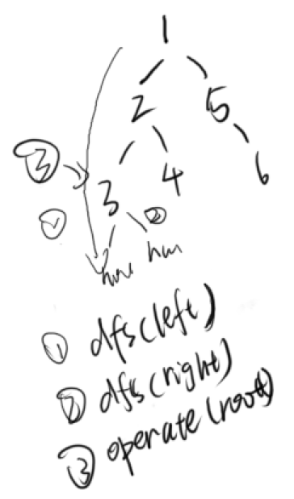

   ```java
   void dfs(TreeNode root) {
       if (root == null) return;
       dfs(root.left);
       dfs(root.right);
       // 在第一次递归到这的时候，root是叶子节点，之后为叶子节点的父节点
   }
   ```

   


# 模型整理

整理一些通用的模型和题目，但是题目还是放在上面一个part。
