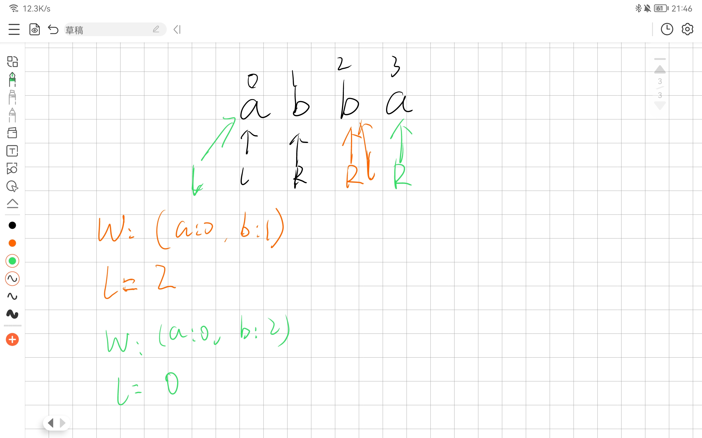

# 基础算法

## 快速排序

背模板，避免边界问题出现。

快速排序的算法思想是（从小到大排序）：

1. 选定一个哨兵元素，从左往右扫描，直到找到第一个比这个数大的数之后，从右往左扫描，直到找到第一个比这个数要小的数。
2. 如果左边的指针小于右边的指针，交换两个指针指向的数。 
3. 重复上面的步骤，直到左边的指针大于右边的指针。

```java
    public static void quickSort(int[] nums) {
        quickSort(nums, 0, nums.length - 1);
    }

    private static void quickSort(int[] nums, int l, int r) {
        if (l >= r) {
            return;
        }

        // 由于选取的第一个数为哨兵节点，所以i = l - 1，为了统一，j也写成r + 1
        int x = nums[l], i = l - 1, j = r + 1;
        while (i < j) {
            while (nums[++i] < x) ;
            while (nums[--j] > x) ;
            // 从i出发找到比x大的数，从j出发找到比x小的数，交换
            if (i < j) {
                swap(nums, i, j);
            }
        }

        // 注意边界
        quickSort(nums, l, j);
        quickSort(nums, j + 1, r);
    }

    private static void swap(int[] nums, int i, int j) {
        int tmp = nums[i];
        nums[i] = nums[j];
        nums[j] = tmp;
    }
```

### 快速选择

```java
    public static int quickSelect(int[] nums, int k, int l, int r) {
        if (l >= r) {
            return nums[l];
        }
        int x = nums[l], i = l - 1, j = r + 1;
        while (i < j) {
            while (nums[++i] < x) ;
            while (nums[--j] > x) ;
            if (i < j) {
                swap(nums, i, j);
            }
        }
        // 如果k落在分区的左边，则就是找左边分区第k小的数字
        if (j - l + 1 >= k) {
            return quickSelect(nums, k, l, j);
        }
        // 如果分区落在了右边，则找右边分区第 k - (j - l + 1) 小的数字
        return quickSelect(nums, k - (j - l + 1), j + 1, r);
    }
```


## 归并排序

和快速排序一样，背模板，避免造成边界问题。
算法思想是：
1. 把一个大数组不断分成小数组。
2. 从小数组开始，选取两个小数组，合并数组。
3. 重复上述步骤，直到只有一个数组。

```java
    public static void mergeSort(int[] nums) {
        mergeSort(nums, 0, nums.length - 1);
    }

    public static void mergeSort(int[] nums, int l, int r) {
        if (l >= r) {
            return;
        }
        int mid = l + r >> 1;
        mergeSort(nums, l, mid);
        mergeSort(nums, mid + 1, r);
        merge(nums, l, r);
    }

    private static void merge(int[] nums, int l, int r) {
        int[] tmp = new int[r - l + 1];
        int mid = l + r >> 1;
        int i = l, j = mid + 1, idx = 0;

        while (i <= mid && j <= r) {
            tmp[idx++] = nums[i] < nums[j] ? nums[i++] : nums[j++];
        }
        while (i <= mid) {
            tmp[idx++] = nums[i++];
        }
        while (j <= r) {
            tmp[idx++] = nums[j++];
        }
        for (int k = 0; k < tmp.length; k++) {
            nums[l + k] = tmp[k];
        }
    }
```

### [剑指 Offer 51. 数组中的逆序对](https://leetcode.cn/problems/shu-zu-zhong-de-ni-xu-dui-lcof/)

在归并排序中，分成了两个数组，其中会产生三种情况：

1. 所有的逆序对都在同一边（左边和右边）。
2. 逆序对分别在两个部分，

其中第一个问题，可以递归的转换成第二个问题，所以只需要关心第二个问题。

在归并的时候，两边的数组都是有序的，所以对于前面部分的 `i`和后面部分的`j`来说，如果`nums[i] > nums[j]`，即前面的部分>后面的部分时，`nums[i]`和`nums[j]`都组成了一对逆序对。并且，由于两边的部分都是有序的，所以对于下标`j`来说，左边部分的下标大于`i`的元素都能与下标为`j`的元素组成逆序对。

总结一下来说，对于j来说，逆序对数为`mid - i + 1`，而对于右边部分的所有元素来说都可能会出现这种情况。所以求和就行。


```java
class Solution {
    public int reversePairs(int[] nums) {
        return mergeSort(nums, 0, nums.length - 1);
    }

    public int mergeSort(int[] nums, int l, int r) {
        if (l >= r) {
            return 0;
        }
        int mid = l + r >> 1;
        
        int res = mergeSort(nums, l, mid) + mergeSort(nums, mid + 1, r);

        int[] tmp = new int[r - l + 1];
        // 归并
        int i = l , j = mid + 1, idx = 0;
        while(i <= mid && j <= r) {
            // 前面的小于后面的，则正常归并，否则计算逆序对数
            if (nums[i] <= nums[j]) {
                tmp[idx++] = nums[i++];
            } else {
                tmp[idx++] = nums[j++];
                res += mid - i + 1;
            }
        }
        while(i <= mid) {
            tmp[idx++] = nums[i++];
        }
        while(j <= r) {
            tmp[idx++] = nums[j++];
        }

        for(int k = 0; k < tmp.length; k++) {
            nums[l + k] = tmp[k];
        }
        return res;
    }
}
```


# 并查集

两个集合找祖宗节点，看祖宗是否相等，如果祖宗相同，则认为这两个集合相同。


# 滑动窗口

例题：给定一个数组arr和一个窗口，这个窗口在运动，求在这个窗口每次运动时，这个窗口的最大值。

解题思路：

维护一个双端队列，保持单调性，从大到小。

每次窗口移动时，如果是right指针移动，则把arr[right]给放入队列中，如果队列中有比arr[right]小的就pop。

如果left指针移动，看队首是否存放的left所在的下标。

```java
	public static int[] getMaxValInWindow(int[] arr, int w) {
        if (arr == null || arr.length < w) {
            return null;
        }
        // 从小->大
        Deque<Integer> deque = new ArrayDeque<>();
        int[] res = new int[arr.length - w + 1];
        int idx = 0;

        // right = i
        for (int i = 0; i < arr.length; i++) {

            while (!deque.isEmpty() && arr[deque.peekLast()] <= arr[i]) {
                deque.pollLast();
            }
            deque.addLast(i);
            if (deque.peekFirst() == i - w) {
                deque.pollFirst();
            }
            // 如果right >= 窗口长度了，就要统计最大值了
            if (i >= w - 1) {
                res[idx++] = arr[deque.peekFirst()];
            }
        }
        return res;
    }
```


# 动态规划

优化过程：

递归 -> 记忆化搜索 -> 画图 -> 自底向上的dp。

## 线性动态规划

### 背包问题

#### 01背包问题

对于有每个v都有选和不选两种选择，所以可以使用dfs来写。

但是**注意**！01背包问题，可能会出现**包未装满**的情况，所以需要看当前的下标是否超过了数组的长度，此时来判断包是否装满

<font color="red">**错误示例**</font>：

```java
	public static int dfs(int[] v, int[] w, int capacity, int cur, int curV) {
        // 在这里，没有考虑到，包未装满的情况
        if (curV > capacity || cur >= v.length) {
            return -1;
        }
        
        if (dp[cur][curV] != -2) {
            return dp[cur][curV];
        }
        
        if (curV == capacity) {
            dp[cur][curV] = 0;
        } else {
            int p1 = dfs(v, w, capacity, cur + 1, curV + v[cur]);
            int p2 = dfs(v, w, capacity, cur + 1, curV);
            if (p1 == -1){
                dp[cur][curV] = p2;
            } else if(p2 == -1) {
                dp[cur][curV] = p1 + w[cur];
            } else {
                dp[cur][curV] = Math.max(p1 + w[cur], p2);
            }
        }
        
        return dp[cur][curV];
    }
```

下面的才是<font color='green'>**正确示例**</font>：

```java
import java.util.*;

class Main{
    private static int[][] dp;
    public static void main(String[] args){
        Scanner sc = new Scanner(System.in);
        int n = sc.nextInt();
        int k = sc.nextInt();
        int[] v = new int[n];
        int[] w = new int[n];
        
        dp = new int[n + 1][k + 1];
        
        for(int[] d : dp) {
            Arrays.fill(d, -2);
        }
        
        for(int i = 0; i < n; i++){
            v[i] = sc.nextInt();
            w[i] = sc.nextInt();
        }
        System.out.println(dfs(v, w, k, 0, 0));
    }
    
    public static int dfs(int[] v, int[] w, int capacity, int cur, int curV) {
        // v: 6 5 5 2
        // w: 7 3 6 9
        // capacity: 10
        // 可能会出现包未装满的情况，但是此时的价值是最大的。
        if (cur >= v.length) {
            if (curV <= capacity) {
                dp[cur][curV] = 0;
                return 0;
            } else {
                return -1;
            }
        }
        if (curV > capacity) {
            return -1;
        }

        if (dp[cur][curV] != -2) {
            return dp[cur][curV];
        }

        if (curV == capacity) {
            dp[cur][curV] = 0;
        } else {
            int p1 = dfs(v, w, capacity, cur + 1, curV + v[cur]);
            int p2 = dfs(v, w, capacity, cur + 1, curV);
            if (p1 == -1 && p2 == -1) {
                dp[cur][curV] = -1;
            } else if (p1 == -1) {
                dp[cur][curV] = p2;
            } else if (p2 == -1) {
                dp[cur][curV] = p1 + w[cur];
            } else {
                dp[cur][curV] = Math.max(p1 + w[cur], p2);
            }
        }

        return dp[cur][curV];
    }
}
```

优化成dp表后的代码：

优化的步骤：先把base case位置上的数据填入表格，然后看递归函数的依赖关系。如上面的` p1`依赖于`dfs(cur+1, curV+v[cur])`的位置，所以优化成dp表的版本就是`dp[i][j] = max(dp[i + 1][j + v[i]] + w[i], ...)`，但是在优化时，需要注意边界问题。

```java
	public static void main(String[] args) throws IOException {
        BufferedReader br = new BufferedReader(new InputStreamReader(System.in));

        String[] ns = br.readLine().split(" ");
        int n = Integer.parseInt(ns[0]);
        int V = Integer.parseInt(ns[1]);

        int[] v = new int[n];
        int[] w = new int[n];

        dp = new int[n + 1][V + 1];

        for (int i = 0; i < n; i++) {
            String[] tmp = br.readLine().split(" ");
            v[i] = Integer.parseInt(tmp[0]);
            w[i] = Integer.parseInt(tmp[1]);
        }
		
        // 在递归的base case中，n - 1 和 V 的位置都填0，所以可以忽略初始化的步骤。
        // 自顶向下的循环遍历，要求的就是dp[0][0]（在递归函数参数为0和0）
        for (int i = n - 1; i >= 0; i--) {
            for (int j = V; j >= 0; j--) {
                if (j + v[i] > V) {
                    dp[i][j] = dp[i + 1][j];
                } else {
                    dp[i][j] = Math.max(dp[i + 1][j + v[i]] + w[i], dp[i + 1][j]);
                }
            }
        }
        System.out.println(dp[0][0]);
    }
```


#### 01完全背包问题

与01背包问题不同的是，每件物品都是无限的。和下面的[322. 零钱兑换](#322-零钱兑换)是一个类型的。

```java
import java.util.*;

class Main{
    private static int[][] dp;
    public static void main(String[] args){
        Scanner sc = new Scanner(System.in);
        int n = sc.nextInt();
        int V = sc.nextInt();
        int[] v = new int[n];
        int[] w = new int[n];
        
        dp = new int[n + 1][V + 1];
        
        for(int[] d : dp) {
            Arrays.fill(d, -2);
        }
        
        for(int i = 0; i < n; i++){
            v[i] = sc.nextInt();
            w[i] = sc.nextInt();
        }
        System.out.println(dfs(v, w, V, 0, 0));
    }
    
    public static int dfs(int[] v, int[] w, int capacity, int cur, int curV) {
        // v: 6 5 5 2
        // w: 7 3 6 9
        // capacity: 10
        // 可能会出现包未装满的情况，但是此时的价值是最大的。
        if (cur >= v.length) {
            if (curV <= capacity) {
                dp[cur][curV] = 0;
                return 0;
            } else {
                return -1;
            }
        }
        if (curV > capacity) {
            return -1;
        }

        if (dp[cur][curV] != -2) {
            return dp[cur][curV];
        }

        if (curV == capacity) {
            dp[cur][curV] = 0;
        } else {
            // 这个地方不能+1，要首先尝试一直拿一个物品。
            int p1 = dfs(v, w, capacity, cur, curV + v[cur]);
            int p2 = dfs(v, w, capacity, cur + 1, curV);
            if (p1 == -1 && p2 == -1) {
                dp[cur][curV] = -1;
            } else if (p1 == -1) {
                dp[cur][curV] = p2;
            } else if (p2 == -1) {
                dp[cur][curV] = p1 + w[cur];
            } else {
                dp[cur][curV] = Math.max(p1 + w[cur], p2);
            }
        }

        return dp[cur][curV];
    }
}
```

## 动态规划压缩

# 单调队列

例题：给定一个滑动窗口和一个数组，每次滑动窗口都往右边移动1格，求每个滑动窗口中的最大值。leetcode：[239. 滑动窗口最大值](https://leetcode.cn/problems/sliding-window-maximum/)

解法：

维护一个单调队列，右指针在移动的时候，把元素的下标从后面入队，此时要维护单调性，如果当前元素下标入队会破坏单调性，则一直pop数据，直到单调性正确为止。

每次左边指针移动时，如果左边指针的下标是队首中的元素，则将队首的元素过期（pop()）掉，每次窗口移动时，都取队首元素作为当前窗口的最大值。

```java
class Solution {
    public int[] maxSlidingWindow(int[] nums, int w) {
        int n = nums.length;
        int idx = 0;
        // 比nums的长度少w-1个
        int[] res = new int[n - w + 1];
        Deque<Integer> queue = new ArrayDeque<>();
        for(int r = 0; r < n; r++) {
            // r在移动时，维持单调队列的单调性
            while(!queue.isEmpty() && nums[queue.peekLast()] <= nums[r]) {
                queue.pollLast();
            }

            queue.addLast(r);
            // 滑动窗口的左边界
            int l = r - w + 1;
            // 如果滑动窗口把队列的最大值给划过去了，就需要把队首元素给删除
            if (queue.peekFirst() == l - 1) {
                queue.pollFirst();
            }

            // 如果有滑动窗口了，就要取最大值了
            if (l >= 0) {
                res[idx++] = nums[queue.peekFirst()];
            }
        }

        return res;
    }
}
```


# 单调栈

例题：给定一个数组arr，求数组中每个元素的左边和右边的离该数字最近的最大的数。

解法：

维护一个栈，在遍历数组的时候，把数放进栈里面，不过要保证单调性。

```java
	public static int[][] getNearBiggerNoRepeat(int[] arr) {
        int[][] res = new int[arr.length][2];
        Stack<Integer> stack = new Stack<>();
        for (int i = 0; i < arr.length; i++) {
            // 如果栈里面的数比当前数要大，则需要pop栈中数据，把当前数据放入stack。
            while (!stack.isEmpty() && arr[stack.peek()] < arr[i]) {
                int popIndex = stack.pop();
                int leftLessIndex = stack.isEmpty() ? -1 : stack.peek();
                if (leftLessIndex != -1) {
                    res[popIndex][0] = arr[leftLessIndex];
                } else {
                    res[popIndex][0] = leftLessIndex;
                }
                res[popIndex][1] = arr[i];
            }
            stack.push(i);
        }
        while (!stack.isEmpty()) {
            int popIndex = stack.pop();
            int leftLessIndex = stack.isEmpty() ? -1 : stack.peek();
            if (leftLessIndex != -1) {
                res[popIndex][0] = arr[leftLessIndex];
            } else {
                res[popIndex][0] = leftLessIndex;
            }
            res[popIndex][1] = -1;
        }
        return res;
    }
```


# 题目

## [5. 最长回文子串](https://leetcode.cn/problems/longest-palindromic-substring/)

解法：

枚举每一个字字符串，看是否为回文串，如果为回文串，并且长度更长，则更新结果。

判断是否为回文串，用dp记录一下[i....j]是否已经计算过，如果计算过则返回，否则`f(i, j) = s[i] == s[j] && f(i + 1, j -1);`

```java
	public String longestPalindrome(String s) {
        int n = s.length();
        String res = "";
        Boolean[][] dp = new Boolean[n + 1][n + 1];

        for(int i = 0; i < n; i++) {
            for (int j = i; j < n; j++) {
                if (isPalindrome(dp, s, i, j) && j - i + 1 > res.length()) {
                    res = s.substring(i, j + 1);
                }
            }
        }
        return res;
    }

    public boolean isPalindrome(Boolean[][] dp, String s, int i, int j) {

        if (dp[i][j] != null) {
            return dp[i][j];
        }

        if (i == j) {
            dp[i][j] = true;
        } else if (i + 1 == j) {
            dp[i][j] = s.charAt(i) == s.charAt(j);
        } else {
            dp[i][j] = (s.charAt(i) == s.charAt(j) && isPalindrome(dp, s, i + 1, j - 1));
        }

        return dp[i][j];
    }
```

## [1143. 最长公共子序列](https://leetcode.cn/problems/longest-common-subsequence/)

dp问题，子问题就是 如果两个字符串s1 s2，s1[0] == s2[0]，可转换成s1[1:] 和 s2[1:]的最长公共子序列。

递归解法（未ac，超时）

```java
class Solution {
    public int longestCommonSubsequence(String text1, String text2) {
        return longestCommonSubsequence(text1, text2, 0, 0);
    }

    public int longestCommonSubsequence(String text1, String text2, int i, int j) {
        // base case
        if (i == text1.length() || j == text2.length()) {
            return 0;
        }
        if (text1.charAt(i) == text2.charAt(j)) {
            return longestCommonSubsequence(text1, text2, i + 1, j + 1) + 1;
        }
        return Math.max(longestCommonSubsequence(text1, text2, i + 1, j), longestCommonSubsequence(text1, text2, i, j + 1));
    }
}
```

记忆化搜索，（ac）

```java
class Solution {
    private int[][] dp;
    public int longestCommonSubsequence(String text1, String text2) {
        dp = new int[text1.length() + 1][text2.length() + 1];
        for(int[] d: dp) {
            Arrays.fill(d, -1);
        }
        return longestCommonSubsequence(text1, text2, 0, 0);
    }

    public int longestCommonSubsequence(String text1, String text2, int i, int j) {
        if(dp[i][j] != -1) {
            return dp[i][j];
        }
        if (i == text1.length() || j == text2.length()) {
            dp[i][j] = 0;
        } else if (text1.charAt(i) == text2.charAt(j)) {
            dp[i][j] = longestCommonSubsequence(text1, text2, i + 1, j + 1) + 1;
        } else {
            dp[i][j] = Math.max(longestCommonSubsequence(text1, text2, i + 1, j), longestCommonSubsequence(text1, text2, i, j + 1));
        }
        return dp[i][j];    
    }
}
```

## [45. 跳跃游戏 II](https://leetcode.cn/problems/jump-game-ii/)

dp问题：

先用dfs模拟跳跃。
```java
class Solution {
    public int jump(int[] nums) {
        int res = dfs(nums, 0);
        return res;
    }

    public int dfs(int[] nums, int curIdx) {

        if (curIdx >= nums.length - 1) {
            return 0;
        }

        int tmp = nums[curIdx];
        int res = Integer.MAX_VALUE;
        while (tmp > 0) {
            // 开始跳
            int r = dfs(nums, curIdx + (tmp--));
            if (r != -1) {
                res = Math.min(res, r + 1);
            }
        }
        // -1表示跳不到，在nums[curIdx] = 0时，是不可达的
        res = res == Integer.MAX_VALUE ? -1 : res;
        return res;
    }
}
```

记忆化搜索：

```java
class Solution {
    private int[] dp;
    public int jump(int[] nums) {
        dp = new int[nums.length + 1];
        Arrays.fill(dp, -2);
        int res = dfs(nums, 0);
        return res;
    }

    public int dfs(int[] nums, int curIdx) {
        if (curIdx >= nums.length) {
            return 0;
        }
        if (dp[curIdx] != -2) {
            return dp[curIdx];
        }

        if (curIdx == nums.length - 1) {
            dp[curIdx] = 0;
            return dp[curIdx];
        }

        int tmp = nums[curIdx];
        int res = Integer.MAX_VALUE;
        while (tmp > 0) {
            int r = dfs(nums, curIdx + (tmp--));
            if (r != -1) {
                res = Math.min(res, r + 1);
            }
        }
        dp[curIdx] = res == Integer.MAX_VALUE ? -1 : res;
        return dp[curIdx]; 
    }
}
```

优化成dp表的代码：

```java
class Solution {
    private int[] dp;
    public int jump(int[] nums) {
        int n = nums.length;
        // 是否为n+1影响不大
        dp = new int[n];
        
        // basecase 为 dp[n - 1] = 0
        // 所以下面的从n-2开始往下循环
        for(int i = n - 2; i >= 0; i--) {
            int tmp = nums[i];
            // 这里比较坑，不能使用Integer.MAX_VALUE，不然会溢出.....
            dp[i] = 1 << 31 -1;
            for(int j = 1; j <= tmp; j++ ) {
                if (i + j < n) {
                    dp[i] = Math.min(dp[i], dp[i + j] + 1);
                }
            }
        }
        return dp[0];
    }
}
```


## [3. 无重复字符的最长子串](https://leetcode.cn/problems/longest-substring-without-repeating-characters/)

解法：

使用滑动窗口，用哈希表来存放不同元素的最大的下标。

```java
class Solution {
    public int lengthOfLongestSubstring(String s) {
        // 左边界
        int l = 0;
        int n = s.length();
        int res = 0;
        Map<Character, Integer> window = new HashMap<>();
        for(int r = 0; r < n; r++) {
            // 如果包含了当前字符，说明有重复字符，需要移动左边界。
            if (window.containsKey(s.charAt(r))) {
                // 这里使用max的原因是：如果不使用，则在abba 的这种情况下，在r指针指向最后一个a的时候，l会往回挪。
                l = Math.max(l, window.get(s.charAt(r)) + 1);
            }
            window.put(s.charAt(r), r);
            res = Math.max(res, r - l + 1);
        }
        return res;
    }
}
```



## [11. 盛最多水的容器](https://leetcode.cn/problems/container-with-most-water/)

解法：

求i-j的的面积，有三种情况

1. i-j就是最大的
2. i+1,j中会有最大的
3. i,j - 1中会有最大的

优化前的：

```java
class Solution {
    public int maxArea(int[] height) {
        int n = height.length;
        int[][] dp = new int[n][n];
        for(int[] d: dp) {
            Arrays.fill(d, -1);
        }
        return f(dp, height, 0, n - 1);
    }

    // i 和 j之间的最大面积
    public int f(int[][] dp, int[] height, int i, int j) {
        if(dp[i][j] != -1) {
            return  dp[i][j];
        }

        // base case: j - i == 1 return min(height[i], height[j])
        if (j - i == 1) {
            dp[i][j] = Math.min(height[i], height[j]);
            return dp[i][j];
        }
        int s = (j - i) * Math.min(height[i], height[j]);
        dp[i][j] = Math.max(s, Math.max( f(dp, height, i + 1, j), f(dp, height, i, j - 1)));
        return dp[i][j];
    }
}
```


优化后的

```java
class Solution {
    public int maxArea(int[] height) {
        return f(height, 0, height.length - 1);
    }

    // i 和 j之间的最大面积
    public int f(int[] height, int i, int j) {
        // base case: j - i == 1 return min(height[i], height[j])
        if (j - i == 1) {
            return Math.min(height[i], height[j]);
        }
        int tmp;
        // 因为面积是按照最矮的一条边来算的，s=x*h. 面积是无论如何都不会超过h*x的，x为最短边，但是如果移动高的则可能会变得更小。
        if (height[i] < height[j]) {
            tmp = f(height, i + 1, j);
        } else {
            tmp = f(height, i, j - 1);
        }

        int s = (j - i) * Math.min(height[i], height[j]);
        return Math.max(s, tmp);
    }
}
```

## [42. 接雨水](https://leetcode.cn/problems/trapping-rain-water/)

解法：

维护一个单调栈，每次要破坏单调性的时候，计算接到的雨水。

在栈中，栈底的元素总是比栈顶要大（或者等于）的，所以当要破坏单调性的时候，就说明出现了凹槽。

在重新维护单调栈的时候，先把栈顶元素出栈，原来栈顶下面的元素为left，此时待入栈的元素height[i]。

计算雨水的时候，计算的方式是计算每一层的接到的雨水（每次pop元素的时候，都是计算该元素被两边夹住的高度差），高即为left和height[i]的最小值-刚出栈的元素的高度，宽度是pop的元素的两侧元素的下标差，并且需要减去待入栈的元素本身的宽度。

```java
class Solution {
    public int trap(int[] height) {
        int res = 0;
        Deque<Integer> stack = new ArrayDeque<>();
        for(int i = 0; i < height.length; i++) {
            // 遇到破坏单调性的元素，重新入栈了，此时应该计算能接到的水的数量
            while(!stack.isEmpty() && height[stack.peek()] < height[i]) {
                int top = stack.pop();
                // 栈中至少要有两个元素
                if(stack.isEmpty()) {
                    break;
                }
                int left = stack.peek();
                int curLen = i - left - 1;
                // 每次都是计算top被夹住的情况
                int curHeight = Math.min(height[i], height[left]) - height[top];

                res += curHeight * curLen;

            }
            stack.push(i);
        }

        return res;
    }
}
```

## [62. 不同路径](https://leetcode.cn/problems/unique-paths/)

同[11. 盛最多水的容器](#11-盛最多水的容器)，使用记忆化搜索。

可以一步一步的优化成自底向上的dp。

```java
class Solution {
    // 版本3
    public int uniquePaths(int m, int n) {
        int[][] dp = new int[n][m];
        for(int i = 0; i < m; i++ ) {
            dp[0][i] = 1;
        }

        for(int i = 0; i < n; i++) {
            dp[i][0] = 1;
        }

        for(int i = 1; i < n; i++) {
            for(int j = 1; j < m; j++) {
                dp[i][j] = dp[i - 1][j] + dp[i][j - 1];
            }
        }

        return dp[n - 1][m - 1];
    }
    
	// 版本2
    // public int uniquePaths(int m, int n) {
    //     int[][] dp = new int[n + 2][m + 2];
    //     for(int[] d: dp) {
    //         Arrays.fill(d, -1);
    //     }

    //     return dfs(dp, m, n, 1, 1);
    // }

    // public int dfs(int[][] dp,int m, int n, int x, int y) {
    //     if(dp[x][y] != -1) {
    //         return dp[x][y];
    //     }

    //     if (x > n || y > m) {
    //         dp[x][y] = 0;
    //     } else if (x == n && y == m) {
    //         dp[x][y] = 1;
    //     } else {
    //         dp[x][y] = dfs(dp, m, n, x + 1, y) + dfs(dp, m, n, x, y + 1);
    //     }

    //     return dp[x][y]; 
    // }
    
    // 版本1
	// public int uniquePaths(int m, int n) {
    //     return dfs(m, n, 1, 1);
    // }
    //
    // public int dfs(int m, int n, int x, int y) {
    //     if (x > n || y > m) {
    //         return 0;
    //     } else if (x == n && y == m) {
    //         return 1;
    //     }
    //
    //     return dfs(m, n, x + 1, y) + dfs(m, n, x, y + 1);
    // }
}
```

## [198. 打家劫舍](https://leetcode.cn/problems/house-robber/)


## [322. 零钱兑换](https://leetcode.cn/problems/coin-change/)

经典的dp问题，用二维的dp数组存放。

子问题：

min(选择当前钱币；不选择当前的钱币，选择下一个钱币)

如果选择了当前的钱币，则答案需要+1，表示选择了钱币。

```java
class Solution {
    private int[][] dp;
    public int coinChange(int[] coins, int amount) {
        dp = new int[amount + 1][coins.length + 1];
        for(int[] d: dp) {
            Arrays.fill(d, -2);
        }
        return coinChange(coins, amount, 0, 0);
    }

    public int coinChange(int[] coins, int amount, int sum, int index) {
        if (sum > amount || index >= coins.length || sum < 0) {
            return -1;
        }

        if(dp[sum][index] != -2) {
            return dp[sum][index];
        }
		
        // 这里返回0是表示basecase，需要退出了，如果是在求零钱兑换的方式，这里返回1表示一种兑换方式，但是在这里是求硬币个数
        // 所以不能在这里返回1，需要在调用递归函数的时候计算。
        if (sum == amount) {
            dp[sum][index] = 0;
        } else {
            // 选择当前的硬币，并且可以再次选择相同的硬币，所以p1需要+1
            int p1 = coinChange(coins, amount, sum + coins[index], index);
            // 不选当前硬币，选择新的硬币
            int p2 = coinChange(coins, amount, sum, index + 1);
            if (p1 == -1 && p2 == -1) {
                dp[sum][index] = -1;
            } else if (p1 == -1) {
                dp[sum][index] = p2;
            }else if(p2 == -1) {
                dp[sum][index] = p1 + 1;
            }else {
                dp[sum][index] = Math.min(p1 + 1, p2);
            }
        }
        return dp[sum][index];
    } 
}
```

## [32. 最长有效括号](https://leetcode.cn/problems/longest-valid-parentheses/)

解法：

暴力循环，判断每个字串是否有效括号，并且记录下最长的长度。（未ac，超时）

```java
class Solution {
    public int longestValidParentheses(String s) {
        int n = s.length();
        int res = 0;
        for(int i = 0; i < n; i++) {
            for(int j = i + 1; j < n; j++) {
                if(isValid(s, i, j)) {
                    res = Math.max(res, j - i + 1);
                }
            }
        }

        return res;
    }

    public boolean isValid(String s, int start, int end) {
        int balance = 0;
        for(int i = start; i <= end; i++) {
            if (s.charAt(i) == '(') {
                balance++;
            } else {
                balance--;
            }
            if (balance < 0) {
                return false;
            }
        }
        return balance == 0;
    }
}
```

暴力循环优化版：增加缓存（未ac，内存超了）

```java
class Solution {
    public int longestValidParentheses(String s) {
        int n = s.length();
        int res = 0;
        Boolean[][] dp = new Boolean[n + 1][n + 1];
        for(int i = 0; i < n; i++) {
            for(int j = i + 1; j < n; j++) {
                if(isValid(dp, s, i, j)) {
                    res = Math.max(res, j - i + 1);
                }
            }
        }

        return res;
    }

    public boolean isValid(Boolean[][] dp, String s, int start, int end) {
        if (dp[start][end] != null) {
            return dp[start][end];
        }
        int balance = 0;
        for(int i = start; i <= end; i++) {
            if (s.charAt(i) == '(') {
                balance++;
            } else {
                balance--;
            }
            if (balance < 0) {
                dp[start][end] = false;
                return dp[start][end];
            }
        }
        dp[start][end] = balance == 0;
        return dp[start][end];
    }
}
```

自底向上动态规划

放几个截图来说明这个问题：


```java
class Solution {
    public int longestValidParentheses(String s) {
        int n = s.length();
        // dp[i]表示以`)`结尾的，前i个字符的最长有效括号的长度。
        // 如果在当前字符前 dp[i - 1] (前面一个以`)`结尾的最长有效括号长度)的字符前面一个字符为`(`，则dp[i] = dp[i - 1] + 2;
        // 如果跳到了前一个为`(`的字符串，前面的还有有效括号则需要接上一段
        int[] dp = new int[n + 1];
        int res = 0;
        for(int i = 1; i < n; i++) {
            if (s.charAt(i) == ')') {
                int pre = i - dp[i - 1] - 1;
                if( pre >= 0 && s.charAt(pre) == '(') {
                    dp[i] = dp[i - 1] + 2;
                    if (pre > 0) {
                        dp[i] += dp[pre - 1];
                    }
                }
                // 这里使用max是因为，最后一个字符可能是`(`，这样dp[i]为0，所以需要一个最大值存放答案
                res = Math.max(res, dp[i]);
            }
        }
        return res;
    }
}
```

## [剑指 Offer 46. 把数字翻译成字符串](https://leetcode.cn/problems/ba-shu-zi-fan-yi-cheng-zi-fu-chuan-lcof/)

两种解法：

子问题：max(开始选择一个字符翻译的结果数；开始选择2个字符的翻译结果数)。

但是在写代码的时候，需要注意的几个特例：

* 递归到了最后1个字符，则只能选择单字符翻译。
* 如果当前字符串为0，则必须单字符翻译，因为字符串如01，02，03等，是不能双字符翻译
* 如果当前字符和后面的字符合起来，在有效字符范围之外，如26、27等，只能选择单字符翻译。

一种解法是转换成字符串，递归。

```java
class Solution {
    public int translateNum(int num) {
        return translateNum(String.valueOf(num), 0);
    }

    public int translateNum(String s, int index) {
        int n = s.length();
        // base case 到头了，说明这种方式能行，返回1
        if (index == n) {
            return 1;
        }
        // 只剩最后一个字符，或者当前的字符为0，或者>=26 区间外边，后边的字符都是取一个
        if (index == n - 1 || s.charAt(index) == '0' || s.substring(index, index + 2).compareTo("26") >= 0) {
            return translateNum(s, index + 1);
        } else {
            return translateNum(s, index + 1) + translateNum(s, index + 2);
        }
    }
}
```


另一种比较高效，使用取模和除法巧妙递归。

```java
class Solution {
    public int translateNum(int num) {
        if (num == 0) {
            return 1;
        }
        // 最后两位是10- 26之间的，就可以用两种方法翻译。
        // 除法是为了取前1位（/100）或者前两位(/100)
        if (num%100 >= 10 && num%100 < 26) {
            return translateNum(num/10) + translateNum(num/100);
        // 否则就是一种翻译方式，并且取前1位
        } else {
            return translateNum(num/10);
        }
    }
}
```

## [300. 最长递增子序列(最长上升子序列)](https://leetcode.cn/problems/longest-increasing-subsequence/)

dp问题。

暴力递归：

把所有的最长上升子序列的长度都找出来，选择最大的那个。

```java
class Solution {
    public int lengthOfLIS(int[] nums) {
        int max = 0;

        // 由于没有自动寻路的功能，所以需要循环调用dfs函数
        for(int i = 0; i < nums.length; i++) {
            max = Math.max(max, lengthOfLIS(nums, i));
        }
        
        return max;
    }

    public int lengthOfLIS(int[] nums, int index) {
        int n = nums.length;
        // 遍历到了nums数组的结尾，退出函数
        if (index == n) {
            return 0;
        }

        // 上升子序列中已经有了nums[index]，所以长度为1
        int res = 1;
        // 从index+1开始算，可以少算一个
        for(int i = index + 1; i < n; i++) {
            if (nums[i] > nums[index]) {
                res = Math.max(res, lengthOfLIS(nums, i) + 1);
            }
        }
        return res;
    }
}
```

记忆化搜索：

```java
class Solution {
    public int lengthOfLIS(int[] nums) {
        int max = 0;
        int[] dp = new int[nums.length + 1];
        Arrays.fill(dp, -1);

        // 由于没有自动寻路的功能，所以需要循环调用dfs函数
        for(int i = 0; i < nums.length; i++) {
            max = Math.max(max, lengthOfLIS(dp, nums, i));
        }
        
        return max;
    }

    public int lengthOfLIS(int[] dp, int[] nums, int index) {
        int n = nums.length;
        if (dp[index] != -1) {
            return dp[index];
        }

        // 遍历到了nums数组的结尾，退出函数
        if (index == n) {
            dp[index] = 0;
            return dp[index];
        }

        // 上升子序列中已经有了nums[index]，所以长度为1
        int res = 1;
        // 从index+1开始算，可以少算一个
        for(int i = index + 1; i < n; i++) {
            if (nums[i] > nums[index]) {
                res = Math.max(res, lengthOfLIS(dp, nums, i) + 1);
            }
        }
        dp[index] = res;
        return dp[index];
    }
}
```

## 之字形打印矩阵

解法：固定两个点，一个点负责向下，一个点负责向右，每次都只打印两个点连起来的线。

```java
	public static void zigzagPrintMatrix(int[][] matrix) {
        // 点A往右边走
        int aRow = 0;
        int aCol = 0;
        // 点B往下边走
        int bRow = 0;
        int bCol = 0;
        int endRow = matrix.length;
        int endCol = matrix[0].length;
        boolean toDown = false;
        while (aRow != endRow) {
            printLevel(matrix, aRow, aCol, bRow, bCol, toDown);
            // 当a往右走，走到最后一列的时候，需要往下走
            aRow = aCol == endCol - 1 ? aRow + 1 : aRow;
            aCol = aCol == endCol - 1 ? aCol : aCol + 1;
            // 当b往下走，走到最后一行的时候，需要往右边走
            bCol = bRow == endRow - 1 ? bCol + 1 : bCol;
            bRow = bRow == endRow - 1 ? bRow : bRow + 1;
            toDown = !toDown;
        }
    }

    public static void printLevel(int[][] matrix, int aRow, int aCol, int bRow, int bCol, Boolean toDown) {
        if (toDown) {
            // 从上往下打印
            while (aRow <= bRow) {
                System.out.println(matrix[aRow++][aCol--]);
            }
        } else {
            // 从下网往打印
            while (bCol <= aCol) {
                System.out.println(matrix[bRow--][bCol++]);
            }
        }
    }
```

## 螺旋打印矩阵

与之字形打印矩阵一样，控制两个点从外往内移动，打印这两个点之间的轨迹就行。

```java
public static void spiralPrint(int[][] matrix) {
        int aRow = 0, aCol = 0;
        int bRow = matrix.length - 1, bCol = matrix[0].length - 1;

        while (aRow <= bRow && aCol <= bCol) {
            printCircle(matrix, aRow++, aCol++, bRow--, bCol--);
        }
    }

    public static void printCircle(int[][] matrix, int aRow, int aCol, int bRow, int bCol) {
        if (aRow == bRow) {
            for (int i = aCol; i <= bCol; i++) {
                System.out.printf("%d\t", matrix[aRow][i]);
            }
        } else if (aCol == bCol) {
            for (int i = aRow; i <= bRow; i++) {
                System.out.printf("%d\t", matrix[i][aCol]);
            }
        } else {
            int curRow = aRow, curCol = aCol;
            while (curCol < bCol) {
                System.out.printf("%d\t", matrix[curRow][curCol++]);
            }
            while (curRow < bRow) {
                System.out.printf("%d\t", matrix[curRow++][curCol]);
            }
            while (curCol > aCol) {
                System.out.printf("%d\t", matrix[curRow][curCol--]);
            }
            while (curRow > aRow) {
                System.out.printf("%d\t", matrix[curRow--][curCol]);
            }
        }
    }
```

## [155. 最小栈](https://leetcode.cn/problems/min-stack/)

解法：

维护两个栈，一个普通的栈，一个栈顶为最小值的栈，两个栈同进同出，在push值的时候，最小栈检查栈顶的值与push进来的值哪个最小，把最小值入栈（如果原来的元素就在栈内，也必须入栈，因为要保证和另一个栈同进同出）


## [判断两个字符串是否互为旋转词](https://www.nowcoder.com/questionTerminal/687deda2cc57473499e058207f6258cf)

解法：

把母串复制一遍，拼在母串后面，看字串是否为拼接后的字符串的子串。


## 达标字符串


## [46. 全排列](https://leetcode.cn/problems/permutations/)

解法：

使用回溯。每次都交换两个数

```java
class Solution {
    public List<List<Integer>> permute(int[] nums) {
        List<List<Integer>> res = new ArrayList<>();
        List<Integer> clone = new ArrayList<>();

        for (int n : nums) {
            clone.add(n);
        }
        permute(clone, res, 0, clone.size() );
        return res;
    }

    private void permute(List<Integer> nums, List<List<Integer>> res, int start, int end) {
        if (start >= end) {
            res.add(new ArrayList<>(nums));
        }
        
        // 遍历 start - end，每次交换两个数
        for (int i = start; i < end; i++ ) {
            Collections.swap(nums, start, i);
            permute(nums, res, start + 1, end);
            Collections.swap(nums, start, i);
        }
    }
}
```

## [240. 搜索二维矩阵 II](https://leetcode.cn/problems/search-a-2d-matrix-ii/)

解法：

最开始在矩阵右上角，如果比目标数大，就往下搜，如果比目标数小，往左边搜，直到成功搜索到，否则说明矩阵中没有此元素。和[螺旋打印矩阵](#螺旋打印矩阵)类似，都是用有限几个点控制，而非关注细节。

```java
class Solution {
    public boolean searchMatrix(int[][] matrix, int target) {
        if (matrix == null || matrix.length == 0) {
            return false;
        }
        int r = 0, c = matrix[0].length - 1;
        int m = matrix.length;
        while(r < matrix.length && c >=0 ) {
            if (matrix[r][c] == target) {
                return true;
            } else if (r < m && matrix[r][c] < target) {
                r++;
            } else if (c >=0 && matrix[r][c] > target) {
                c--;
            }
        }
        return false;
    }
}
```

## [236. 二叉树的最近公共祖先](https://leetcode.cn/problems/lowest-common-ancestor-of-a-binary-tree/)

解法：

看左右子树是否包含给定的节点，如果左右子树都包含则说明root为给定节点的最近公共祖先，如果只有左子树或者右子树一边包含，则需要在右子树/左子树中重复上述步骤递归搜索。

```java
class Solution {
    public TreeNode lowestCommonAncestor(TreeNode root, TreeNode p, TreeNode q) {
        // 如果搜索到了就返回
        if (root == null || root.val == p.val || root.val == q.val) {
            return root;
        }
        TreeNode left = lowestCommonAncestor(root.left, p, q);
        TreeNode right = lowestCommonAncestor(root.right, p, q);
        if (left != null && right != null) {
            return root;
        }
        if (left != null ) {
            return left;
        }
        if (right != null) {
            return right;
        }
        // 没有公共节点
        return null;
    }
}
```