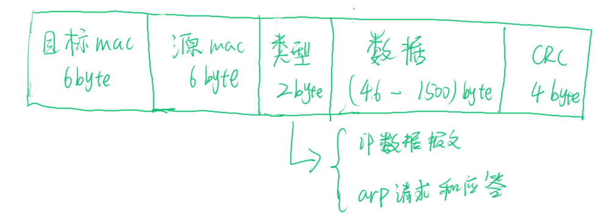

从下到上学习网络。

# 分层

## 物理层

底层的硬件设备：网线、网卡等。

## 数据链路层

mac层，解决3个问题：

1. 数据包发送的时候，发送给谁？
2. 如果大家都在发送数据包的时候，会不会产生混乱？
3. 如果在发送的时候出现了错误，怎么办？

### 数据链路层网络包格式

从网络包格式上可以看出，使用源和目标的mac地址可以知道发送方和接收方，这个报文是从谁那发出，被谁接收的。这解决了第1个问题。

如果要知晓目标mac地址，在局域网上使用**ARP协议**广播，根据IP地址广播得到目标的mac地址；为了避免频繁的广播，机器本地也会进行arp缓存，但是由于ip可能会变化，则过一段时间也会清空。（有个问题：如果缓存错误命中了怎么办？）

报文最后的crc校验和就是校验报文是否完整，解决了第3个问题。

在发送数据报文的时候，数据链路层有几种算法能够保证发送不会混乱，这也就解决了第1个问题：

1. 信道划分。你走你的，我走我的，互不干扰。
2. 轮流协议。你现在发，我明天发，和摇号一样。
3. 随机接入协议。先发送，如果信道太堵了，就不发了，等待一段时间再发。

### 二层设备

广播的方式还是不太靠谱，如果广播的数据报文太多了，信道完全用不了。

这个时候可以使用**交换机**，把报文发送给交换机，让交换机根据发送过来的报文，发送给目标网口所连接的机器。

交换机会进行学习，根据报文保存一个**转发表**，和缓存一样，是有过期时间的。